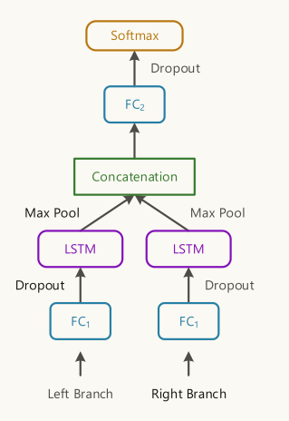

# Temporal Information Extraction for Question Answering Using  Syntactic Dependencies in an LSTM-based Architecture

## 1 论文基本信息

1.   作者：Yuanliang Meng, Anna Rumshisky, Alexey Romanov
2.   发表时间：2017年

## 2 解决了什么问题

尝试一个相对简单的、保留信息能力最小的体系结构是否能够合并识别文本中时间关系所需的信息。

## 3使用了什么方法

### 任务一：识别文本中的时间表达式和事件

1.   使用HeidelTime package识别时间表达式

     >   Jannik Str¨otgen and Michael Gertz. 2013. Multilingual and cross-domain temporal tagging. Language Resources and Evaluation, 47(2):269–298.

2.   训练了一个神经网络模型提取事件提及

     长短期记忆神经网络模型

     提取模型有两个组成部分：

     +   一个组件LSTM层，将单词嵌入作为输入。

     +   另一个组件采用4个令牌级特性作为输入。

     最后进行二分类

     >   Sepp Hochreiter and J¨urgen Schmidhuber. 1997.
     >   Long short-term memory. Neural Computation,
     >   9(8):1735–1780.

3.   我们使用NewsReader进行标记、词性标注和依赖解析

     >   Rodrigo Agerri, Josu Bermudez, and German Rigau.2014.Ixa pipeline: Efficient and ready to use multilingual nlp tools. In Proc. of the 9th Language Resources and Evaluation Conference (LREC2014),
     >   pages 26–31

### 任务二：时序关系分类器

由四部分组成：**基于lstm的句子内实体关系模型**，基于lstm的跨句子关系模型，另一个**基于lstm的文档创建时间关系模型**，以及**用于TIMEX对的基于规则的组件**。

**四个组件分别进行分类，最后都输出到一个剪枝模块内，去除冲突的时序关系**

基于LSTM的三个组件使用**相同流线结构**，通过**实体对之间的最短依赖路径**实现恢复标记排序

#### 1 句子内实体关系模型

使用依赖树中实体之间的最短路径来捕获基本上下文。

1.   使用NewsReader管道，我们确定最短路径，并使用路径中所有令牌的单词嵌入作为神经网络的输入。

2.   使用了两个分支接收词嵌入序列

+   左分支处理从源实体到最小共同祖先的路径。
+   右分支处理从目标实体到最小共同祖先的路径。

>   Yan Xu, Lili Mou, Ge Li, Yunchuan Chen, Hao Peng, and Zhi Jin. 2015. Classifying relations via long short term memory networks along shortest dependency paths. In Proc. ofEMNLP 2015, pages 1785–1794.Association for Computational Linguistics.

3.   每个分支都经过一个最大池化层
4.   连接
5.   经过一个隐藏层
6.   softmax产生类的概率分布

>   通过翻转每一个事件对来增加训练数据

#### 2 跨句子实体分类模型

目的：通过文档，找到更多实体之间的存在的时序关系

模型与句子间实体分类模型相似

由于不同句子中的实体之间没有共同的根，所以我们使用实体和句子根之间的路径来构造输入数据。

#### 3 文档创建时间模型

#### 4 时间序列关系

## 4 取得了什么成果

1.   使用SemEval2015 Task 5，也就是QA-TempEval进行评估任务

## 5 数据集

### 1 SemEval2015 Task 5，也就是QA-TempEval

1.   276个带注释的TimeML文件，其中大部分是来自20世纪90年代末到21世纪初的主要机构或Wikinews的新闻文章。该数据包含事件注释、时态表达式(称为timex)和时态关系(称为TLINKs)。
2.   三种类型的未注释文件:10篇2014年的新闻文章、10篇关于世界历史的维基百科文章和8篇2000年代初的博客文章。

### 2 TimeBank-Dense

<[muk343/TimeBank-dense: The Timebank dense data in .tml format (github.com)](https://github.com/muk343/TimeBank-dense)>
