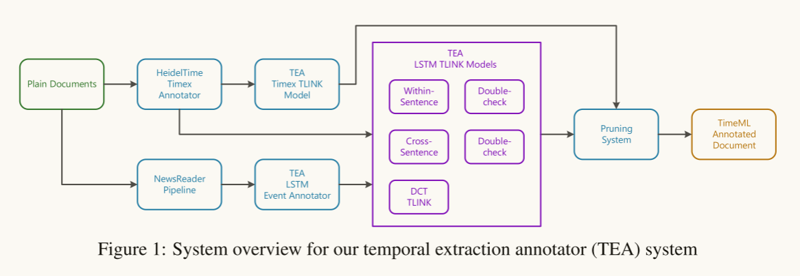
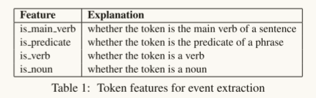
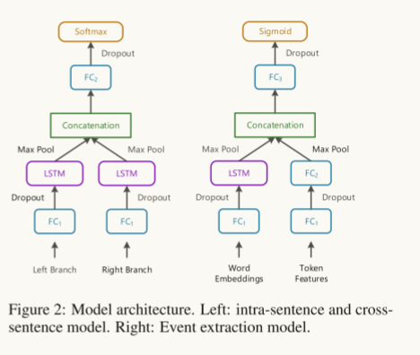

# Temporal Information Extraction for Question Answering Using  Syntactic Dependencies in an LSTM-based Architecture

## 1 论文基本信息

1.   作者：Yuanliang Meng, Anna Rumshisky, Alexey Romanov
2.   发表时间：2017年

## 2 解决了什么问题

尝试一个相对简单的、保留信息能力最小的体系结构是否能够合并识别文本中时间关系所需的信息。

## 3使用了什么方法

任务一：识别文本中的时间表达式和事件

1.   使用HeidelTime package识别时间表达式

     >   Jannik Str¨otgen and Michael Gertz. 2013. Multilingual and cross-domain temporal tagging. Language Resources and Evaluation, 47(2):269–298.

2.   训练了一个神经网络模型提取事件提及

     长短期记忆神经网络模型

     提取模型有两个组成部分：

     +   一个组件LSTM层，将单词嵌入作为输入。

     +   另一个组件采用4个令牌级特性作为输入。

     最后进行二分类

     >   Sepp Hochreiter and J¨urgen Schmidhuber. 1997.
     >   Long short-term memory. Neural Computation,
     >   9(8):1735–1780.

3.   我们使用NewsReader进行标记、词性标注和依赖解析

     >   Rodrigo Agerri, Josu Bermudez, and German Rigau.2014.Ixa pipeline: Efficient and ready to use multilingual nlp tools. In Proc. of the 9th Language Resources and Evaluation Conference (LREC2014),
     >   pages 26–31

任务二：时序关系分类器

由四部分组成：**基于lstm的句子内实体关系模型**，基于lstm的跨句子关系模型，另一个**基于lstm的文档创建时间关系模型**，以及**用于TIMEX对的基于规则的组件**。

**四个组件分别进行分类，最后都输出到一个剪枝模块内，去除冲突的时序关系**

基于LSTM的三个组件使用**相同流线结构**，通过**实体对之间的最短依赖路径**实现恢复标记排序

## 4 取得了什么成果

1.   使用SemEval2015 Task 5，也就是QA-TempEval进行评估任务

## 5 数据集

### 1 SemEval2015 Task 5，也就是QA-TempEval

1.   276个带注释的TimeML文件，其中大部分是来自20世纪90年代末到21世纪初的主要机构或Wikinews的新闻文章。该数据包含事件注释、时态表达式(称为timex)和时态关系(称为TLINKs)。
2.   三种类型的未注释文件:10篇2014年的新闻文章、10篇关于世界历史的维基百科文章和8篇2000年代初的博客文章。

### 2 TimeBank-Dense
