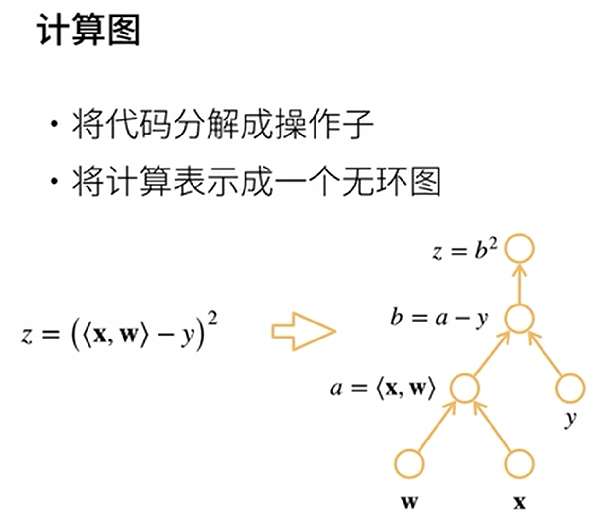
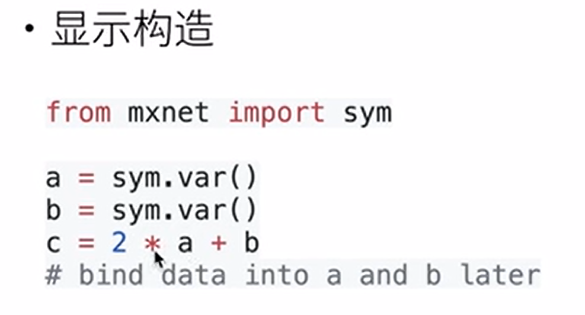
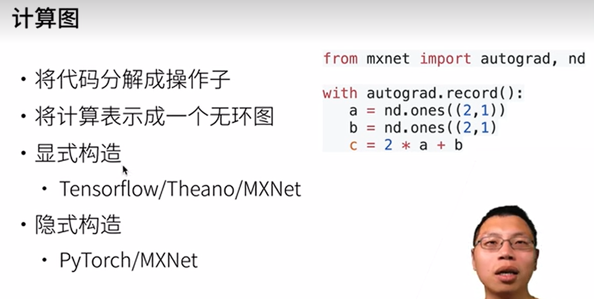
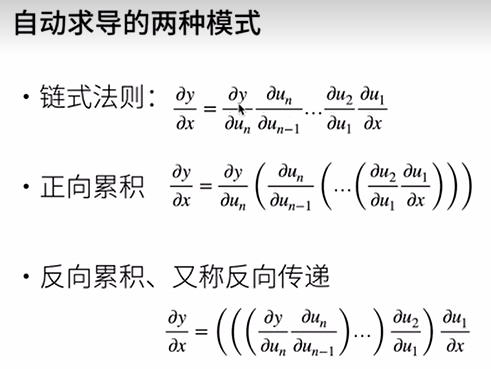
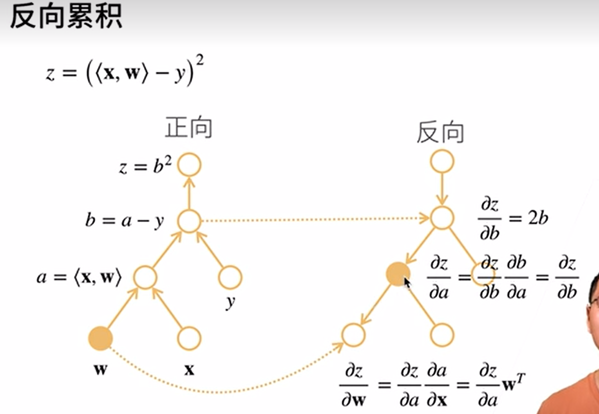
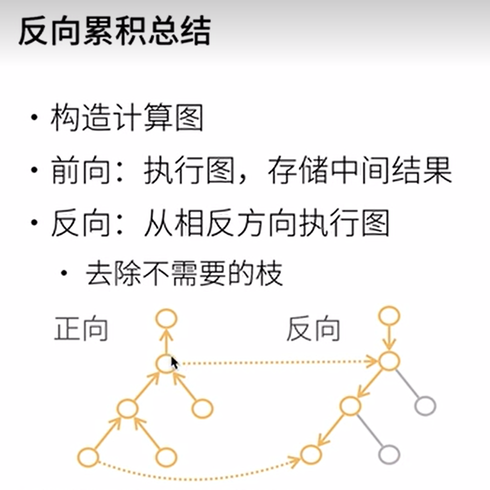
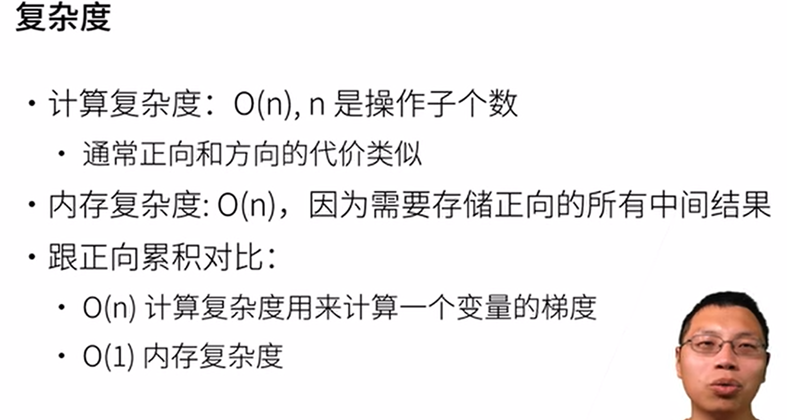

# 自动求导

链式法则

一个函数在指定值上求导
















正向和反向的区别，就是一个自上而下，一个自下而上

正向计算每一层的时候，需要将这一层下面的所有层的结果都计算出来

而反向在计算每一层的时候，只需要将这一层下面一层的值作为一个输入参数，然后对这一层进行计算

>   通过正向计算，将网络每一层的结果计算出来，当我们需要计算某一层的梯度时，就只需要直接使用正向计算出来的结果，然后进行反向计算

## 代码实现

```python
import torch

x= torch.arange(4.0, requires_grad=True)
print(x.grad) # 默认为None 后面访问导数用

y = 2 * torch.dot(x, x)
print(y)

y.backward() # 通过调用反向传播函数来自动计算y关于x的梯度
print(x.grad)

print(x.grad == 4 * x)

# 默认情况pytorch会累积梯度，计算下一个梯度时，需要将之前的值清空
x.grad.zero_()
# 计算下一个梯度
y = x.sum()
y.backward()
print(x.grad)

# 对非标量调用 backward，需要传入 gradient 参数
# 大部分情况都不会对向量进行求导，通常都会对标量进行求导
# 一般会将向量进行一个求和，然后对这个求和进行求导
x.grad.zero_()
y = x*x
y.sum().backward()
print(x.grad)

# 将某些计算挪到计算图之外
x.grad.zero_()
y = x*x
u = y.detach() # detach 将计算挪出计算图之外
z = u*x
z.sum().backward()
# 就上面这个例子而言，可以看出 y = f(x) = x * x
# 而 u = y.detach()
# z = u * x
# 如果 u 不是 y 的 detach() ，那么，z 对 x 求导就等于 u`x + u
# 而这里，u = y.detach()，我们使用 detach() 函数，将 u(x) 排除到计算图之外
# 而这个计算图是以 x 为未知数的计算图，而 u 虽然也是未知数，但在z对x求导的计算中，就不能作为未知数计算了
# 而是作为标量常数看待，也就是 dz/dx == u
print(x.grad == u) # tensor([True, True, True, True])

# 经过控制流的求导
def f(a):
    b = a*2
    while b.norm() < 1000:
        b = b*2
    if b.sum() > 0:
        c = b
    else :
        c = 100 * b
    return c
a = torch.randn(size=(), requires_grad=True)
d=f(a)
d.backward()
print(a.grad == d/a) # tensor(True)
```

