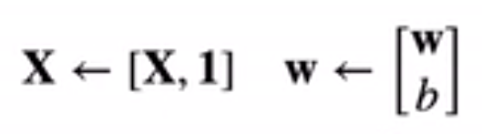
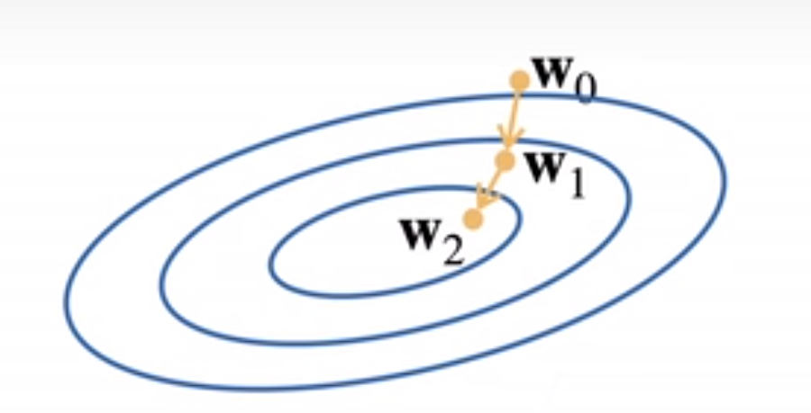

# 线性回归和基础优化算法

## 1 基础理论了解

### **线性模型**

1 n 维的输入 $X = [x_1, x_2,...,x_n]^T$

2 n 维权重$W=[w_1, w_2,...,w_n]^T$

### 3 1个偏差 b

输出，是输入的加权和

 $y = w_1x_1 + w_2x_2 +...+w_nx_n + b$

向量版本：$y = <W,X>+b$

### **衡量预估质量**

平方损失
$$
l(y,y`) = \frac{1}{2} (y - y`)^2
$$

### 参数学习

训练损失
$$
l(X,Y,w,b) = \frac{1}{2n} \sum_{i=1}^n(y_i - <x_i,w> -b)^2
$$
最小化损失来学习参数
$$
W^*,b^* = arg \space min_{w,b} l(X,Y,w,b)
$$

### 显示解

将偏差加入权重



损失函数修改为
$$
\begin{split}
l(X,y,w) &= \frac{1}{2n} \sum_{i=1}^n(y_i - <x_i,w> )^2 \\ 
&= \frac{1}{2n} {\Vert y-Xw \Vert}^2
\end{split}
$$
求导
$$
\frac {\partial} {\partial w}l(X,y,w) = \frac {1} {n} (y - Xw)^TX
$$
利用函数最优解来求$w$

函数最优解，也就是极值点，导数为0

也就是，
$$
\frac {\partial} {\partial w}l(X,y,w) = 0
$$

$$
\frac {1} {n} (y - Xw)^TX = 0
$$
则，
$$
w = X^Ty
$$

### 总结

+   线性回归就是对n维输入的加权和偏差

+   使用平方损失来衡量真实值和预测值之间的差异

+   线性回归有显示解
    +   大部分模型都没有显示解，往往有显示解的网络都过于简单

+   线性回归可以看成单层神经网络

## 2 基础优化算法

1 挑选一个初始值$w_0$

2 重复迭代参数 $ t= 1, 2,3$
$$
w_t = w_{t-1} - \eta{\frac {\partial l}{\partial w_{t-1}}}
$$

+   $\eta$：学习率，步长
+   $\frac {\partial l} {\partial {w_{t-1}}}$ :梯度



>   $\eta{\frac {\partial l}{\partial w_{t-1}}}$其实是向量$[w_{t-1},w_t]$
>
>   我们选择这个梯度，也就是选择$w_t$在梯度$\eta$下最快接近最优解的路径

### 小批量随机梯度下降

超参数$b$

随机采样 $b$ 个样本，在这 $b$ 个样本上来近似损失

### 总结

梯度下降通过不断沿着反梯度方向更新参数求解

小批量随机梯度下降是深度学习默认的求解算法

+   最简单，很稳定

+   两个重要超参数 批量大小$b$和学习率，也就是步长 $\eta$

## 3 线性回归从零开始实现

### 1 生成数据集

设置参数为$w = [2, -3.4]^T、b = 4.2、\epsilon$

设置$y$为
$$
y = Xw + b + \epsilon
$$
**代码**

```python
# from d2l import torch as d2l
import torch
from matplotlib import pyplot as plt

# 设置生成 features 和 labels 的函数
    """生成 y = Xw + b + 噪声"""
def synthetic_data(w, b, num_examples):
    
	"""
	这里是根据均值为 0, 方差为 1的正态函数随机取值设置 x
	
	这里x的个数为 num_examples * len(w)
	"""
    x = torch.normal(0, 1, (num_examples, len(w)))
    
    """
    这里根据 y = xw + b 来计算出初步的 y
    """
    y = torch.matmul(x, w) + b

    """
    这里是根据均值为 0, 方差为 0.01的正态函数随机取值设置噪声
    噪声个数与 y 的个数相同，都为 num_examples 个
    
    y += torch.normal(0, 0.01, y.shape) 也就是 y += 噪声
    
    最后得出的 y = xw + b + 噪声
    
    这个地方我本来代码取的方差值为0.1
    结果实验结果最后得到的loss值下降到0.0047左右就无法下降了
    """
    y += torch.normal(0, 0.01, y.shape)
    
    # 返回 x 作为 features, 返回 y 作为 labels
    return x, y.reshape((-1,1)) # 将 y 变成列向量

# 生成数据集
true_w = torch.tensor([2, -3.4]) # 设置真实的w
true_b = 4.2 # 设置真实的b
features, labels = synthetic_data(true_w, true_b, 1000)# 生成特征 x 和标签 y

# 绘制生成数据集的图像
print('features:', features[0], '\nlabels:', labels[0])
plt.title("生成数据集图像")
plt.xlabel("特征")
plt.ylabel("标签")
# plt.plot(features[:, (1)].detach().numpy(), labels.detach().numpy(), ".b")
plt.plot(features[:, 1], labels, ".")
plt.show()
# d2l.set_figsize() # 只有ipython支持
# d2l.plt.scatter(features[:, (1)].detach().numpy(),
#                 labels.detach().numpy(),1)
```

1.   `torch.normal(c1,c2,c3)`

     返回一个张量，包含从给定参数`c1`,`c2`的**离散正态分布**中抽取随机数。

     +   `c1` 均值

     +   `c2` 方差

     +   `c3` shape

2.   `torch.matmul(x, w)`

     `torch`的乘法，返回`x`和`w`相乘之后的张量

3.   `plt.plot(c1, c2, c3)`

     绘制图形，会需要调用库`from matplotlib import pyplot as plt`

     +   `c1` 张量1
     +   `c2` 张量2
     +   `c3` 字符串，用来描写绘制怎么样的图形
         +   默认绘制图形是根据`c1`和`c2`中的数据一一对应构成点的连线
         +   点的形状 `marker`
             +   `.` 小圆点 `O` 大圆点
         +   颜色
             +   `c` 青 `r` 红 `g` 绿 `b` 蓝 `w` 白 `k` 黑 `y` 黄 `m` 洋红
         +   连线形状 `color`
             +   `:` 点线
             +   `-.` 点画线
             +   `--` 短划线
             +   `-` 实线（默认）

     4.   `labels.detach().numpy()`

          `detach()`函数的作用是将数值分离出来，而不带有梯度，不再被反向传播作用

          之所以这里要`detach()`，是因为在 pytorch 的一些版本中，`torch`只有`detach()`后才能转换成`numpy`

     5.   `y.reshape(-1, 1)`

          在pytorch里面 -1 指代着任意数量

          所以这句代码的意思是，将y的形状变成任意行一列，也就是将y变成了列向量

### 2 读取小批量

定义一个`data_iter`函数，该函数接收批量大小、特征矩阵和标签向量作为输入，生成大小为`batch_size`的小批量为输出

**代码**

```python
def data_iter(batch_size, features, labels):
    
    """
    1 将数据集中的数据打乱
    
    这里是通过数据下标将数据集打乱
    """
    num_examples = len(features)
    indices = list(range(num_examples))

    """
    random.shuffle(indices)
    1. 需要引入random模块
    2. 打乱 indices
    """
    random.shuffle(indices)
    
    """
    2 根据下标indices将数据集切分成batch_size大小的子数据集
    """
    for i in range(0, num_examples, batch_size):
        # 将 indices 分组，并变成一个tensor
        batch_indices = torch.tensor(
            # indices[i:i+batch_size] # 其实这个就可以，因为在 python 中切片越界也不会报错的
            indices[i: min(i+batch_size, num_examples)] # 考虑到最后如果数据不足 batch_size 大小时，那么就截止到 num_examples 位置
        )
        """
        yield: 和 return 类似
        和 return 的区别:
        return 返回所有结果，程序终止不再运行，并销毁局部变量
        yield 返回一个可迭代的生成器对象，使用 for 或者 next()方法遍历生成器对象来提取结果
        """
        yield features[batch_indices], labels[batch_indices]
```

直接使用 indices，而不再将其变成 tensor

```python
def data_iter2(batch_size, features, labels):
    num_examples = len(features)
    indices = list(range(num_examples))
    random.shuffle(indices)
    for i in indices[::batch_size]:
        yield features[i: i+batch_size], labels[i: i+batch_size]
```

### 3 初始化模型参数并定义模型

```python
"""
初始化模型参数

这里根据均值为 0，方差为 1 的正态函数随机取值设置为 w，w 为 2*1 的张量，并将 b 初始化为 0

requires_grad=True 梯度，也将变量添加到计算图中
"""
w = torch.normal(0, 1, size=[2, 1], requires_grad=True)
b = torch.zeros(1, requires_grad=True)

"""
定义模型
"""
def linreg(x, w, b):
    """
    线性回归模型
    模型的本质就是函数
    这里的线性回归模型就是
    y = x*w + b
    """
    return torch.matmul(x, w) + b
```

### 4 定义损失函数

```python
def squared_loss(y_hat, y):
    """
    均方误差
    
    真实值和计算值作差，平方求和，最后再求均值
    """
    return (y_hat - y.reshape(y_hat.shape)) ** 2 / 2
```

### 5 定义优化算法

```python
def sgd(params, lr, batch_size):
    """小批量随机梯度下降"""
    """
    with torch.no_grad() 将计算排除在torch计算图之外, 也就是如下计算的过程和结果将不影响torch计算图的计算
    
    为什么参数更新操作需要排除到计算图之外？
    
    因为这里只是参数更新操作，这里也只能做参数更新操作，不需要对参数进行更新
    """ 
    with torch.no_grad():
        for param in params:
            # 优化算法的核心代码 每次在梯度计算之后，参数都将会下降 lr * param.grad / batch_size 个数量级
            param -= lr * param.grad / batch_size
            # 在pytorch中，不会自动清除梯度，所以每次使用梯度之后，都需要将梯度清空，否则会出现梯度累积问题
            param.grad.zero_()
```

### 6 训练

代码

```python
def train_(batch_size, features, labels):
    lr = 0.003 # 设置学习率
    num_epochs = 10 # 设置学习次数
    net = linreg # 设置模型
    loss = squared_loss # 设置损失函数

    for epoch in range(num_epochs):
        for x, y in data_iter(batch_size, features, labels):
            l = loss(net(x, w, b), y) # x 和 y 的小批量损失
            
            """
            根据损失计算梯度
            
            这里需要意识到为什么计算梯度时，有个求和操作
            
            因为对每一个 x 和 y 计算梯度，会形成 len(x) 个梯度，也就是一个梯度张量
            而求和后，则是得到一个梯度
            如果不进行求和操作，得到的结果会是张量会变得越来越大
            如果模型很大，那么需要的计算资源会很多
            """
            l.sum().backward() 
            sgd([w, b], lr, batch_size) # 根据参数的梯度来更新参数
        with torch.no_grad(): # 这里又一个将计算排除到计算图之外的操作
            train_l = loss(net(features, w, b), labels)
            print(f'epoch {epoch + 1}, loss {float(train_l.mean()):f}')
train_(batch_size, features, labels)
```

### 7 整体代码

```python
# # %matplotlib inline
# import random
# from d2l import torch as d2l
import random
import torch
from matplotlib import pyplot as plt

def synthetic_data(w, b, num_examples):
    """生成 y = Xw + b + 噪声"""
    x = torch.normal(0, 1, (num_examples, len(w)))
    y = torch.matmul(x, w) + b
    y += torch.normal(0, 0.01, y.shape)
    return x, y.reshape((-1,1))

"""
生成特征 x 和标签 y
"""
true_w = torch.tensor([2, -3.4]) # 定义w
true_b = 4.2 # 定义 b
features, labels = synthetic_data(true_w, true_b, 1000)# 生成特征 x 和标签 y

def draw_data():
    """绘制生成数据集"""
    print('features:', features[0], '\nlabels:', labels[0])
    plt.figure(figsize=(4, 3))
    plt.title("build_test_data")
    plt.xlabel("features")
    plt.ylabel("labels")
    plt.plot(features[:, 1], labels, ".")
    plt.show()

# 设置批量大小    
batch_size = 10
    
def data_iter(batch_size, features, labels):
    """读取小批量"""
    num_examples = len(features)
    indices = list(range(num_examples))
    random.shuffle(indices)
    for i in range(0, num_examples, batch_size):
        batch_indices = torch.tensor(
            indices[i: min(i+batch_size, num_examples)]
        )
        yield features[batch_indices], labels[batch_indices]

def print_first_x_y(batch_size, features, labels):
    """使用for循环遍历提取生成器对象结果并打印"""
    for x, y in data_iter(batch_size, features, labels):
        print(x, '\n', y)
        break

"""
初始化模型参数
"""
w = torch.normal(0, 1, size=[2, 1], requires_grad=True)
b = torch.zeros(1, requires_grad=True)

"""
定义模型
"""
def linreg(x, w, b):
    """线性回归模型"""
    return torch.matmul(x, w) + b

def squared_loss(y_hat, y):
    """均方误差"""
    return (y_hat - y.reshape(y_hat.shape)) ** 2 / 2

def sgd(params, lr, batch_size):
    """小批量随机梯度下降"""
    with torch.no_grad():
        for param in params:
            param -= lr * param.grad / batch_size
            param.grad.zero_()

def train_(batch_size, features, labels, w, b):
    """训练"""
    lr = 0.003
    num_epochs = 10
    net = linreg
    loss = squared_loss

    for epoch in range(num_epochs):
        for x, y in data_iter(batch_size, features, labels):
            l = loss(net(x, w, b), y) # x 和 y 的小批量损失
            l.sum().backward() # 计算梯度
            sgd([w, b], lr, batch_size) # 根据参数的梯度来更新参数
        with torch.no_grad():
            train_l = loss(net(features, w, b), labels)
            print(f'epoch {epoch + 1}, loss {float(train_l.mean()):f}')


# draw_data()
train_(batch_size, features, labels)
```

### 8 总结

这次实验，首先进行了数据集的生成，其次进行了对数据集生成的读取设置，然后设置了设置了对模型和模型的初始参数进行了设置，之后又设置了loss函数，优化函数，最后进行了训练

## 4 简洁实现

```python
import numpy as np
import torch
from torch.utils import data
from torch import nn
"""
from torch.utils import data 引入torch负责数据处理的模块
下面数据导入阶段需要使用这个模块的TensorDataset方法和DataLoader方法

from torch import nn
在pytorch中 nn 是集成各种神经网络的层
"""


"""
1 生成数据模块
"""
def synthetic_data(w, b, n):
    x = torch.normal(0, 1, (n, len(w)))
    y = torch.matmul(x, w) + b
    y += torch.normal(0, 0.01, y.shape)
    return x, y.reshape((-1, 1))

true_w = torch.tensor([2, -3.4])
true_b = 4.2
features, labels = synthetic_data(true_w, true_b, 1000)

"""
2 读取数据模块

使用pytorch自带的数据模块来进行数据的读入

首先，将features 和 labels 做成一个 list
然后传入 data.TensorDataset方法中 获得一个 pytorch 的dataset对象
调用data.DataLoader方法，每次从 dataset 对象中挑选 batch_size 条数据
其中 shuffle 控制是否需要将数据打乱
返回的同样是一个可迭代的对象，可以使用for循环，或者 使用 next(iter(data_iter)) 读取
"""
def load_array(data_arrays, batch_size, is_train=True):
    # 函数调用实参前加星号，作用是解包，在这里就是指将列表元素作为参数输入，而不是将列表作为参数输入
    dataset = data.TensorDataset(*data_arrays)
    return data.DataLoader(dataset, batch_size, shuffle=is_train)

batch_size = 10
data_iter = load_array((features, labels), batch_size)

# 打印第一个x, y
def print_first_x_y(data_iter):
    # 1 可以使用next()函数访问
    print(next(iter(data_iter))[0])
    print(next(iter(data_iter))[1], "\n")

    # 2 也可以使用for循环访问
    for x, y in iter(data_iter):
        print(x, "\n", y)
# print_first_x_y(data_iter)

"""
3.1 设置神经网络

nn中集成了各种经典神经网络
对于线性回归神经网络就可以直接调用 Linear(c1, c2)，其中参数 c1 代表输入的维度 c2 代表输出维度

nn.Sequential 方法，作用是将参数，也就是输入的网络层放进 Sequential 容器中，类似于神经网路层列表 (List of Layers)
比如，下面的 nn.Linear(2, 1) 线性神经网络层，就会被放置到 Sequential 容器 net 的第 0 位
也就是 net[0] == nn.Linear(2, 1)
"""
net = nn.Sequential(nn.Linear(2, 1))

"""
3.2 初始化模型参数

设置权重 w 初始值为 均值 0 方差 0.01 的正态分布上的随机值
设置偏差 b 初始值为 0

net[0]，也就是线性神经网络层，带有两个属性 weight 和 bias 分别对应 w 和 b
访问他们的 data 并修改其值
其中比如normal_()，函数名后有短横杠的，代表在值上进行修改
比如fill_(0)代表将 data 以 0 填充
"""
net[0].weight.data.normal_(0, 0.01)
net[0].bias.data.fill_(0)

"""
4 设置损失函数
设置损失函数为均方误差随机函数
"""
loss = nn.MSELoss()

"""
5 设置优化函数为随机梯度下降

设置优化函数为SGD，其中需要设置的两个参数，第一个就是网络层的参数，第二个就是学习率
"""
trainer = torch.optim.SGD(net.parameters(), lr=0.03)

"""
3 训练模块
"""
num_epochs = 3
for epoch in range(num_epochs):
    for x, y in data_iter:
        l = loss(net(x), y)
        trainer.zero_grad()
        l.backward()
        trainer.step()
    l = loss(net(features), labels)
    print(f'epoch:{epoch + 1},loss:{l:f}')

```

