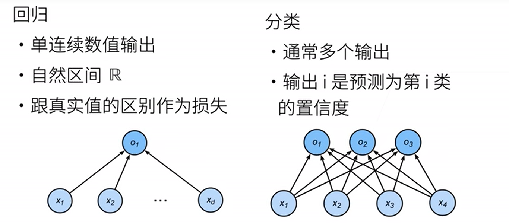
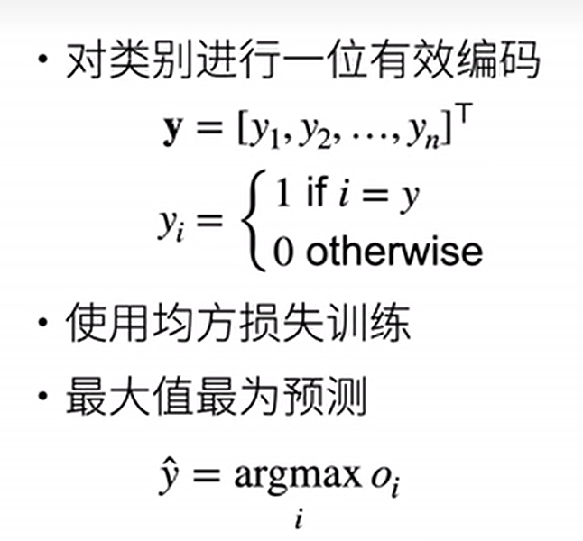
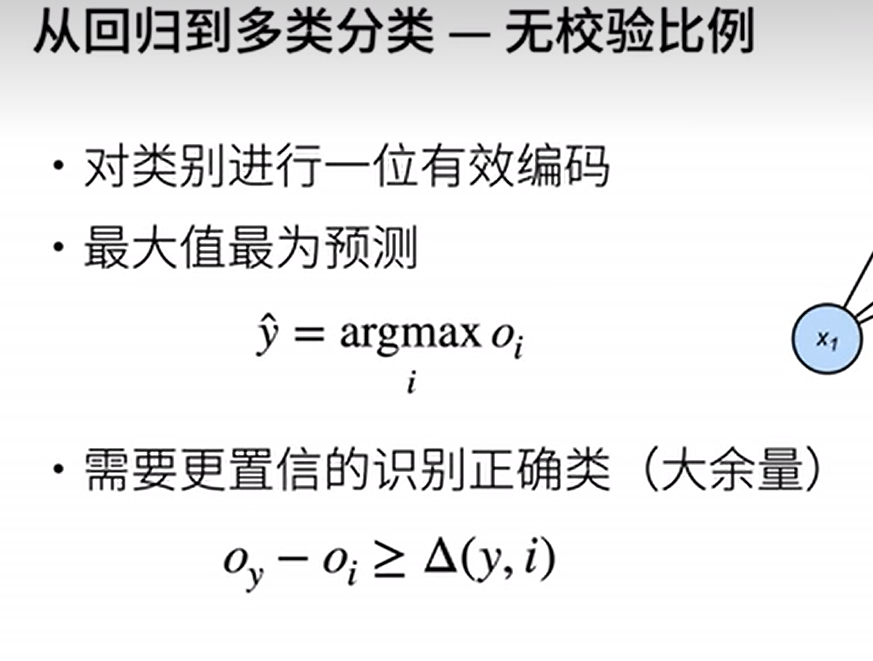
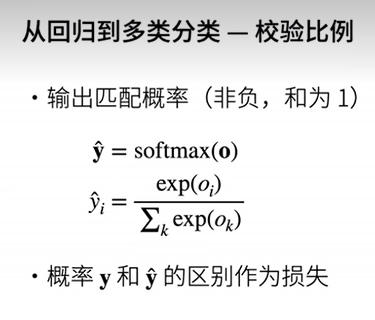
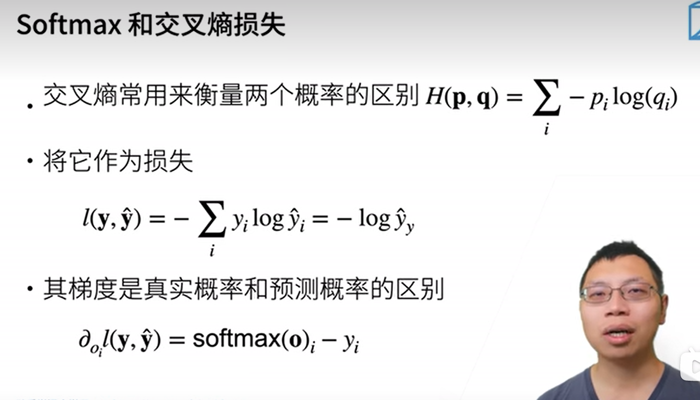
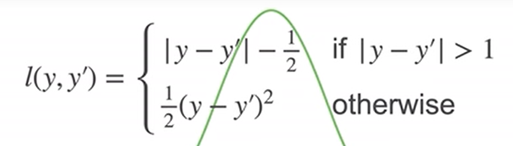

# softmax回归

## 1 理论基础

### 1 回归和分类

+   回归估计一个连续值

+   分类预测一个离散类别



### 2 从回归到多分类

#### 1 均方损失



### 2 无校验比例



>   希望最大值 $o_i$ 减去其余的 $o_i$ 能够大于一个阈值

### 3 校验比例



>   将多个离散输出变成一个离散的概率分布，然后就将一个分类问题转换为一个回归问题，就可以使用回归的方法计算损失，一般使用交叉熵

### 4 交叉熵损失



#### 交叉熵基础知识

##### 1 熵

表示系统的不确定程度，熵越大，就代表系统越不稳定

##### 2 信息量

在计算出结果的过程中，某一分支对结果从不确定到确定的过程中贡献的价值
$$
\begin{split}
f(x) &:= 信息量 \\
f(x) &:= -log_2(x)
\end{split}
$$

+   $-$ 是定义给出
+   $log_2$ $log$是定义的，但以 2 为底是为了让信息量以比特为单位

##### 3 某一分支贡献信息量

$$
f(x_i) = -\log_2(P(x_i))
$$

##### 4 某一分支对整个系统贡献的信息量

$$
f(x_i) = P(x_i) * -\log_2(P(x_i))
$$

##### 5 计算系统熵

就是计算系统整体信息量的期望，也就是将所有的分支贡献信息量的求和
$$
\begin{split}
H(P) &:= E(P_f) \\
H(P) &:= \sum_{i=0}^m P(x_i) * -\log_2(P(x_i))
\end{split}
$$

##### 6 比较两个系统的熵——KL散度

可以直接进行相减，但更高级的做法是相对熵，也叫KL散度

当两个模型进行熵比较时，是以一个模型为基准的，这里是以 P 为基准

然后使用模型 P 的概率分布计算二者的信息量的差值
$$
\begin{split}
& D_{KL}(P||Q) \\
& = \sum_{i=0}^{max(n, m)}p_i * -log_2(p_i - q_i) \\
& = \sum_{i=0}^{max(n, m)}p_i * -log_2(q_i) - \sum_{i=0}^{max(n, m)}p_i * -log_2(p_i)
\end{split}
$$
而当我们以模型 P 为基准时，模型P的系统熵是已知常数，也就是$\sum_{i=0}^{max(n, m)}p_i * -log_2(p_i)$ 为常数，而前半截 $\sum_{i=0}^{max(n, m)}p_i * -log_2(q_i)$ 也就是 P 和 Q 的交叉熵了

根据吉布斯不等式可知，KL散度一定为正，也就是 P 和 Q 的交叉熵一定大于 P 的系统熵

也就是说，**P 和 Q 的交叉熵越大**，P 和 Q 系统熵的差值也就越大，**俩模型离得也就越远**

##### 7 交叉熵应用到神经网络

二分类应用
$$
\begin{split}
&\sum_{i=0}^{max(n, m)}x_i * -log_2(q_i) \\ 
& = \sum_{i=0}^{max(n, m)}x_i * -log_2(q_i) \\
&= - \sum_{i=0}^{max(n, m)} (x_i * log_2(y_i) + (1-x_i)*log_2(1-y_i))
\end{split}
$$

### 5 交叉熵求梯度

$$
\begin{align}
l(y,y`) &= -\sum_i y_i log({y`}_i) \\
&= -\sum_i y_i log(softmax(o_i)) \\
&= -\sum_i y_i log(\frac {e^{o_i}} {\sum_j e^{o_j}}) \\
&= -\sum_i y_i (o_i - log(\sum_j e^{o_j}))  \\
&= -\sum_i y_io_i +\sum_i (y_i log(\sum_j e^{o_j}))  \\
&= -\sum_i y_io_i + log(\sum_j e^{o_j})
\end{align}
$$

>   上述第55到第56个公式的转换过程原因
>
>   $\sum_i y_i log(\sum_j e^{o_j}))$ 整体的求和公式是针对 i 的，而 $log(\sum_j e^{o_j}))$ 是关于 j 的式子，也就是说相对于外部的求和符号而言，其是常数，所以可以将上述式子转化为 $\sum_i y_i  * log(\sum_j e^{o_j}))$ 而 $y_i$ 是关于 $o_i$ 的概率分布，也就是 $\sum_i y_i = 1$ ，所以可以最终转化为 $log(\sum_j e^{o_j}))$

求导数：

由于这个求导是针对于 $o_i$ 而言的，所以
$$
\begin{align}
l'(y,y`) &= -y_i + \frac {e^{o_i}}{\sum_{j \space \&\& \space j != i} e^{o_j}} \\
&= \frac {e^{o_i}}{\sum_{j \space \&\& \space j != i} e^{o_j}}-y_i \\
&= softmax(o_i) - y_i
\end{align}
$$

### 6 总结

+   softmax 是一个多分类模型
+   使用 softmax 操作子得到每一个类的置信度
+   使用交叉熵衡量预测和标号的差距

## 2 损失函数

### 1 均方损失 

别名：MSE，L2 Loss(二分类)
$$
l(y,y`) = \frac{1}{2}(y - y`)^2
$$


### 2 绝对值损失

L1 Loss
$$
l(y,y`) = |y - y`|
$$

### 3 Huber's Robust Loss



## 3 图片数据集

MNIST 数据集

这里使用类似但更复杂的Fashion-MNIST

导库

```python
```

