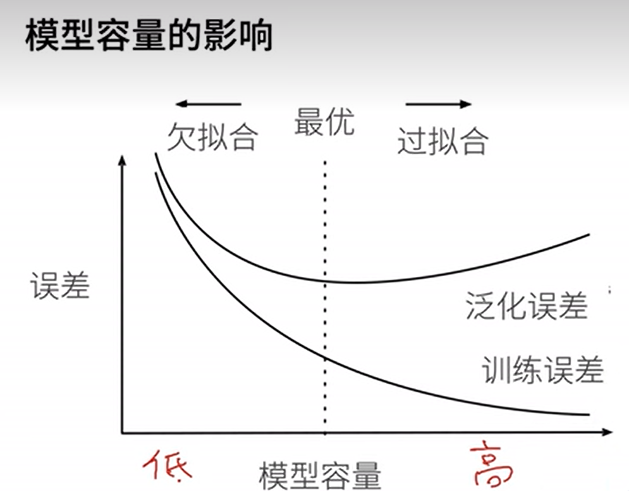

# 模型选择

## 1 理论基础

### 1 训练误差和泛化误差

训练误差：模型在训练数据上的误差

**泛化误差**：模型在新数据上的误差——重要

### 2 验证数据集和测试数据集

**验证数据集**： 一个用来评估模型好坏的数据集

+   可以从训练数据中拿出一部分当做训练数据
+   但不可以和训练数据混用

测试数据集：只用一次的数据集

### 3 K-则交叉验证

应用场景：**没有足够多的数据时**

算法流程：

1.   将训练数据打乱，然后分割成 k 块
2.   `for i in range(1,k+1):`
     1.   使用第 i 块作为验证数据集，其余作为训练数据集
3.   计算 K 个验证集误差平均

+   常用：K = 5 或 10

## 2 过拟合和欠拟合理论基础

### 1 模型容量

+   拟合各种函数的能力

+   低容量的模型难以拟合训练数据

+   高容量的模型可以记住所有的训练数据

### 2 模型容量的影响

### 3 估计模型容量

给定模型种类，将有两个主要因素

+   参数个数

+   参数值的选择范围

>   参数个数越大，参数值的选择范围越大，模型容量越大

### 4 数据复杂度

+   样本个数
+   每个样本的元素个数
+   时间、空间结构
+   多样性