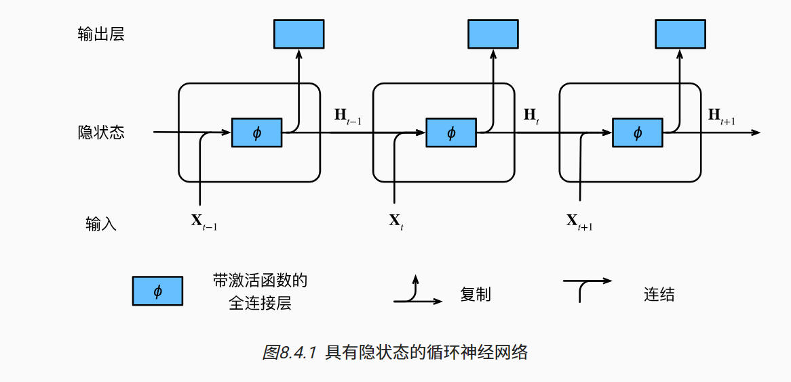

# 循环神经网络

隐藏层
$$
H_t = \phi(X_t*W_{xh} + H_{t-1}*W_{hh} + b_h)
$$

+   $X_t$ 输入
+   $t$ 时间步

输出层
$$
O = H * W_hq + b_q
$$
图示



代码：

```python
import torch
from d2l import torch as d2l

"""
H_t = X_t * W_xh + H_t-1 * H_hh
1. 定义矩阵X、W_xh、H和W_hh， 它们的形状分别为 (3, 1), (1, 4), (3, 4), (4, 4)
2. 相乘相加，规则如上
"""
X, W_xh = torch.normal(0, 1, (3, 1)), torch.normal(0, 1, (1, 4))
H, W_hh = torch.normal(0, 1, (3, 4)), torch.normal(0, 1, (4, 4))
H_t = torch.matmul(X, W_xh) + torch.matmul(H, W_hh)
print(H_t)
# tensor([[ 4.1566,  1.0447,  0.7936,  2.9641],
#         [ 0.0211, -1.8744, -2.8662,  1.5193],
#         [ 2.7304, -1.8915,  1.5069, -1.6834]])

"""
1. 沿列拼接 X、H，沿行拼接 W_xh、W_hh
2. 相乘
"""
H_t2 = torch.matmul(torch.cat((X, H), 1), torch.cat((W_xh, W_hh), 0))
print(H_t2)
# tensor([[ 4.1566,  1.0447,  0.7936,  2.9641],
#         [ 0.0211, -1.8744, -2.8662,  1.5193],
#         [ 2.7304, -1.8915,  1.5069, -1.6834]])

```


困惑度

用来描述预测结果的正确性

使用n个词元的交叉熵损失的平均来衡量
$$
困惑度 = \exp ({-\frac{1}{n}\sum_{t=1}^n \log P(x_t|x_{t-1}, ..., x_1)})
$$


课后题

如果我们使用循环神经网络来预测文本序列中的下一个字符，那么任意输出所需的维度是什么？

>   输入的纬度

为什么循环神经网络可以基于文本序列中所有先前的标记在某个时间步表示标记的条件概率？

>   每一层都会使用到之前的一个隐藏状态

如果你反向传播一个长序列，梯度会发生什么？

>   梯度爆炸或者消失（步子太长了）