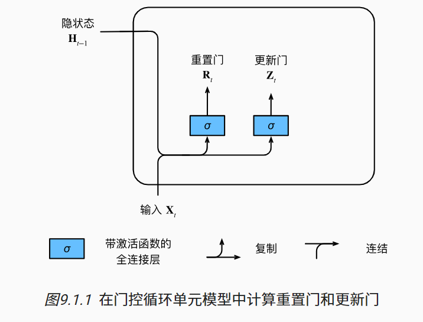

# GRU 门控神经网络

使用一些额外的控制单元，在构造隐藏状态的时候，保留重要信息而遗忘不重要的信息

要关注的概念：更新门、重置门

## 1 门

跟隐藏状态长度一样的向量，计算方法和隐藏状态的计算方法是一样的

概念来自于电路设计

1.   更新门 update gate: **允许我们控制新状态中有多少个是旧状态的副本**

2.   重置门(遗忘门) reset gate: **允许我们控制“可能还想记住”的过去状态的数量**

输入和 RNN 的输入是一样的，而输出则是由使用 sigmoid 激活函数的两个全连接层给出——本质上这两个控制单元就是两个全连接层
$$
\begin{split}
&\text{遗忘门:} R_t = \sigma(X_tW_{xr} + H_{t-1}W_{hr} + b_r)\\
&\text{更新门:} Z_t \sigma(X_tW_{xz} + H_{t-1}W_{hz} + b_z)
\end{split}
$$


## 2 候选隐藏状态

$$
H^{hat}_t = \tanh (X_tW_{xh} + (R_t \odot H_{t-1})W_hh + b_h)
$$

+   $\odot$ 按照元素相乘，Hadamard积

当 $R_t$ 全是 1 时，上述公式就变成 **RNN** 了

当 $R_t$ 全是 0 时， 就是将上一层的隐藏状态全部遗忘掉，上述公式就会变成以 $X_t$ 作为输入的**多层感知机**的结果，那么**隐藏状态就会被重置到默认值了**


## 3 隐状态

$$
H_t = Z_t \odot H_{t-1} + (1 - Z_t) \odot H^{hat}_t
$$


当 $Z_t$ 全是 1，不更新隐藏状态，$H_t == H_{t-1}$，相当于将 $X_t$  舍弃

当 $Z_t$ 全是 0，$H_t == H^{hat}_t$，那么当 $R_t$ 里面全是 1 时，就回到了 RNN 

显而易见，经过 $Z_t$ 时，其实是在 $H_{t-1}$ 和 $H^{hat}_t$ 之间做一个取舍，控制二者在更新隐藏状态时的比重：

1.   当 $Z_t $ 倾向于 1时，模型就倾向于保留上一层的隐藏状态，而当前输入 $X_t$ 就被倾向于被忽略，从而跳过依赖链条中的时间比重 $t$.
2.   当 $Z_t$ 接近0时， 新的隐状态 $H_t$ 就会接近候选隐状态 $H^{hat}_t$

**控制门的设计有助于处理 RNN 中的梯度消失问题，更好的捕获时间步长很长的序列的依赖关系**

## 4 总结

GRU 是基于 RNN 的前提下，引入了**两个门控单元**：

1.   **遗忘门**
2.   **更新门**

这两个门控单元主要负责在更新隐藏状态时候控制使用 $X_t$ 和 $H_{t-1}$ 的比重

首先经过 $R_t$ 的控制，对上一层的隐藏状态做一个取舍，判断当投入 $X_T$ 时，需要保留上一层隐藏状态的什么内容，从而获取到候选隐藏状态 $H^{hat}_t$

然后经过 $Z_t$ 的控制，在上一层隐藏状态 $H_{t-1}$ 和候选隐藏状态 $H^{hat}_t$ 之间做一个比例的取舍

几个**极端情况**：

1.   当 $Z_t$ 全为 1 时，$H_t = H_{t-1}$，更新隐藏状态时完全忽略当前输入 $X_t$
2.   当 $Z_t$ 全为 0 时，$H_t = H^{hat}_t$
     1.   $R_t$ 全为 1，则 GRU 退回到 RNN
     2.   $R_t$ 全为 0，更新隐藏状态时完全忽略上一层隐藏状态

两个特征：

+   重置门有助于捕获序列中的短期依赖
+   更新门有助于捕获序列中的长期依赖

## 5 代码实现

### 1 引入依赖包，导入数据

```python
import torch
from torch import nn
from d2l import torch as d2l

batch_size, num_steps = 32, 35
train_iter, vocab = d2l.load_data_time_machine(batch_size, num_steps)
```

### 2 初始化模型参数

```python
def get_params(vocab_size, num_hiddens, device):
    """
    生成模型需要的各种参数的函数
    :param vocab_size: 词汇表长度，也就是 one_hot 向量长度
    :param num_hiddens: 隐藏层大小
    :param device: 计算资源
    :return: 模型需要的各种参数
    """
    num_inputs = num_outputs = vocab_size

    def normal(shape):
        """
        使用正态随机出一个 tensor 的函数
        inputs: shape
        outputs: 形状为 shape 的 tensor
        注意这里的 0.01 初始化时应该要给一个较少的值
        如果这个值很大，训练效果就很差
        如果这个值太小，就需要更多的训练次数
        """
        return torch.randn(size=shape, device = device)* 0.01

    def three():
        """初始化三个参数的函数"""
        return (normal((num_inputs, num_hiddens)),
                normal((num_hiddens, num_hiddens)),
                torch.zeros(num_hiddens, device=device))

    W_xz, W_hz, b_z = three() # 更新门参数
    W_xr, W_hr, b_r = three() # 重置门参数
    W_xh, W_hh, b_h = three() # 候选隐藏层参数，也就是之前的 RNN 模型中计算隐藏状态的的参数，如今作为计算候选隐藏状态参数
    # 输出层参数
    W_hq = normal((num_hiddens, num_outputs))
    b_q = torch.zeros(num_outputs, device=device)
    # 附加梯度
    params = [W_xz, W_hz, b_z, W_xr, W_hr, b_r, W_xh, W_hh, b_h, W_hq, b_q]
    for param in params:
        param.requires_grad_(True)
    return params
```


### 3 定义模型

```python
def init_gru_state(batch_size, num_hiddens, device):
    """
    生成 GRU 第一个隐藏状态的函数
    """
    return (torch.zeros((batch_size, num_hiddens), device=device),)

def gru(inputs, state, params):
    """
    定义单层 GRU 神经网络模型
    过程就是 GRU 的计算过程
    首先计算出 R 门 和 Z 门，就是 inputs 和 state 经过各自一层激活函数为 sigmoid 的全连接网络:
    + R = sigmoid(X * W_xr + H * W_hr + b_r)
    + Z = sigmoid(X * W_xz + H * W_hz + b_z)
    然后经过 R 门 计算出 H_hat, H_hat = tanh(X * W_xr + (R \odot H) * W_hr + b_r)
    再经过 Z 门 计算出 H_new, H_new = Z * H + (1 - Z) * H_hat

    @ 运算符：线性代数中的矩阵乘法
    A @ B 等价于 torch.matmul(A, B)

    上述中的 * 是为了思路看着更清晰，使用 * 充当矩阵乘法
    而在 pytorch 中，* 则是普通乘法，比如 A * B = C，
    如果 A 和 B 是一个标量，结果就是 A 和 B 相乘的值；
    而如果 A 和 B 是两个向量，则会使用广播机制，会进行 A 矩阵和 B 矩阵的按元素相乘，也就是得到 A 和 B 的 Hadamard 积
    A * B 等价于 torch.mul(A, B)

    注意 R 和 Z 的作用，是通过 (0 , 1) 组成的矩阵来控制对旧隐藏状态中的信息的取舍：
        对于需要的信息就乘以 1；
        对于不需要的信息就乘以 0
    所以模型中隐藏状态与 R 和 Z 的相乘需要做的都是按元素相乘，而不是矩阵的乘法
    可以轻易看到，下面代码中，数据和参数的乘法都是矩阵相乘，使用 @ 运算符
    而隐藏状态和控制单元的乘法都是按元素相乘，使用 * 运算符
    """
    W_xz, W_hz, b_z, W_xr, W_hr, b_r, W_xh, W_hh, b_h, W_hq, b_q = params
    H, = state
    outputs = []
    for X in inputs:
        Z = torch.sigmoid((X @ W_xz) + (H @ W_hz) + b_z)
        R = torch.sigmoid((X @ W_xr) + (H @ W_hr) + b_r)
        H_hat = torch.tanh(X @ W_xh + (R * H) @ W_hh + b_h)
        H = Z * H + (1 - Z) * H_hat
        Y = H @ W_hq + b_q
        outputs.append(Y)
    return torch.cat(outputs, dim=0), (H,)
```


### 4 训练与预测

```python
vocab_size, num_hiddens, device = len(vocab), 256, d2l.try_gpu()
num_epochs, lr = 500, 1
# 这里选择使用之前写过的 RNN 模型类，将 GRU 的生成初始隐藏状态的函数和模型函数传入进 RNN 模型类
# 说明本质上，GRU 其实还是 RNN，修改的部分是其中的计算过程，而无论是输入还是输出的形状，都和 RNN 一样
#
model = d2l.RNNModelScratch(vocab_size, num_hiddens, device, get_params, init_gru_state, gru)
d2l.train_ch8(model, train_iter, vocab, lr, num_epochs, device)
```


### 5 完整代码

```python
import torch
from torch import nn
from d2l import torch as d2l

batch_size, num_steps = 32, 35
train_iter, vocab = d2l.load_data_time_machine(batch_size, num_steps)


def get_params(vocab_size, num_hiddens, device):
    num_inputs = num_outputs = vocab_size

    def normal(shape):
        return torch.randn(size=shape, device = device) * 0.01

    def three():
        return (normal((num_inputs, num_hiddens)),
                normal((num_hiddens, num_hiddens)),
                torch.zeros(num_hiddens, device=device))

    W_xz, W_hz, b_z = three() # 更新门参数
    W_xr, W_hr, b_r = three() # 重置门参数
    W_xh, W_hh, b_h = three() # 候选隐藏层参数
    # 输出层参数
    W_hq = normal((num_hiddens, num_outputs))
    b_q = torch.zeros(num_outputs, device=device)
    # 附加梯度
    params = [W_xz, W_hz, b_z, W_xr, W_hr, b_r, W_xh, W_hh, b_h, W_hq, b_q]
    for param in params:
        param.requires_grad_(True)
    return params


def init_gru_state(batch_size, num_hiddens, device):
    return (torch.zeros((batch_size, num_hiddens), device=device),)

def gru(inputs, state, params):
    W_xz, W_hz, b_z, W_xr, W_hr, b_r, W_xh, W_hh, b_h, W_hq, b_q = params
    H, = state
    outputs = []
    for X in inputs:
        Z = torch.sigmoid((X @ W_xz) + (H @ W_hz) + b_z)
        R = torch.sigmoid((X @ W_xr) + (H @ W_hr) + b_r)
        H_hat = torch.tanh(X @ W_xh + (R * H) @ W_hh + b_h)
        H = Z * H + (1 - Z) * H_hat
        Y = H @ W_hq + b_q
        outputs.append(Y)
    return torch.cat(outputs, dim=0), (H,)

vocab_size, num_hiddens, device = len(vocab), 256, d2l.try_gpu()
num_epochs, lr = 500, 1
model = d2l.RNNModelScratch(vocab_size, num_hiddens, device, get_params, init_gru_state, gru)
d2l.train_ch8(model, train_iter, vocab, lr, num_epochs, device)
```

由于本人使用的编译器为 idea，没有办法使用书中的 Ipython 中的绘图方法，所以将训练函数中的绘图函数替换成如下：

```python
"""
训练和预测
"""
def set_axes(axes, xlabel, ylabel, xlim, ylim, xscale, yscale, legend):
    plt.xlabel = xlabel
    plt.ylabel = ylabel
    plt.legend = legend
    plt.xlim(xlim)
    plt.ylim(ylim)
    plt.xscale = xscale
    plt.yscale = yscale
    if legend:
        axes.legend(legend)
    axes.grid()

class MyPlotMethod:
    def __init__(self,  xlabel=None, ylabel=None, legend=None, xlim=None,
                 ylim=None, xscale='linear', yscale='linear',
                 fmts=('-', 'm--', 'g-.', 'r:'), nrows=1, ncols=1,
                 figsize=(3.5, 2.5)):
        if legend is None:
            legend = []
        self.fig, self.axes = plt.subplots(nrows, ncols, figsize=figsize)
        plt.rcParams['figure.figsize'] = figsize
        if nrows * ncols == 1:
            self.axes = [self.axes, ]
        self.config_axes = lambda: set_axes(
            self.axes[0], xlabel, ylabel, xlim, ylim, xscale, yscale, legend)
        self.X, self.Y, self.fmts = None, None, fmts

    def add(self, x, y):
        # Add multiple data points into the figure
        if not hasattr(y, "__len__"):
            y = [y]
        n = len(y)
        if not hasattr(x, "__len__"):
            x = [x] * n
        if not self.X:
            self.X = [[] for _ in range(n)]
        if not self.Y:
            self.Y = [[] for _ in range(n)]
        for i, (a, b) in enumerate(zip(x, y)):
            if a is not None and b is not None:
                self.X[i].append(a)
                self.Y[i].append(b)
        self.axes[0].cla()
        for x, y, fmt in zip(self.X, self.Y, self.fmts):
            self.axes[0].plot(x, y, fmt)
        self.config_axes()


def predict_ch8(prefix, num_preds, net, vocab, device):
    """Generate new characters following the `prefix`.

    Defined in :numref:`sec_rnn_scratch`"""
    state = net.begin_state(batch_size=1, device=device)
    outputs = [vocab[prefix[0]]]
    get_input = lambda: d2l.reshape(d2l.tensor(
        [outputs[-1]], device=device), (1, 1))
    for y in prefix[1:]:  # Warm-up period
        _, state = net(get_input(), state)
        outputs.append(vocab[y])
    for _ in range(num_preds):  # Predict `num_preds` steps
        y, state = net(get_input(), state)
        outputs.append(int(y.argmax(dim=1).reshape(1)))
    return ''.join([vocab.idx_to_token[i] for i in outputs])


def grad_clipping(net, theta):
    """Clip the gradient.

    Defined in :numref:`sec_rnn_scratch`"""
    if isinstance(net, nn.Module):
        params = [p for p in net.parameters() if p.requires_grad]
    else:
        params = net.params
    norm = torch.sqrt(sum(torch.sum((p.grad ** 2)) for p in params))
    if norm > theta:
        for param in params:
            param.grad[:] *= theta / norm


def train_epoch_ch8(net, train_iter, loss, updater, device, use_random_iter):
    """Train a net within one epoch (defined in Chapter 8).

    Defined in :numref:`sec_rnn_scratch`"""
    state, timer = None, d2l.Timer()
    metric = d2l.Accumulator(2)  # Sum of training loss, no. of tokens
    for X, Y in train_iter:
        if state is None or use_random_iter:
            # Initialize `state` when either it is the first iteration or
            # using random sampling
            state = net.begin_state(batch_size=X.shape[0], device=device)
        else:
            if isinstance(net, nn.Module) and not isinstance(state, tuple):
                # `state` is a tensor for `nn.GRU`
                state.detach_()
            else:
                # `state` is a tuple of tensors for `nn.LSTM` and
                # for our custom scratch implementation
                for s in state:
                    s.detach_()
        y = Y.T.reshape(-1)
        X, y = X.to(device), y.to(device)
        y_hat, state = net(X, state)
        l = loss(y_hat, y.long()).mean()
        if isinstance(updater, torch.optim.Optimizer):
            updater.zero_grad()
            l.backward()
            grad_clipping(net, 1)
            updater.step()
        else:
            l.backward()
            grad_clipping(net, 1)
            # Since the `mean` function has been invoked
            updater(batch_size=1)
        metric.add(l * d2l.size(y), d2l.size(y))
    return math.exp(metric[0] / metric[1]), metric[1] / timer.stop()


def train_ch8(net, train_iter, vocab, lr, num_epochs, device,
              use_random_iter=False):
    """Train a model (defined in Chapter 8).

    Defined in :numref:`sec_rnn_scratch`"""
    loss = nn.CrossEntropyLoss()
    animator = MyPlotMethod(xlabel='epoch', ylabel='perplexity',
                            legend=['train'], xlim=[10, num_epochs])
    # Initialize
    if isinstance(net, nn.Module):
        updater = torch.optim.SGD(net.parameters(), lr)
    else:
        updater = lambda batch_size: d2l.sgd(net.params, lr, batch_size)
    predict = lambda prefix: predict_ch8(prefix, 50, net, vocab, device)
    # Train and predict
    for epoch in range(num_epochs):
        ppl, speed = train_epoch_ch8(
            net, train_iter, loss, updater, device, use_random_iter)
        if (epoch + 1) % 10 == 0:
            print(predict('time traveller'))
            animator.add(epoch + 1, [ppl])
    print(f'perplexity {ppl:.1f}, {speed:.1f} tokens/sec on {str(device)}')
    print(predict('time traveller'))
    print(predict('traveller'))

train_ch8(model, train_iter, vocab, lr, num_epochs, device)
```

同样是书中的训练函数，只不过将其中的绘图函数替换掉了

### 6 简洁实现

```python

```

