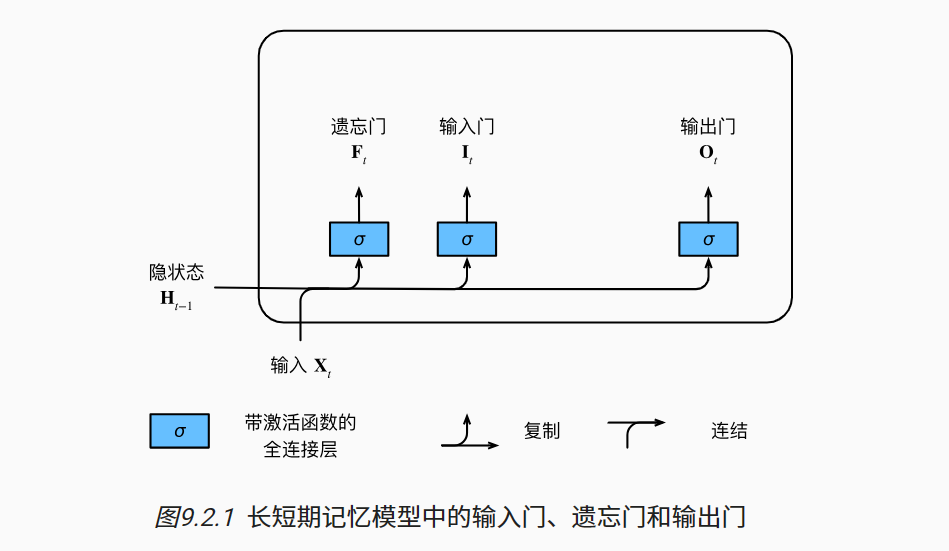
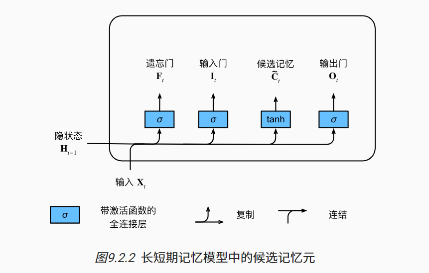
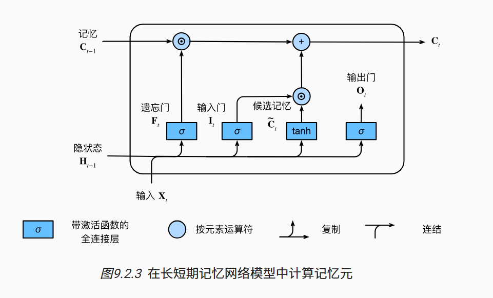

# LSTM 长短期神经网络

## 1 门

+   忘记门: Forget gate，将值朝0减少
+   输入门: Input gate：决定是否忽略掉输入数据
+   输出门: Output gate：决定是否使用隐藏状态

$$
\begin{align}
I_t = \sigma(X_tW_{xi} + H_{t-1}W_{hi} +b_i) \\
F_t = \sigma(X_tW_{xf} + H_{t-1}W_{hf} +b_f) \\
O_t = \sigma(X_tW_{xo} + H_{t-1}W_{ho} +b_o)
\end{align}
$$



和 GRU 差不多，也是三个激活函数为 sigmoid 的全连接层，因此 $F_t$、$I_t$、$O_t$ 三个门的值域为 $(0, 1)$

## 2 候选记忆单元

$$
C^{hat}_t = \tanh (X_tW_{xc} + H_{t-1} W_{hc} + b_c)
$$

和 RNN 里面计算隐状态 $H_t$ 的过程一样

$\tanh$ 的值域为 $[-1, 1]$，所以 $C^{hat}_t$ 也属于 $[-1, 1]$



## 3 记忆单元

$$
C_t = F_t \odot C_{t-1} + I_t \odot C^{hat}_t
$$

整体结构和 GRU 计算 $H_t$ 类似，可以参照理解

这里使用了两个门：

+   $F_t$ 控制保留旧的记忆单元 $C_{t-1}$ 内容的多少
+   $I_t$ 控制采用多少来自 $C^{hat}_t$ 的新数据

和 GRU 计算 $H_t$ 不一样的地方是：

+   在 GRU 中，是在 $H_{t-1}$ 和  $H^{hat}_t$ 之间做一个取舍，$Z_t$ 和 $1 - Z_t$，二者之间是没有办法共存的，取了一方一个数据，那另一方对应的数据就取不到。
+   而这里 $F_t$ 和 $I_t$ 之间没有任何关系，极端情况下，当二者都为0时，就会抛弃掉过去的记忆单元和当前的候选记忆单元，或者当二者都为 1 时，可以二者都取。当 $F_t == 1-I_t$时，这里就和 GRU 完全一样了




## 4 隐状态

$$
H_t = O_t \odot \tanh(C_t)
$$

问题1：**为什么这里要对 $C_t$ 做一次 $\tanh$？**

由上述公式可知：

1.   $C^{hat}_t$ 一定属于 $[-1 ,1]$
2.   $I_t $、$F_t$、$O_t$ 三者值域都属于 $[0, 1]$
3.   $C_t$ 的计算公式是递归公式，$C_t = \sum_{t=0}^n F_{t}(I_{t-1} \odot C^{hat}_{t-1})$
4.   所以 $C_t$ 值不一定属于 $[-1, 1]$

为了保证 $H_t$ 的值域同样为 $[-1,1]$，所以需要对 $C_t$ 再做一次 $\tanh$，将 $H_t$ 的值域压缩到 $[-1, 1]$ 

问题2：**这里 $O_t$ 的作用是什么？**

$O_t$ 也就是输出门，这里控制 $H_t$ 的存在

+   极端情况下，当 $O_t$ 全是 0 时，$H_t$ 会置为 0，将之前所有的状态都忘记，但是之前计算的 $C_{t}$ 会保留下来，作为下次计算的输入 $C_{t-1}$;
+   当 $O_t$ 接近 1 时，则会将保留的记忆信息 $C_{t}$ 更新为 $H_t$，并最后传递给预测部分

## 5 实现

### 1 导入依赖包和数据

```python
```

### 2 初始化模型参数

### 3 定义模型

### 4 训练和预测


