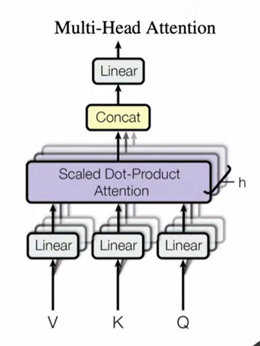

# Attention Is All You Need

特点：只使用了注意力机制

## 1 结构

编码器-解码器结构

### 1 编码器

编码器包括两个子层：

1. 多头自注意机制块
2. MLP：全连接前馈神经网络

每一个块的最后都做一次残差连接，然后做一个 Norm

子层公式：
$$
LayerNorm(x+Sublayer(x))
$$
超参数：

1. 编码器层数：6
2. 每一层维度：512

#### LayerNorm 和 BatchNorm

Norm 就是将 tensor 变成均值为 0 方差为 1

BatchNorm 就是将每一个特征，也就是 tensor 中的每一个列，进行 Norm

LayerNorm 就是将每一个样本，也就是每一个行，进行Norm

### 2 解码器

解码器和编码器类似

编码器是自回归的，也就是将上一时刻的输出，作为下一时刻的输入

超参：

1. 层数仍然为 6
2. 维度仍然为 512

子层：比编码器的子层多了一个

1. 多头自主注意力
2. 全连接前馈神经网络
3. 掩码多头自主意力：
   1. 因为编码器是自回归，所以在每一次训练时会输入上一时刻的输出
   2. 注意力机制中，每次是能看到完整的输入的
   3. 但是在 t 时刻的预测时，是不应该要看到 t 时刻之后的输入的，所以这里采用了一个掩码机制，将 t 时刻后的数据掩饰掉

## 2 注意力

注意力函数：将 query 和 key-value pair 映射成一个 output 的函数

1. query、key、value、output都是向量
2. output 其实是 value 的加权和，所以 output 的维度其实也就是 value 的维度
3. value 的权重，根据 key 和 query 的相似度计算而来

### 1 注意力机制

query 和 key 长度 $d_k$，value 长度 $d_v$

计算权重：

1. 对所有的query 和 key 做==内积==计算相似度 $p$
2. 相似度再除以 $\sqrt{d_k}$
3. 最后再做 softmax 计算出权重

注意力函数：
$$
Attention(Q, K, V) = \text{softmax}(\frac{QK^T}{\sqrt{d_k}})V
$$

+ $\text{softmax}(\frac{QK^T}{\sqrt{d_k}})$ 这一部分就是计算权重的过程

**为什么要除以$d_k$** 

当 $d_k$ 过大的时候，计算出来的点积就会要么很大或者要么很小，最后做出 softmax 后，大的点积就会趋近于1，小的点积就会趋近于 0，值向两端靠拢，导致计算出来的梯度过小，就会导致计算停止。为了避免这种情况，所以需要除以 $d_k$

### 2 Masked

Masked 主要为了防止训练的时候，在 t 时刻看到 t 时刻后面的东西，为了使训练和预测一致

首先照常将所有的$v_t$计算出来，在计算权重时，将 $q_t$和 $k_t$ 后面的值替换成**绝对值非常大的负数**，这样在经过 softmax 后，这些值都会变成0，这样那些时刻对应的 $v_t$ 就不会加上去了

## 3 Multi-Head

head 的数量为 $h = 8$

投影的维度 $d_k = d_v = d_{model}/h$

将单个注意力函数，替换成多个更低维度的注意力函数

1. 将Q，K， V投影到更低维度的三个向量，投影 h 次
2. 然后对这些低维的进行 h 次的注意力计算
3. 将每一个函数的输出并到一起，得到最后的输出

**为什么要做多头注意力机制**

因为如果是一整个QKV做内积，其中训练的参数只是一种

但是将QKV投影成 h 份更低维的，然后再进行 h 次内积，相当于独立进行了 h 个训练，可能会得到不同的 h 种参数，更能够匹配不同的模式

有点像卷积神经网络多个输出通道

## 4 三个 attention

### 4.1 编码器的 attention

假设句子长度为 n ，$p_n$ 大小为1

1. 输入：
   1. 输入则是 n 个 长为 d 的向量                                                                                                                                                                                                        
   2. 自注意力机制。将输入的向量复制为三份，分别作为Q，K，V来使用
2. 输出
   1. n 个 query 得到 n 个输出
   2. 输出是 value 的加权和，所以输出的维度 = 输入的维度
   3. 输出是 value 的加权和，权重是 query 和 key 的相似度，这里有 n 个输入，也就是说每次计算一个输出，就是对应的 query 和 所有的query 都进行相似度计算(因为 query 和 key 是相同数据，也就是自主意力嘛)
   4. 多头会导致学习出 h 个不一样的距离空间出来

### 4.2 解码器的 masked attention

### 4.3 解码器的 attention

## 面试题

\1. Transformer为何使用多头注意力机制？（为什么不使用一个头）
2.Transformer为什么Q和K使用不同的权重矩阵生成，为何不能使用同一个值进行自身的点乘？ （注意和第一个问题的区别）
3.Transformer计算attention的时候为何选择点乘而不是加法？两者计算复杂度和效果上有什么区别？
4.为什么在进行softmax之前需要对attention进行scaled（为什么除以dk的平方根），并使用公式推导进行讲解
5.在计算attention score的时候如何对padding做mask操作？
6.为什么在进行多头注意力的时候需要对每个head进行降维？（可以参考上面一个问题）
7.大概讲一下Transformer的Encoder模块？
8.为何在获取输入词向量之后需要对矩阵乘以embedding size的开方？意义是什么？
9.简单介绍一下Transformer的位置编码？有什么意义和优缺点？
10.你还了解哪些关于位置编码的技术，各自的优缺点是什么？
11.简单讲一下Transformer中的残差结构以及意义。
12.为什么transformer块使用LayerNorm而不是BatchNorm？LayerNorm 在Transformer的位置是哪里？
13.简答讲一下BatchNorm技术，以及它的优缺点。
14.简单描述一下Transformer中的前馈神经网络？使用了什么激活函数？相关优缺点？
15.Encoder端和Decoder端是如何进行交互的？（在这里可以问一下关于seq2seq的attention知识）
16.Decoder阶段的多头自注意力和encoder的多头自注意力有什么区别？（为什么需要decoder自注意力需要进行 sequence mask)
17.Transformer的并行化提现在哪个地方？Decoder端可以做并行化吗？
19.Transformer训练的时候学习率是如何设定的？Dropout是如何设定的，位置在哪里？Dropout 在测试的需要有什么需要注意的吗？
20解码端的残差结构有没有把后续未被看见的mask信息添加进来，造成信息的泄露。