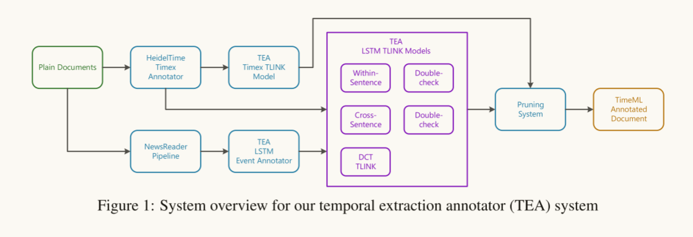
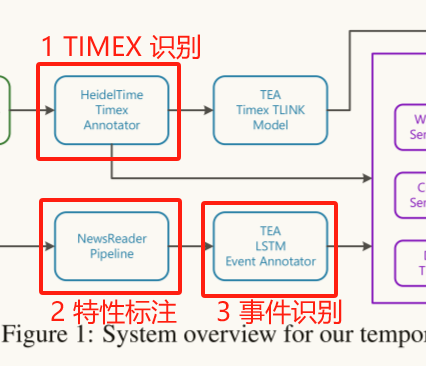
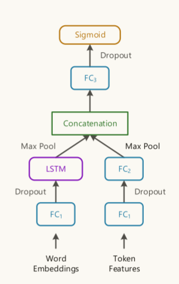
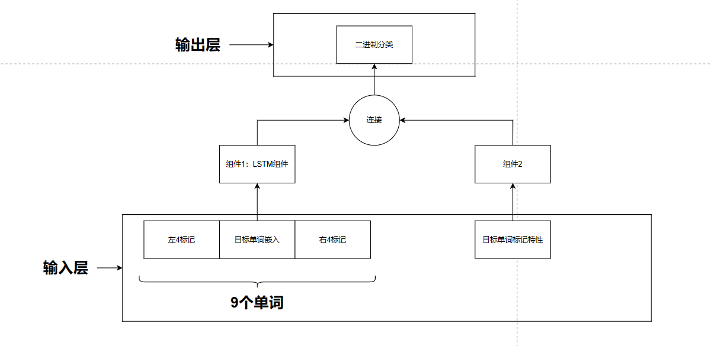
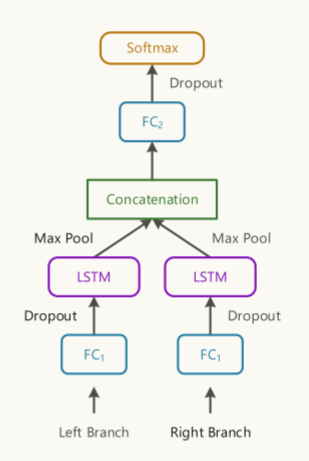
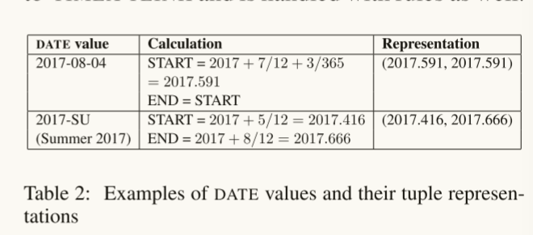
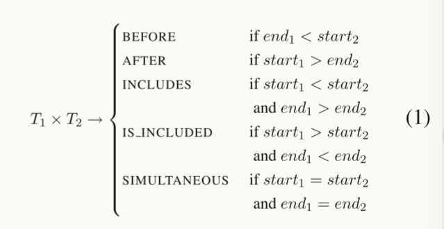

# Temporal Information Extraction for Question Answering Using Syntactic Dependencies in an LSTM-based Architecture

## 0 摘要

在本文中，我们提出了一套**简单的、统一的基于lstm的模型**来从文本中恢复不同类型的时间关系。**使用实体之间最短的依赖路径作为输入，实现相同的体系结构，提取句子内、句子间和文档创建时间关系**。

+   “**双重检查**”技术逆转了分类中的实体对，**提高了正向案例的召回率，减少了相反类别之间的错误分类**。
+   一种有效的**剪枝算法**可以全局解决冲突。
+   在**QA-TempEval** (SemEval2015 Task 5)上进行评估后，我们提出的技术大大优于目前最先进的方法。我们也在**Timebank-Dense**上进行了内在的评估和最新的结果。

数据集：

+   QA-TempEval
+   Timebank-Dense

## 1 结构

## 2 子任务

### 1 TIMEX 和 事件识别

也就是流程图中的 Annotator 模块

1.   使用HeidelTime软件包识别文章中的 TIMEX 公式

2.   使用NewsReader工具对文章进行标记、词性标注和依赖解析

3.   事件提取

     

     

### 2 时态关系分类

### 1 句子内

1.   受益于编码句法关系
2.   依赖树中的最短路径捕获上下文
     1.   左分支：源实体到最小共同祖先；
     2.   右分支：目标实体到最小共同祖先
3.   输入：单词嵌入
4.   LSTM处理单词序列——最大池化层
5.   两个分支的最大池化层的结果被连接并馈送到一个隐藏层
6.   softmax来产生类的概率分布

### 2 句子间

实体的时态关系来自：

1.   话语连接词
2.   自然顺序

模型类似5.1 中的模型

由于不同句子中的实体之间没有共同的根，所以我们使用实体和句子根之间的路径来构造输入数据。句子的词根通常是主要动词或连词。

### 3 文档创建时间

文档创建时间(DCT)自然充当“当前时间”。在本节中，我们讨论如何识别事件和DCT之间的时间关系。这里的假设是，事件的提及和它的本地上下文通常可以满足DCT TLINKs。

我们使用的模型再次类似于第5.2节中的模型。

虽然在本例中一个分支就足够了，但是我们在实现中使用了两个分支。

1.   一个分支处理从给定实体到句子根的路径
2.   另一个分支反向处理从根到实体的相同路径。

### 4 时间表达式之间的关系

时间表达式明确地表示一个时间点或一个时间间隔。如果没有TIMEX实体作为“中心”，许多事件将彼此隔离。我们**使用基于规则的技术**来识别已经被HeidelTime识别和规范化的TIMEX对之间的时间关系。DCT与其他时间表达式之间的关系只是TIMEXto-TIMEX TLINK的一种特殊情况，也用规则来处理。

在目前的实现中，我们主要关注TIMEX标记的DATE类，这在新闻专线文本中很常见。包含更多信息的**TIME类标签被转换为DATE**。**每个DATE值都映射到一个实数元组(start, end)**。**TIMEX标记的“value”属性遵循ISO-8601标准**，因此映射很简单。表2提供了一些示例。我们将**最小时间间隔设置为一天**。实际上，这样的处理对我们的数据已经足够了。将DATE值映射为实数元组后，可以定义5个TIMEX实体T1 = (start1, end1)和T2 = (start2, end2)之间的关系如下:

训练数据中的TLINKs包含的关系类型比公式1中描述的五种关系类型更多。但是，像IBEFORE(“紧接前”)、IAFTER(“紧接后”)和IDENTITY这样的关系只用于事件对，而不是TIMEX对。QA系统也不针对TIMEX对上的问题。这里的目的是使用TIMEX**关系来链接其他孤立的事件**。

