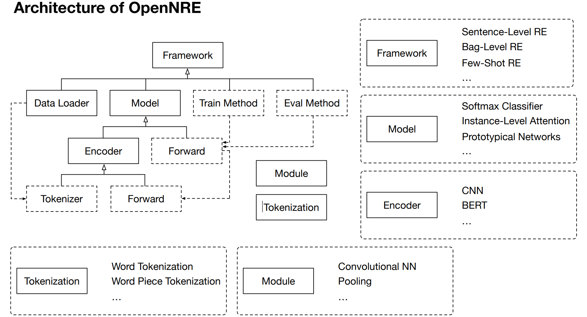

# 2 应用场景

## 2.1 面向实体的应用

**原文翻译**：

​		为了从纯文本中提取结构化信息，需要从文本中提取实体，然后预测实体之间的关系。在正常的正则场景中，所有提到的实体都已经被标注，正则模型只需要对所有标注实体对的关系进行分类。虽然面向实体的应用程序不是我们工具箱的重点，但我们仍然为NER (Lample等人，2016)和EL (Han等人，2011)实现了特定的模块。NER模块可以检测代表真实世界对象的单词或短语(也称为实体提及)。在OpenNRE中，我们为NER提供了两种方法，一种是基于spaCy，另一种是基于微调BERT (Devlin et al.， 2019)。EL模块可以根据TagMe (Ferragina和Scaiella, 2010)将这些实体提到与Wikidata (Vrandeˇci´c和Kr¨otzsch, 2014)中的实体对齐。

> **总结**:
>
> + OpenNRE提供了NER和EL
> + NER包含两种方法：
>   + **基于spaCy**
>   + *基于fine-tuning BERT
> + EL：**基于TagMe**，将实体与Wikidata对齐

# 3 Toolkit Design and Implementation

**四个目标**：

1. 对于系统封装，我们构建一个统一的底层平台来封装各种数据处理和训练策略，这样开发人员就可以最大限度地重用代码，避免不必要的冗余模型实现。
2. 为了提高运行效率，OpenNRE是基于TensorFlow和PyTorch的，这使得开发人员能够在gpu上训练模型。
3. 对于模型可扩展性，我们系统地实现了各种神经模块和一些特殊算法(如对抗训练(Wu et al.， 2017)和强化学习(Feng et al.， 2018))。因此，基于OpenNRE实现新的关系抽取模型是很容易的。
4. 我们还实现了一些典型的关系抽取模型，以便为特定的应用场景训练自定义模型。

## 3.1 Tokenization

标记化组件负责**将输入文本标记为几个输入标记**。

在OpenNRE中，我们实现了 **word-level tokenization** 和 **subword-level tokenization** 。这两个操作满足了大多数标记化需求，并帮助开发人员避免花费太多时间编写用于数据处理的胶水代码。

**为了构建新的tokenizer，扩展BasicTokenizer类并实现特定的标记化操作是很方便的。**

标记化组件负责**将输入文本标记为几个输入标记**

实现操作：

+ word-level tokenization
+ subword-level tokenization

## 3.2 Module

模块组件由用于模型实现的各种**功能神经模块**组成，如基本的网络层、一些池化操作和激活函数。为了使这些模块适应关系抽取场景，我们还实现了一些特殊的关系抽取神经模块(如**分段池操作 (piece-wise pooling operation)**(Zeng et al.， 2015))。使用这些原子模块构建和部署关系抽取系统具有高度的自由度。

模块组件由用于模型实现的各种**功能神经模块**组成

+ 基本网络成
+ 池化操作
+ 激活函数
+ 特殊的关系抽取神经模块
  + 分段池操作 (piece-wise pooling operation)

## 3.3 Encoder

该编码器用于**将文本编码成相应的嵌入文本，以提供语义特征**。在OpenNRE中，我们实现了基于令牌化和模块组件的BaseEncoder类，它可以提供文本令牌化和嵌入查找的基本功能。通过扩展BaseEncoder类并实现特定的神经编码体系结构，我们可以实现各种特定的编码器。在OpenNRE中，我们实现了常见的卷积和递归神经编码器，以及预训练的编码器BERT。

该编码器用于**将文本编码成相应的嵌入文本，以提供语义特征**。

BaseEncoder：

+ 基于tokenization
+ 模型组件
+ 能提供文本标记化和嵌入