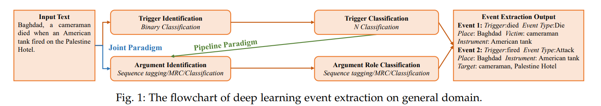
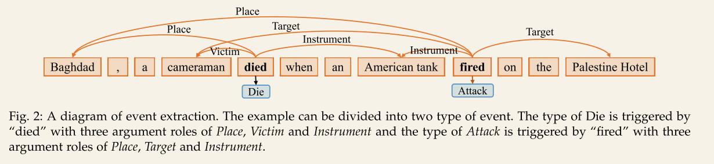

# 1 介绍

**事件提取任务**旨在将此类事件信息**从非结构化的纯文本中提取成结构化的形式**，这种形式主要描述真实世界事件的“谁、何时、何地、什么、为什么”和“如何”发生。

+ 要抽取的要素为：
  + 人物(who)、时间(when)、地点(where)、内容(what & how)、原因(why)

事件提取可以分为两组:

+ 闭合域事件提取[13]、[14]、[15]

+ 开放域事件提取[16]、[17]、[18]。

**事件通常在预定义的事件模式中考虑**，在该模式中，一些特定的人和对象在特定的时间和地点进行交互。

**闭域事件抽取任务**的目标是**找到属于特定事件模式的词**，即发生的动作或状态变化，其抽取目标包括时间、地点、人物、动作等。

**在开放式域事件提取任务**中，事件被视为主题的一组相关描述，这些描述可以表示为一个分类或聚类任务。开放域事件提取是指获取与特定主题相关的一系列事件，通常由多个事件组成。

无论是封闭域还是开放域事件提取任务，事件提取的目的都是**从大量文本中捕获我们感兴趣的事件类型，并以结构化的形式显示事件的基本论元**。

**一般领域的深度学习事件提取**有很多工作要做，已经成为一个比较成熟的研究分类。它从文本中发现事件提及(event mentions)，并提取包含事件触发器和事件论元的事件，其中事件提及被称为包含一个或多个触发器和论元的句子。

事件提取需要**识别事件**、**对事件类型进行分类**、**识别论元和判断论元角色**。

具体来说，

+ **触发器识别**和**触发器分类**通常形成**事件检测任务**[19]、[20]、[21]、[22]
  + **触发器分类**是一个多分类[23]、[24]、[25]任务，**对每个事件的类型进行分类**。
+ 而**论元识别**和**论元角色分类**通常定义为**论元提取任务**。
  + **角色分类任务**是基于词对的多类分类任务，**确定句子中任意一对触发器与实体之间的角色关系**。

从技术角度来看，**事件抽取**可以依赖于一些其他的基础自然语言处理(NLP)任务，如**命名实体识别**(NER)[26]、[27]、[28]、**语义解析**[29]、[30]、[31]，以及**关系抽取**[32]、[33]、[34]。

一般域上深度学习事件提取的流程图

事件提取是查找焦点事件类型，并提取其参数及其角色。

对于**管道范式事件提取(pipeline paradigm event extraction)**

1. 需要区分给定文本文本中的事件类型，称为触发器分类。
2. 针对不同的事件类型，设计了不同的事件模式。
3. 根据模式提取事件论元，包括论元标识和论元角色分类子任务。
   + 在早期，论元角色分类被认为是一项**词汇分类任务**，对文本中的每个词汇进行分类。
   + 还有序列标记(sequence labeling)
   + 机器阅读理解(machine reading comprehension, MRC)
   + 序列-结构生成方法(sequence-to-structure generation methods)。

对于**联合范式事件提取(joint paradigm event extraction)**，该模型**同时对事件类型和论元角色进行分类**，以避免来自触发器分类子任务的错误。

## 1.1文章贡献

基于深度学习模型[18]、[35]、[36]的事件提取方法。

基于Transformer的事件提取方法[37]得到了显著的改进

此外，事件提取方法：

+ 分类和序列标注方式[38]，[39]，[40]，
+ 机器阅读理解和生成[41]，[42]

表1：根据出版年份总结了深度学习模型的必要信息。

表2：总结了主要数据集的必要信息。

表4：总结了ACE 2005数据集上的事件提取准确性得分和事件提取应用

## 1.2 文章结构

文章的其余部分组织如下：

第2节：事件提取的概念和任务定义

第3节：已有的与事件提取相关的范式，包括基于管道的方法和基于联合的方法，构成了一个汇总表

第4节：对传统事件提取和基于深度学习的事件提取并进行了比较

第5节：不同场景下的事件提取

第6节和第7节：事件提取主流语料库和度量

第8节：经典事件提取数据集中主要模型的定量结果

第9节和第10节：事件提取的应用和事件提取的主要挑战

第11节：文章总结

# 2 准备

介绍当前事件抽取研究中的概念、子任务和模型方法。

## 2.1 概念

事件表示动作或状态变化的发生，通常由动词或动名词驱动。它包含动作所涉及的主要成分，如时间、地点和人物角色。

事件提取技术从非结构化文本中提取用户感兴趣的事件，并以结构化形式[39]呈现给用户。简而言之，**事件提取检测事件及其类型，并从文本中提取核心论元**

事件抽取涉及许多前沿学科，如机器学习、模式匹配、自然语言处理等。

通常，自动内容提取(Automatic Content Extraction， ACE)描述了一个事件提取任务，该任务包含以下术语:

+ 实体(Entity:):实体是语义范畴中的一个对象或一组对象。实体主要包括人、组织、地点、时间、事物等。
  + 在图2中，“巴格达”、“摄影师”、“美国坦克”、“巴勒斯坦旅馆”这几个词是实体。
+ 事件提及(Event mentions):描述事件的短语或句子包含一个触发器和相应的论元。
+ 事件类型(Event type):事件类型描述了事件的性质，指的是事件对应的类别，通常由事件触发器的类型表示。
  + 对于图2中的句子，它包含了Die和Attack事件类型。
+ 事件触发器(Event trigger):事件触发器是指事件提取的核心单位，动词或名词。**触发器识别是基于流水线的事件提取的关键步骤。**
  + 对于图2中的Die事件，事件触发是“死亡”。
+ 事件论元(Event argument:):事件论元是事件的主要属性。它包括实体、非实体参与者和时间等等。
  + 对于图2中的事件Die，事件论元为“巴格达”、“摄像师”、“美国坦克”。
+ 论元角色(Argument role):论元角色是事件中论元所扮演的角色，即事件论元与事件触发器之间的关系表示。
  + 对于图2中死亡事件的论元“巴格达”，论元的角色是Place。

## 2.2 子任务

事件提取包括四个子任务:**触发器分类、触发器标识、论元标识和论元角色分类**

+ 触发器识别(Trigger identification):一般认为触发器是事件提取的核心单元，能够清晰地表达事件的发生情况。触发器识别子任务是**从文本中查找触发器**。
  + 在图2中，触发器识别是指识别触发器“死亡”和“开火”。

+ 触发器分类(Trigger classification):触发器分类是**根据已有的触发器来判断每个句子是否为一个事件**。此外，如果句子是一个事件，我们需要**确定句子属于一个或几个事件类型**。
  + 以图2为例，子任务的目标是将触发器的事件类型划分为“死亡”和“开火”，分别对应Die和Attack。
  + 因此，**触发器分类子任务可以看作是一个多标签文本分类任务**。

+ 参数标识(Argument identification):参数标识是**从文本中标识事件类型中包含的所有论元**。**参数识别通常取决于触发分类和触发识别的结果**。
  + 以图2中的Die事件为例，论元识别是提取单词 “Baghdad” ， “cameraman” 和 “American tank”。

+ 参数角色分类(Argument role classification):参数角色分类**基于事件提取模式中包含的论元，并且根据识别的论元对每个论元的类别进行分类**。
  + 对于从图2中提取的单词，如“cameraman”，这个子任务是将单词分类到Object类别中。
  + 因此，它也可以看作是一个**多标签文本分类任务**。

## 2.3事件提取方式

事件抽取是信息抽取中很有代表性的一个热门话题，它研究如何从包含事件信息的非结构化文本(新闻、博客等)中抽取特定类型的事件信息。

可以将其简化为**多分类任务**，这些任务**确定每个实体所属的事件类型和论元角色**。

+ 图2中的cameraman一词，基于分类的方法是将其在给定的角色集合中属于哪个论元角色进行分类。

+ 该分类方法**依赖于命名实体识别(Named Entity Recognition, NER)**，导致**错误信息传播**

在此基础上，提出了一种**基于序列标记(sequence labeling)**的事件抽取方法，该方法对每个论元的起始位置和结束位置进行标记。基于序列标记的方法在`BIO`中给出了一个单词“cameraman”的标签，其中B代表“开始”，I代表“内部”，O代表“外部”。事件抽取的任务比较复杂，论元之间关系密切。采用机器阅读理解(MRC)进行联想学习，通过问答对找出每个论元。基于mrc的方法生成一个问题为论元的角色，如对象，该模型是寻找论元的角色扮演的对象。因此，事件抽取任务可以看作是分类任务、序列标记任务和机器阅读理解任务。最近，一些作品专注于使用生成方式[43]，[44]。这四个任务的详细定义如下: