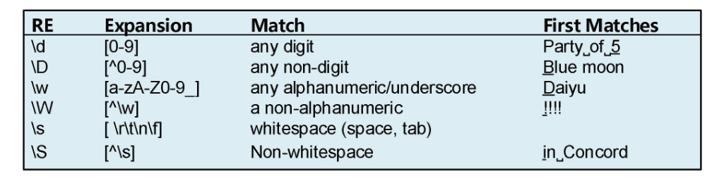
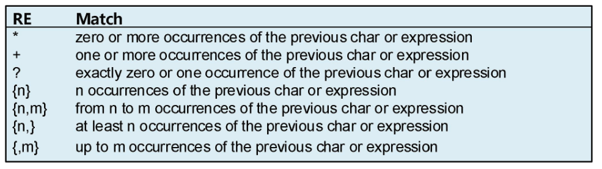
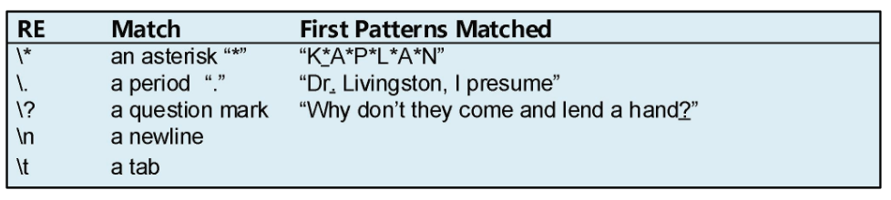
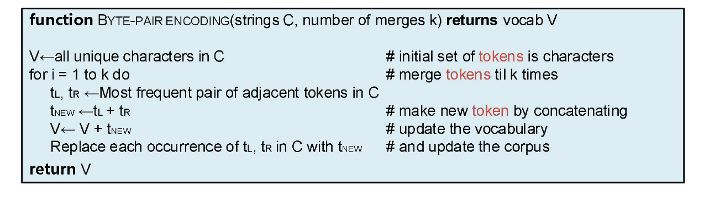

**正则表达式**：描述文本模式的重要工具

**文本规范化**：

+ 符记化任务：从句子中分离出单词
  + 英语主要根据空降将单词分开标记
+ 词形还原：识别单词是否具有相同的词根
  + 词干化：从单词的末位将词缀去除
+ 句子分段：根据句点和感叹号将句子分割出不同段落

**编辑距离**：采用一个字符串转变成另一个字符串需要经历的编辑（插入、删除、替换）次数，来衡量单词与字符串之间的相似度

## 2.1 正则表达式

### 2.1.1 正则表达式基本形式

1. 最简单形式-一系列简单字符串：包含单个字符或一个字符序列
   + ==**正则表达式区分大小写**==
2. 方括号`[]`：指定要匹配的字符的析取
   + `[sS]`：匹配字符`s`或者字符`S`——忽视大小写的匹配方法
   + `[wW]orld`，匹配字符串`world`或者`World``
   + ``[1234567890]`：匹配任意数字
3. 破折号`-`：与方括号`[]`配合使用，用于匹配指定范围内的任意字符
   + `[0-9]`：匹配任意数字
   + `[a-z]`：匹配任意小写字母
   + `[A-z]`：匹配任意大写字母
4. 插入符号`^`：
   1. 在方括号中使用-`[^ ]`-==**位置在方括号内第一个字符**==：取反，匹配到第一个非后续字符串的序列
      + `[^a]`：匹配第一个不是`a`的字符
      + `[^aA]`：匹配不是`a`或`A`的字符
      + `[^a-z]`：匹配第一个不是小写字母的字符
   2. 匹配行的开头
      + `^a`：匹配在行首的字符`a`
   3. 仅表示插入符号-当`^`不是方括号中的第一个字符时：
      + `[a^]`：匹配`a`或`^`
      + `a^b`：匹配字符串`a^b`
5. 计数字符`?`：前一个字符的零个或一个实例 
   + `cats?`：匹配`cat`或`cats`
   + `colou?r`：匹配`color`或`colour`
6. 计数字符kleene`*`：表示前一个字符或正则表达式出现零次或多次
   + `as*`：匹配`a`、`as`、`ass`、`asss`、...
7. 计数字符kleene`+`：表示前一个字符或正则表达式出现一次或多次
   + `s+`：匹配`s`、`ss`、`sss`、...
8. 通配符`.`：匹配回车符之外的任意字符
   + `wonde.ful`：匹配任何开头为`wonde `，结尾为`ful`的任意字符串，比如`wonderful`、`wonde·ful`、`wondeaful` 
   + `.*`：表示任意字符串
     + `have.*trees`：匹配任何开头为`have`末位为`trees`的字符串
9. 定位符`^`：匹配行的开头
10. 定位符`$`：匹配行的末位
11. 定位符`\b`：匹配单词边界
12. 定位符`\B`：匹配非单词边界

### 2.1.2 析取，分组和优先

1. 析取符号`|`：也叫管道符号，表示或
   1. `cat|dog`：匹配`cat`或`dog`
   2. `gupp(y|ies)`：匹配`guppy`或`guppies`
2. 括号操作符`()`：选定一个模式
   1. 与kleene `*`配合使用：kleene`*`默认只对前一个字符生效，配合`()`，可以对前面一个模式生效
      + `(abc)*`：匹配零个或多个`abc`
      + `(column [0-9]+ *)*`：匹配单词`colu++++++++++-+mn`后跟数字和可选空格，这个模式匹配零次或多次
3. 优先级
   1. 括号：`()`
   2. 计数器：`?`,`*`,`+`,`{`,`}`
   3. 序列和定位符：`the ^my end$`
      + `the`这些字符是序列
      + `^`和`$`是定位符
   4. 管道符号：`|`
4. **==正则表达式的模式匹配是贪心的(greedy)==**
   1. 如果有多个可以匹配的结果，正则表达式始终匹配其能匹配到的最长字符串
   2. 可以使用`?`操作符来限制贪心匹配
      1. `*?`：kleene星号，匹配的字符越少越好
      2. `+?`：kleene加号，匹配的字符越少越好

### 2.1.3 一个简单例子

题目：查找单词the

1. 最简单的模式

   ```c++
   the
   ```

   

2. 漏了The的情况

   解决方法：增加大写字母判定

   ```c++
   [Tt]he
   ```

   

3. 当the是一个单词的组成部分时，错误查找，比如there，other等

   解决方法：增加单词边界判定

   ```c++
   \b[tT]he\b
   ```

   

4. 上述情况，不使用`\b`时

   `[tT]he`单词前后不能有其他字母，也就是说[`tT]he`单词前后应该是非字母字符

   ```c++
   [^a-zA-Z][tT]he[^a-zA-Z]
   ```

   

5. 上述步骤，会导致，当the处于行首或者行末时会匹配不到结果

   解决方法：增加行首和行末的判定

   ```c++
   (^|^[a-zA-Z])[tT]he(^[a-zA-Z]|&)
   ```

   注意：第一个`^`符号是行首定位符

> 上述步骤修复了两种错误：
>
> + 假阳性：第三步前，other或there是错误的答案，却被当成正确答案查找到
> + 假阴性：第一步前，The是正确答案，却被当成错误答案筛选掉
>
> 降低应用系统的总错误率，就是减少这两种错误：
>
> + 提高精度(最大程度减少假阳性)
> + 增加召回率(最大程度减少假阴性)

### 2.1.4 其他字符

1. 常见字符集的别名



2. 用于计数的正则表达式操作符



3. 一些需要反斜杠的字符(转义字符)



### 2.1.5 更复杂的例子

题目：假设我们需要构建一个应用程序来帮组用户购买Web上的计算机。用户可能希望“任何具有6GHz频率和500GB磁盘空间且价格低于\$1000的机器”。我们需要查找6GHz或500GB或Mac或\$999.99的表达式

例子：匹配价格的正则表达式

1. 一个简单模式

   ```c++
   $[0-9]+\.[0-9][0-9]
   ```

2. 这个无法匹配没有小数的整数价格

   解决方法：将小数点后数字变成可选

   ```c++
   $[0-9]+(\.[0-9][0-9])?
   ```

3. 设置边界 - (不太理解为什么开头是`\W`)

   ```c++
   [^|\W]$[0-9]+(\.[0-9][0-9])?\b
   ```

4. 限制金额，题目中是价格低于1000，所以要求数字的整数部分应该是0-999

   解决方法：使用`{n, m}`替换`+`

   ```c++
   $[0-9]{0, 3}(\.[0-9][0-9])?
   ```

问题一：磁盘空间的正则表达式

1. 简单的模式

   ```c++
   [0-9]+\.[0-9]+[A-Z][A-z]
   ```

2. 匹配无小数和一位小数的情况

   ```c++
   [0-9]+(\.[0-9]{1, 2})?[A-Z][A-z]
   ```

3. 确定字母部分 GB 或者是 Gigabyte 或者是 gigabyte 或者是 Gigabytes 或者是 gigabytes

   ```c++
   [0-9]+(\.[0-9]{1, 2})?(GB|[Gg]igabytes?)
   ```

4. 在数字和字母之间存在空格的情况

   使用` *`来匹配0到多个空格

   ```c++
   [0-9]+(\.[0-9]{1, 2})? *(GB|[Gg]igabytes?)
   ```

5. 确定词边界

   ```c++
   \b[0-9]+(\.[0-9]{1, 2})? *(GB|[Gg]igabytes?)\b
   ```

问题二：修改上述正则表达式，使其仅匹配大于500GB的情况

上述表达式`\b[0-9]+(\.[0-9]{1, 2})? *(GB|[Gg]igabytes?)\b`

解决思路：仅大于500GB，也就是整数部分要大于等于500

也就是第一数位数值大于等于5，之后的数位的个数大于等于2

```c++
\b[5-9][0-9]{2,}(\.[0-9]{1, 2})? *(GB|[Gg]igabytes?)\b
```

### 2.1.6 替换，捕捉组和ELIZA

**替换(substitution)**

作用：使用替换操作符将以正则表达式为特征的一个字符串替换成另一个字符串

语法：`s / regexp1 / pattern /`

`s/被替换的字符串/替换字符串`

**捕捉组**

使用括号将模式存储在内存中(被圆括号括起来的部分)被称为捕捉组，每一个捕捉组对应一个匹配项(也就是编号)，放在编号寄存器中，匹配项从`\1`开始，第二个捕捉组对应`\2`，以此类推

> 捕捉组中的pattern会被存储在寄存器中，可以使用`(?:`将捕捉组变成非捕捉组，防止将模式防止寄存器中

例子：

捕捉组和匹配项的操作可以用来指定某个字符必须在文本中出现两次

例子：`the(.*)er they were, the \1er they will be`


`the(.\*)er they(.\*), the \1er we \2`

这里的`\1`匹配的是第一个捕捉组，`\2`匹配的是第二个捕捉组


括号的作用不只是创建捕捉组，还能用来对术语分层，以指定操作符的使用顺序

如果只是想使用分组作用，则需要在括号内部开始的部分添加字符`?:`

语法：`(? : pattern)`

例子：`(?:some|a few)(people|cats) like some \1`

这里的匹配项`\1`只能匹配到第二个括号中的`people|cats`，而不会匹配到第一个括号中的`some|a few`

### 2.1.7 Lookahead Assertions

`(?`语法

作用：匹配但不保存匹配结果（这个保存结果，就是捕捉组将模式保存在寄存器中，以供以后使用）

+ `(?: pattern)`：匹配结果，但不保存匹配的结果，作用为将捕捉组变成非捕捉组，使括号只是起到对术语分组的功能

+ `(?=pattern)`：Lookahead Assertion，当模式匹配到之后，在匹配pattern的字符串开始处，从左往右匹配查找字符串

  + 例如，字符串为：`abcdefgh`

    正则表达式为：`.(?=def)..`

    匹配结果为`cde`

    1. 匹配，首先先在字符串中匹配字符`def`

    2. 查找，从匹配的开始处字符`d`，开始正向查找，

       对第一个通配符`.`，也就是在`(?=def)`之前的`.`，匹配到`c`

       对后两个通配符`..`，也就是在`(?=def)`之后的俩`.`，匹配到`de`

+ `(?!pattern)`：negative Lookahead Assertion

  + 例子：字符串`asdadg`

    正则表达式为：`d(?!a)`

    匹配后面没有`a`的d

+ `(?<=pattern)`：Lookbehind Assertion，当模式匹配到之后，在匹配pattern的字符串开始处，从右往左匹配查找字符串

+ `(?<!)`：negative Lookbehind Assertion

## 2.2 单词

单词的定义：

根据研究的方向是否需要，而确定语句中某些单词是否需要被认为是单词

有一些值得考虑的点：

+ 标点符号是否被认为是单词
  + 词类标记、语法分析或语音合成时，有时把标点符号认为是相同单词
+ 大小写符记是否被认为是相同单词
  + 比如`they`和`They`
  + 词类或命名实体标记时，大写被认为是有用特性而需要被保留
+ 不流利填充符是否被认为是单词
  + 比如`uh`和`um`之类的口语中的停顿，或者是汉语口语中的`那个`，`额`之类的停顿
  + 在语音识别中通常被认为是常规单词
+ 不同词形相同词源的单词是否被认为是相同单词
  + 对于形态复杂的语言，需要处理词形还原
  + 对于许多英语任务，不太需要

一些关键字：

+ **语料库(corpus，复数形式为corpora)**：计算机可读的文本和语音集合
+ 语段(utterance)
+ 不流利(disfluency)：口语中片段或者是填充停顿符，被认为是不流利
+ 片段(fragment)：口语中不完整的单词
+ 填充符或填充停顿符(filled pause)：表示停顿的词语 ，比如uh或um
+ **词元(lemma)**：一组具有相同词干、相同主要词类和相同词义的单词形式
+ **词形(wordform)**：是单词的全部变形或派生形态
+ **类型(types)**：语料库中不同单词的数量——语言中单词数量的度量
  + 另一个度量是词元数量
+ **符记(token)**：全部的N个正使用的单词

## 2.3 语料库

能通过语料库创建者建立的**数据表**或数据声明来了解一个语料库的详细信息

## 2.4 文本规范化

在对文本进行自然语言处理之前，必须要进行文本规范化

**文本规范化的三个任务：**

1. 符记化(分段)单词
2. 规范单词格式
3. 分割句子

### 2.4.1 用于粗糙符记化和规范化的Unix工具

三个工具：

+ `tr`：转换或删除输入的字符
+ `sort`：按字母排序对输入行进行排序
+ `uniq`：检查删除重复行

词数统计：

1. 分割单词

   ```shell
   tr -sc 'A-Za-z' '\n' < sh.txt
   ```

   `tr`用于转换和删除字符串：

   语法：`tr [option] [section1] [section2]`

   `-c`：反选，对除了[section1]中的字符选中

   `-s`：将多个字符压缩成一个

   所以，这行代码的意义为，将文本中非字母字符转换为换行符

   也就是把文本的样式变成：一个单词一行

2. 对词按照以字母排序，并统计                                                                                                                                                                                                                                                                                                                                                                                                                                                                                                                                                                                                                                                                                                                                                                                                                                                                                                                                                                                                                                                                                                                                                                                                                                                                                                                                                                                                                                                                                                                                                                                                                                                                                                                                                                                                                                                                                                                                                                                                                                                                                                                                              

   ```c++
   tr -sc 'A-Za-z' '\n' < sh.txt | sort | uniq -c
   ```

   `sort`：按照字母排序

   `uniq`：检查删除重复行

   `-c`：计算重复的行数

   先将文本按照字母排序，然后将结果传递给`uniq -c`，统计单词重复次数

3. 对单词按照数字排序 

   ```c++
   tr -sc 'A-Za-z' '\n' < sh.txt | sort | uniq -c | sort -n -r
   ```

   `sort` :
   
   `-n`：按照数字排序
   
   `-r`：排序结果反转（排序结果从大到小）
   
   

### 2.4.2 单词符记化

单词符记化是NLP在处理文本前，要做的预处理

主要是关于字符单元的选择问题，根据自己NLP需要处理的方向，确定字符要不要处理，要怎么样处理；其次，符记是按照单词，还是按照单词的词素；最后如果是汉语自然语言处理，还需要考虑处理的最小单元是词还是字

+ 非字母字符
  + 需要保留标点符号的原因
    + 逗号是解析器有用信息
    + 句号作为句点边界
    + 想要保存在内部的标点符号，比如价格中的小数点，日期中的斜线等
    + 附着词
  + 难点：
    + 标点符号的多义
      + 比如，逗号可以是句子的分割点，也可以是数字中，每三位的分割点
      + 在其他语言中，逗号拥有更多其他的意思
    + 不同标点符号需要不同的处理
+ 非英语字母
  + 中文：采用字符输入而不是单词输入
  + 泰语和日语：分词算法

### 2.4.3 符记化的字节对编码

使用数据自动地告诉我们应该需要什么符记，而不是将符记定义为单词或字符

**针对未知单词的解决方法：**

符记器自动归纳出一些粒度更小的**子单词(subword)**

子单词可以是任意的字符串，也可以是影响单词意思的一些单元(比如`-est`、`-er`后缀等)

当出现未知单词时，未知单词可以由这些已知的子单元序列组合表示

**三种自动符记化算法：**

+ **byte-pair encoding**(Sennrich et al., 2016)
+ **unigram language modeling**(Kudo, 2018)
+ **WordPiece**(Schuster和Nakajima, 2018)

一个实现：

+ **SentencePiece库**(Kudo和Richardson, 2018)
  + 实现了byte-pair encoding和unigram language modeling

#### **字节对编码(byte-pair encoding， BPE)**

BPE算法的符记学习器部分

翻译：

```python
# 方法 字节对编码(字符串 C, 合并数量 K) 返回 词汇 V
function BYTE-ENCODING(string C, number of merges k) return vocab V
# V = 所有字符串C中的单个字母
V <- all unique characters in C
# 循环k次
for i = 1 to k do
	# C中出现频次最多的字节对
    tL,tR <- Most frequent pair of adjacent tokens in C
    # 合并两个字节为一个单元
    tNew <- tL + tR
    # 将新单元加入到V中
    V <- V + tNew
    # 替换掉所有的C中出现的tL,tR字节对
    Replace each occurrence of tL,tR in C with New
return V
```

原论文代码（[Neural Machine Translation of Rare Words with Subword Units](https://arxiv.org/abs/1508.07909)）：

```python
import re, collections

# 作用：统计vovab中的所有出现的字节对出现的频率，并将统计结果存储在一个字典中返回
# 输入：
	# vocab：字典{词汇:词汇出现的频率}
# 输出 
	# pairs: 字典{字节对：字节对出现的频率}
def get_stats(vocab):
    pairs = collections.defaultdict(int)# 创建一个有默认值的字典 数据类型是int 所以默认值为0 pairs = {defaultdict:0} defaultdict(<class'int'>,{})
    for word, freq in vocab.items():
        symbols = word.split()# 以空格分割字符
        for i in range(len(symbols) - 1): # 将字符串中相邻字符两两组合，组成字节对，字节对为键，字节对出现的次数为值 
            pairs[symbols[i], symbols[i + 1]] += freq
    return pairs

# 作用：
	# 将v_in中的所有的pair连接到一起
	# 将vocab中出现最多频次的键值对合并
# 输入：
    # pair：字节对
    # v_in：字典{}
def merge_vocab(pair, v_in):
    v_out = {}
    str1 = ' '.join(pair)
    print(str1)
    bigram = re.escape(' '.join(pair))
    print(bigram) # e\ s
    p = re.compile(r'(?<!\S)' + bigram + r'(?!\S)')
    print(p)# re.compile('(?<!\\S)e\\ s(?!\\S)')
    for word in v_in:# 这个循环是不断将每次找出的最多的字节对合并
        w_out = p.sub(''.join(pair), word)# p中有正则表达式/(?<!\\S)e\\ s(?!\\S)/ 也就是/(?<!\S)e\ s(?!\S)/ 也就是匹配字符串/e s/
                                    # /(?<!\S)e/：匹配e
                                    # /\\space/：匹配空格
                                    # /(?!\S)s：匹配s
                                # 将word中的p中正则表达式匹配的字符给替换成str
                                # 也就是将word中的/e s/替换成/es/
        v_out[w_out] = v_in[word]
    return v_out


vocab = {'l o w </w>': 5, 'l o w e r </w>': 2,
         'n e w e s t </w>': 6, 'w i d e s t </w>': 3}
num_merges = 10
for i in range(num_merges):
    pairs = get_stats(vocab)
    best = max(pairs, key=pairs.get)
    vocab = merge_vocab(best, vocab)
    print(best)

# output：
# ('e', 's')
# ('es', 't')
# ('est', '</w>')
# ('l', 'o')
# ('lo', 'w')
# ('n', 'e')
# ('ne', 'w')
# ('new', 'est</w>')
# ('low', '</w>')
# ('w', 'i')、

# 算法理解：
# 第一步是统计每个键值对出现的频次
# 第二步是将出现频次最多的字符合并成字节对，替换原字典中的相应键值对
# 重复一二步k次
```

> 1. 使用`collections.defaultdict(数据类型)`创建有默认值的字典
>
> 2. 使用`bigram = re.escape(' '.join(pair))`和
>
>     `p = re.compile(r'(?<!\S)' + bigram + r'(?!\S)')`
>
>    `w_out = p.sub(''.join(pair), word)`
>
>    处理特殊字符

### 2.4.4 单词规范化，词形还原和词干化

**单词规范化：**将单词/符记置于标准格式中，为具有多种形式的单词，选择单一的形式的任务


**大小写折叠：**将大小写相同的单词，统一为相同单词，比如将所有单词小写化


**词形还原：**将形式不同，词根相同的


**词干化：**


**porter词干分析器**

```python
#!/usr/bin/env python

"""Porter Stemming Algorithm
This is the Porter stemming algorithm, ported to Python from the
version coded up in ANSI C by the author. It may be be regarded
as canonical, in that it follows the algorithm presented in

Porter, 1980, An algorithm for suffix stripping, Program, Vol. 14,
no. 3, pp 130-137,

only differing from it at the points maked --DEPARTURE-- below.

See also http://www.tartarus.org/~martin/PorterStemmer

The algorithm as described in the paper could be exactly replicated
by adjusting the points of DEPARTURE, but this is barely necessary,
because (a) the points of DEPARTURE are definitely improvements, and
(b) no encoding of the Porter stemmer I have seen is anything like
as exact as this version, even with the points of DEPARTURE!

Vivake Gupta (v@nano.com)

Release 1: January 2001

Further adjustments by Santiago Bruno (bananabruno@gmail.com)
to allow word input not restricted to one word per line, leading
to:

release 2: July 2008
"""

import sys

class PorterStemmer:

    def __init__(self):
        """The main part of the stemming algorithm starts here.
        b is a buffer holding a word to be stemmed. The letters are in b[k0],
        b[k0+1] ... ending at b[k]. In fact k0 = 0 in this demo program. k is
        readjusted downwards as the stemming progresses. Zero termination is
        not in fact used in the algorithm.
        词干提取算法的主要部分从这里开始
        b是保存单词词干化的缓存区。字母保存在b[]列表中，下标从k0,k0+1,...一直到k
        在这个演示程序中，k0 = 0
        k随着词干化进程逐渐向下调整。0端在算法中并未实际使用

        Note that only lower case sequences are stemmed. Forcing to lower case
        should be done before stem(...) is called.
        注意：只有小写序列被词干化。所以应在词干化程序调用前，将单词序列小写化
        """

        self.b = ""  # buffer for word to be stemmed 保存单词词干化的缓存区
        self.k = 0   # b列表终点
        self.k0 = 0  # b列表起点
        self.j = 0   # j is a general offset into the string 字符串的一般偏移量

    def cons(self, i):
        """cons(i) is TRUE <=> b[i] is a consonant."""
        """cons(i) 判断b[i]是否是一个辅音"""
        """英语对应的元音字母有5个：a, e, i, o, u"""
        if self.b[i] == 'a' or self.b[i] == 'e' or self.b[i] == 'i' or self.b[i] == 'o' or self.b[i] == 'u':
            return 0
        """y在元音前是辅音，在辅音后是元音，所以
        如果 y在单词序列的第一位，则y一定是辅音
        如果 y不在单词序列的第一位，则当y前一位是元音时，y为辅音；y前一位是辅音时，y为元音
        """
        if self.b[i] == 'y':
            if i == self.k0:
                return 1
            else:
                return (not self.cons(i - 1))
        return 1

    def m(self):
        """m() measures the number of consonant sequences between k0 and j.
        if c is a consonant sequence and v a vowel sequence, and <..>
        indicates arbitrary presence,
        m()测量k0到j之间的辅音序列数
        如果c代表一个辅音序列，v代表一个元音序列
        <..>表示任意存在

           <c><v>       gives 0
           <c>vc<v>     gives 1
           <c>vcvc<v>   gives 2
           <c>vcvcvc<v> gives 3
           ....
        """
        n = 0 # 辅音序列数
        i = self.k0
        # 遍历辅音序列
        while 1:
            if i > self.j:
                return n
            if not self.cons(i): # 如果b[i]是一个元音的话
                break
            i = i + 1
        i = i + 1 # 到下一个元音序列的起始位置


        while 1:
            # 遍历元音序列
            while 1:
                if i > self.j:
                    return n
                if self.cons(i):
                    break
                i = i + 1
            i = i + 1 # 到下一个辅音序列的起始位置
            n = n + 1 # 序列数加一

            # 遍历辅音序列
            while 1:
                if i > self.j:
                    return n
                if not self.cons(i):
                    break
                i = i + 1
            i = i + 1  # 到下一个元音序列的起始位置

    def vowelinstem(self):
        """vowelinstem() is TRUE <=> k0,...j contains a vowel"""
        """vowelinstem()为真，则k0 - j 之间必有元音"""
        for i in range(self.k0, self.j + 1):
            if not self.cons(i):
                return 1
        return 0

    def doublec(self, j):
        """doublec(j) is TRUE <=> j,(j-1) contain a double consonant."""
        """doublec(j)为真的话，j,(j-1)包含一个双辅音"""
        if j < (self.k0 + 1): # 单词序列只有一个字母时
            return 0
        if (self.b[j] != self.b[j-1]): # 字母相同
            return 0
        return self.cons(j) # 判断b[j]是否为辅音

    def cvc(self, i):
        """cvc(i) is TRUE <=> i-2,i-1,i has the form consonant - vowel - consonant
        and also if the second c is not w,x or y. this is used when trying to
        restore an e at the end of a short  e.g.
        cvc(i)为真的话 等价于
        当i-2, i-1, i的形式为：辅音 - 元音 - 辅音时，且b[i]不是w, x,


           cav(e), lov(e), hop(e), crim(e), but
           snow, box, tray.
        """
        if i < (self.k0 + 2) or not self.cons(i) or self.cons(i-1) or not self.cons(i-2):
            return 0
        ch = self.b[i]
        if ch == 'w' or ch == 'x' or ch == 'y':
            return 0
        return 1

    def ends(self, s):
        """ends(s) is TRUE <=> k0,...k ends with the string s."""
        length = len(s)
        if s[length - 1] != self.b[self.k]: # tiny speed-up
            return 0
        if length > (self.k - self.k0 + 1):
            return 0
        if self.b[self.k-length+1:self.k+1] != s:
            return 0
        self.j = self.k - length
        return 1

    def setto(self, s):
        """setto(s) sets (j+1),...k to the characters in the string s, readjusting k."""
        length = len(s)
        self.b = self.b[:self.j+1] + s + self.b[self.j+length+1:]
        self.k = self.j + length

    def r(self, s):
        """r(s) is used further down."""
        if self.m() > 0:
            self.setto(s)

    def step1ab(self):
        """step1ab() gets rid of plurals and -ed or -ing. e.g.

           caresses  ->  caress
           ponies    ->  poni
           ties      ->  ti
           caress    ->  caress
           cats      ->  cat

           feed      ->  feed
           agreed    ->  agree
           disabled  ->  disable

           matting   ->  mat
           mating    ->  mate
           meeting   ->  meet
           milling   ->  mill
           messing   ->  mess

           meetings  ->  meet
        """
        if self.b[self.k] == 's':
            if self.ends("sses"):
                self.k = self.k - 2
            elif self.ends("ies"):
                self.setto("i")
            elif self.b[self.k - 1] != 's':
                self.k = self.k - 1
        if self.ends("eed"):
            if self.m() > 0:
                self.k = self.k - 1
        elif (self.ends("ed") or self.ends("ing")) and self.vowelinstem():
            self.k = self.j
            if self.ends("at"):   self.setto("ate")
            elif self.ends("bl"): self.setto("ble")
            elif self.ends("iz"): self.setto("ize")
            elif self.doublec(self.k):
                self.k = self.k - 1
                ch = self.b[self.k]
                if ch == 'l' or ch == 's' or ch == 'z':
                    self.k = self.k + 1
            elif (self.m() == 1 and self.cvc(self.k)):
                self.setto("e")

    def step1c(self):
        """step1c() turns terminal y to i when there is another vowel in the stem."""
        if (self.ends("y") and self.vowelinstem()):
            self.b = self.b[:self.k] + 'i' + self.b[self.k+1:]

    def step2(self):
        """step2() maps double suffices to single ones.
        so -ization ( = -ize plus -ation) maps to -ize etc. note that the
        string before the suffix must give m() > 0.
        """
        if self.b[self.k - 1] == 'a':
            if self.ends("ational"):   self.r("ate")
            elif self.ends("tional"):  self.r("tion")
        elif self.b[self.k - 1] == 'c':
            if self.ends("enci"):      self.r("ence")
            elif self.ends("anci"):    self.r("ance")
        elif self.b[self.k - 1] == 'e':
            if self.ends("izer"):      self.r("ize")
        elif self.b[self.k - 1] == 'l':
            if self.ends("bli"):       self.r("ble") # --DEPARTURE--
            # To match the published algorithm, replace this phrase with
            #   if self.ends("abli"):      self.r("able")
            elif self.ends("alli"):    self.r("al")
            elif self.ends("entli"):   self.r("ent")
            elif self.ends("eli"):     self.r("e")
            elif self.ends("ousli"):   self.r("ous")
        elif self.b[self.k - 1] == 'o':
            if self.ends("ization"):   self.r("ize")
            elif self.ends("ation"):   self.r("ate")
            elif self.ends("ator"):    self.r("ate")
        elif self.b[self.k - 1] == 's':
            if self.ends("alism"):     self.r("al")
            elif self.ends("iveness"): self.r("ive")
            elif self.ends("fulness"): self.r("ful")
            elif self.ends("ousness"): self.r("ous")
        elif self.b[self.k - 1] == 't':
            if self.ends("aliti"):     self.r("al")
            elif self.ends("iviti"):   self.r("ive")
            elif self.ends("biliti"):  self.r("ble")
        elif self.b[self.k - 1] == 'g': # --DEPARTURE--
            if self.ends("logi"):      self.r("log")
        # To match the published algorithm, delete this phrase

    def step3(self):
        """step3() dels with -ic-, -full, -ness etc. similar strategy to step2."""
        if self.b[self.k] == 'e':
            if self.ends("icate"):     self.r("ic")
            elif self.ends("ative"):   self.r("")
            elif self.ends("alize"):   self.r("al")
        elif self.b[self.k] == 'i':
            if self.ends("iciti"):     self.r("ic")
        elif self.b[self.k] == 'l':
            if self.ends("ical"):      self.r("ic")
            elif self.ends("ful"):     self.r("")
        elif self.b[self.k] == 's':
            if self.ends("ness"):      self.r("")

    def step4(self):
        """step4() takes off -ant, -ence etc., in context <c>vcvc<v>."""
        if self.b[self.k - 1] == 'a':
            if self.ends("al"): pass
            else: return
        elif self.b[self.k - 1] == 'c':
            if self.ends("ance"): pass
            elif self.ends("ence"): pass
            else: return
        elif self.b[self.k - 1] == 'e':
            if self.ends("er"): pass
            else: return
        elif self.b[self.k - 1] == 'i':
            if self.ends("ic"): pass
            else: return
        elif self.b[self.k - 1] == 'l':
            if self.ends("able"): pass
            elif self.ends("ible"): pass
            else: return
        elif self.b[self.k - 1] == 'n':
            if self.ends("ant"): pass
            elif self.ends("ement"): pass
            elif self.ends("ment"): pass
            elif self.ends("ent"): pass
            else: return
        elif self.b[self.k - 1] == 'o':
            if self.ends("ion") and (self.b[self.j] == 's' or self.b[self.j] == 't'): pass
            elif self.ends("ou"): pass
            # takes care of -ous
            else: return
        elif self.b[self.k - 1] == 's':
            if self.ends("ism"): pass
            else: return
        elif self.b[self.k - 1] == 't':
            if self.ends("ate"): pass
            elif self.ends("iti"): pass
            else: return
        elif self.b[self.k - 1] == 'u':
            if self.ends("ous"): pass
            else: return
        elif self.b[self.k - 1] == 'v':
            if self.ends("ive"): pass
            else: return
        elif self.b[self.k - 1] == 'z':
            if self.ends("ize"): pass
            else: return
        else:
            return
        if self.m() > 1:
            self.k = self.j

    def step5(self):
        """step5() removes a final -e if m() > 1, and changes -ll to -l if
        m() > 1.
        """
        self.j = self.k
        if self.b[self.k] == 'e':
            a = self.m()
            if a > 1 or (a == 1 and not self.cvc(self.k-1)):
                self.k = self.k - 1
        if self.b[self.k] == 'l' and self.doublec(self.k) and self.m() > 1:
            self.k = self.k -1

    def stem(self, p, i, j):
        """In stem(p,i,j), p is a char pointer, and the string to be stemmed
        is from p[i] to p[j] inclusive. Typically i is zero and j is the
        offset to the last character of a string, (p[j+1] == '\0'). The
        stemmer adjusts the characters p[i] ... p[j] and returns the new
        end-point of the string, k. Stemming never increases word length, so
        i <= k <= j. To turn the stemmer into a module, declare 'stem' as
        extern, and delete the remainder of this file.
        """
        # copy the parameters into statics
        self.b = p
        self.k = j
        self.k0 = i
        if self.k <= self.k0 + 1:
            return self.b # --DEPARTURE--

        # With this line, strings of length 1 or 2 don't go through the
        # stemming process, although no mention is made of this in the
        # published algorithm. Remove the line to match the published
        # algorithm.

        self.step1ab()
        self.step1c()
        self.step2()
        self.step3()
        self.step4()
        self.step5()
        return self.b[self.k0:self.k+1]


if __name__ == '__main__':
    p = PorterStemmer()
    if len(sys.argv) > 1:
        for f in sys.argv[1:]:
            infile = open(f, 'r')
            while 1:
                output = ''
                word = ''
                line = infile.readline()
                if line == '':
                    break
                for c in line:
                    if c.isalpha():
                        word += c.lower()
                    else:
                        if word:
                            output += p.stem(word, 0,len(word)-1)
                            word = ''
                        output += c.lower()
                print(output)
            infile.close()
```

> 根据英语单词的特性，做if判断，将单词后缀去除
>
> 从最简单的规则，一层一层递进，应用到更大更复杂的规则上
>
> 级联的形式串行

### 2.4.5 句子分割

句子分割

根据标点符号来切分句子

可以作为句子边界标记的三个符号`.`，`?`，`!`

其中，`.`有句子边界标记和缩写标记两种作用

1. 依靠缩写字典来确定句点是否为缩写标记
   + kiss and strunk, 2006
2. 看标点符号在结束后会不会和其他字符组成新的标记

(有些疑问)


## 2.5 最小编辑距离

作用：用一种方法量化，两串字符串之间的相似程度

内容：一个字符串变成另一个字符串需要经过的最少编辑(插入，删除，替换)次数

**Levenshtein 距离**

给插入，删除，替换操作赋权值为一，一个字符串通过这三种操作转换成另一个字符串，使用这三种操作的次数和，就是Levenshtein 距离

例子：`intention`和`execcution`之间的距离

```c++
	I N T E * N T I O N
	| | | | | | | | | | 
	* E X E C U T I O N
do: d s s   i s
```

最小编辑距离：5

升级版：

给插入、删除操作赋权值为一，不允许替换操作(但其实相当于对替换操作赋值二，因为替换操作可以用插入，删除操作来代替)，使用这两种操作的次数和。

 例子：`intention`和`execcution`之间的距离

第一版算法中`substitute`操作使用了三次

所以，
$$
最小编辑距离 = delete + insert + 3 * substitute = 8
$$

### 2.5.1 最小编辑距离算法

```toml
算法分析：
    采用动态规划, 字符串str1到str2之间的操作用三种: 删除; 插入; 替换， 设字符串str1到字符串str2之间的最短距离为D[i, j], 则
        D[i, j] = min(
            D[i-1, j] + delete(str1[i]),
            D[i, j-1] + insert(str2[j]),
            D[i-1, j-1] + substitute(str1[i], str2[i]), if str1[i] != str2[j],
            D[i-1, j-1], if str1[i] == str2[j],
        )
```

```python
"""
输入：
  str1：字符串1
  str2：字符串2
  i：字符串1起始终点
  j：字符串2目标终点

"""
def min_edit_distance(str1, str2, i, j):

    if i == -1 and j== -1:
        return 0
    elif i == -1:
        return j+1
    elif j == -1:
        return i+1

    delI = min_edit_distance(str1, str2, i-1, j) + 1
    insJ = min_edit_distance(str1, str2, i, j-1) + 1
    subIJ = min_edit_distance(str1, str2, i-1, j-1)
    if str1[i] != str2[j]:
        subIJ = subIJ + 1
    return min(delI, insJ, subIJ)

# 测试用例
str1 = "horse"
str2 = "ros"
print(min_edit_distance(str1, str2, len(str1)-1, len(str2)-1)) # 3
```

```python
def maxLengthSub(word1, word2):
    """
    这里把excution当成原始字符串
    选择intention为目标字符串
    """
    # 创建dp表
    dp = []

    del_cost = 1 # 删除操作
    ins_cost = 1 # 插入操作
    sub_cost = 1 # 替换操作

    # [0, 0]，空字符串
    dp.append([0])
    # 第0列，目标字符串为空
    for i in range(len(word1)):
        dp.append([dp[i][0] + del_cost])
        pass
    # 第0行，原始字符串为空
    for i in range(len(word2)):
        dp[0].append(dp[0][i] + ins_cost)
        pass

    for i in range(1, len(word1)+1):
        for j in range(len(word2)):
            if word1[i-1] == word2[j]:
                dp[i].append(dp[i-1][j])
                pass
            else:
                dp[i].append(min((dp[i][j] + ins_cost), # 目标字符串减一，插入操作
                             (dp[i-1][j+1] + del_cost), # 原始字符串减一，删除操作
                             (dp[i-1][j] + sub_cost) # 目标字符串和原始字符串同时减一，替换操作
                         ))

    return dp[len(word1)][len(word2)]
str1 = "intention"
str2 = "excution"
print(maxLengthSub(str1,str2))
```

```c++
# 优化点：使用切片来进行字符串操作
# 使用set()数组
# 可读性高
class Solution(object):
    def minDistance(self, word1, word2):
        w1, w2, opened = word1, word2, set()
        topens = [(w1, w2, 0)]
        while True:
            (w1, w2, value) = topens.pop(0)
            if (w1, w2) in opened:
                continue
            if w1 == w2:
                return value
            opened.add((w1, w2))
            while w1 and w2 and w1[0] == w2[0]:
                w1, w2 = w1[1:], w2[1:]
            value += 1
            topens += [(w1[1:], w2, value), (w1, w2[1:], value), (w1[1:], w2[1:], value)]
```

总结：

+ 正则表达式语言是模式匹配的强大工具
+ 单词符记化和规范化通常是通过级联简单正则表达式替换或有限自动机
+ 波特(porter)算法，用于词干提取或者去除词缀，准确率不高
+ 最小编辑距离，是指一个字符串转换成另一个字符串最少编辑次数，可以使用动态规划的方法，同时这个方法还会使字符串对齐
