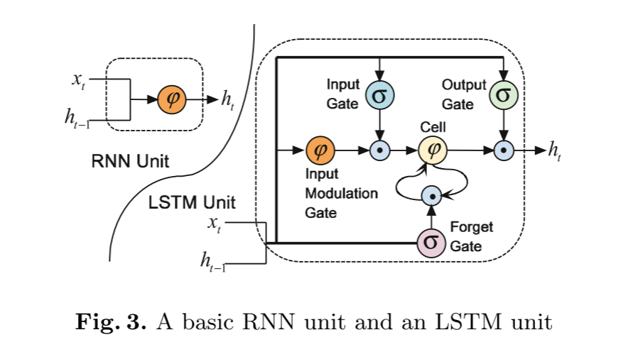

# Abstract

传统ACE时间提取方法

+ 依赖于复杂的自然语言处理(NLP)工具和精心设计的特征
+ 受到现有工具的错误传播的影响，并需要大量的人力资源
+ 几乎所有的方法都是单独提取一个事件的每个论点，而没有考虑候选论元之间的相互作用

提出的新事件提取方法

+ 目的：是在不使用复杂的NLP工具的情况下自动提取有价值的线索，并同时预测事件的所有论元
+ 利用了一个基于长短时记忆网络(LSTM)的上下文感知词表示模型来从纯文本中捕获词的语义
+ 出了一个张量层来探索候选论元之间的相互作用，并同时预测所有论元

# 1 Introduction

## 1.1 语义

语义获取的传统方法：传统的方法通常使用词性标签(part-of-speech，POS)、实体信息和形态学特征（如令牌(token)、引理(lemma)等）。

+ 缺陷：
  + 这些特征对于词来说是一种单一的表示方式，存在数据稀疏性问题，忽略了上下文词的影响
  + 这些方法往往依赖于人类的独创性来设计如此复杂的特征，这是一个耗时的过程，缺乏通用性

**所以，除了词的语义之外，要更精确地提取事件，还需要了解词与词之间的语义关系**

## 1.2 词与词之间的语义关系

传统方法：

+ 使用句法特征捕获语义。当词汇处于不同子句时，难以找到直接依赖路径。因此，使用传统的依赖特征很难找到它们之间的代理角色。
+ 提取这些特征在很大程度上依赖于NLP系统的性能，而NLP系统可能会受到误差传播(error propagation)的影响。

改进的递归神经网络(RNNs)方法：

+ 有效的词汇语义学习方法，考虑了上下文的影响
+ RNN的递归结构也使其经受了“**消失梯度(vanishing gradients)**”问题，这使得RNN模型难以学习序列中的长距离相关性(long-distance correlations)

Bidirectional Long Short-Term Memory(BLSTM) unit：

1. 可以直接使用LSTM-based RNNs对每个词的表示

2. 通过在RNNs上应用**最大池层(max-pooling layer)**来获得整个句子的表示

3. 针对于**一个句子中有多个事件，且多个事件可能以不同角色共享相同论元**的问题

   采用**动态的多池层(dynamic multi-pooling layer)**，自动捕获整个句子的有价值的语义，更全面完整地保留信息来提取事件

4. 针对**候选论元之间相互作用没有建模和预测**的问题

   提出了一个**张量层(tensor layer)**来自动探索论元之间的相互作用

**总结：**

+ 提出事件提取框架——**双向动态多池长短记忆张量神经网络**(Bidirectional Dynamic Multi-Pooling Long Short-Term Memory Tensor Neural Networks, BDLSTM-TNNs)
  + 网络无需复杂的NLP预处理就能自动地为事件提取提供有价值的线索，并能同时预测候选论元

+ 提出**双向动态多池长短记忆网络(BDLSTM)来分别提取事件触发器和论元**
  + 该网络能够在考虑上下文词的情况下捕获词的有意义语义，并自动捕获句子中对事件提取更有价值的信息

+ 设计了一个**张量层**
  + 旨在探索候选论元之间的相互作用，并联合预测它们

+ 采用数据集：**ACE2005事件抽取数据集**

+ 文本采用事例：

  ```xml
  S3: In California, Peterson was arrested for the murder of his wife and
  unborn son.
  ```

+ 图1

  

# 2 Event Extraction Task

在本文中，我们重点研究了自动内容提取(Automatic Content Extraction, ACE)评估中定义的事件提取任务，其中事件被定义为涉及参与者的特定事件。

**ACE术语**

+ Event mention：描述事件的短语或句子，包括触发器和论元。

+ Event trigger：最清楚地表达某一事件发生的词。

+ Event argument：事件中涉及的Event mention、temporal expression or value，也就是参与者

+ Argument role：论元与其参与的事件之间的关系

给定一个文本文档，事件抽取系统应该**预测具有特定子类型的事件触发器及其论元**。 

# 3 Methodology

本文将事件抽取描述为一个两阶段、多类别的分类，通过双向动态多池长短期记忆网络(BDLSTM)自动学习有价值的线索。

两阶段：

1. 触发器分类阶段

   我们**使用一个BDLSTM对句子中的每个词进行分类，以识别触发词**

2. 论元分类阶段

   该阶段**应用同样的BDLSTM将论元分配给触发器，并对齐论元的角色**
   
    为了探索候选论元之间的相互作用，同时预测所有候选论元，我们在论元分类阶段设计了一个张量层。
   
   3.1和3.4：描述了如何用BDLSTM分别预测每个候选论元的方法
   
   3.5：说明了用于触发器分类的BDLSTMs和用于论元分类的BDLSTMs之间的区别。 
   
   3.6和3.7：介绍了双向动态多池长短期记忆张量神经网络(BDLSTMTNN)，并说明了它是如何联合预测所有候选论元的

论元分类的BDLSTM体系结构


主要涉及的三个组件：

+ 上下文感知的词表示
+ 动态多池层
+ 论元分类器输出层

## 3.1 Context-Aware Word Representation Using LSTM Networks

事件抽取的重要线索：

+ 词的语义

+ 词与词之间的关系

思路：

1. 使用LSTM单元的RNNs适合去学习上下文感知语义
2. 前向词、后向词对单词学习很重要
3. 所以提出双向长短期记忆体系结构来表示一个单词

### 3.1.1 Context-Aware Word Representation

上下感知词表示结构：

1. **词的嵌入**，目的是捕捉词的背景； 
2. **左语境(context)和右语境**，有助于消除当前词的语义歧义，揭示词与词之间的关系； 
3. **位置信息**，其目的是指定哪些词是预测的触发器或候选论点； 
4. **预测事件类型**，旨在将触发器分类阶段的预测的事件类型嵌入到论元分类阶段中。


1. **词的嵌入**

   我们使用向量$e(w_i)、e(t)和e(a)$来表示一个词$w_i$、预测触发词$t$和候选论元$a$，它们**通过查找词嵌入来转换**。 **单词嵌入由跳图模型(Skip-gram modal)从大量未标记的数据中训练**。

   工具：Skip-gram modal

   输入：词$w_i$,预测触发器$t$,候选论元$a$

   输出：词的嵌入$e(w_i)$、预测触发器的嵌入$e(t)$和候选论元的嵌入$e(a)$

2. **左语境和右语境** :

   我们将单词$w_i$左侧的所有单词作为左语境$c_l(w_i)$，而右侧的所有单词作为右语境$c_r(w_i)$。每个词的上下文不同。 使用公式1计算单词$w_i$的左侧上下文$c_l(w_i)$。 右语境$c_r(w_i)$以类似的方式计算，如公式2所示。
   $$
   c_l(w_i) = f(c_l(w_{i-1}),e(w_{i-1}))
   $$

   $$
   c_r(w_i) = f(c_r(w_{i+1}),e(w_{i+1}))
   $$

   + $e(w_{i-1})$是单词$w_{i-1}$的单词嵌入
   + $c_l(w_{i-1})$是先前单词$w_{i-1}$的左语境
   + 函数$f$是LSTM的操作，将在下一节中说明

   工具：LSTM

   输入：上一个单词的左语境$c_l(w_{i-1})$,上一个单词的嵌入$w_{i-1}$

   输出：当前单词的左语境$c_l(w_i)$

3. **位置信息**: 

   位置信息$(pi)$被定义为当前单词到预测的触发器或候选参数的相对距离，正如相关论文“计算词汇信息中”所做的那样。

   工具：

   输入：

   输出：$pi$

   ==这一步怎么做到的==

4. **预测事件类型：**

   我们将触发器的预测事件类型$(pe)$编码为位置信息。

5. 结果

   最终定义词$w_i$表示为：

$$
x_i = c_l(w_i) ⊕ e_{w_i} ⊕ c_r(w_i) ⊕ pi ⊕ pe ⊕ e(a) ⊕ e(t)
$$
注：⊕是串联运算符

这样，利用这些上下文信息和事件特定信息，我们的模型可以更好地对$w_i$词本身的意义以及$wi$词与其他词的语义关系消除歧义，特别是对预测的触发器和候选论元之间的交互作用。

对$x_i$应用线性变换和$\tan h$激活函数，并将结果发送给下一层$y^{(1)}$
$$
y_i^{(1)} = \tan h(W_1x_i + b_i)
$$
$(1 \leq i \leq n, n=句子的长度,下一层y^{(1)}是矩阵y^{(1)} \in R^{n \times m},m是y_i^{(1)}的维数)$

==$W_1$是什么？==

### 3.1.2 Long Short-Term Memory Networks.



**传统RNNs**

传统的RNNs能够在隐藏状态向量(hidden state vector)$h_t$上反复应用一个转移函数来处理任意长度的输入序列

通常，RNN单元通过递归方程5计算隐藏状态。
$$
h_t = \varphi(W_hx_t + U_hh_{t-1} + b_h)
$$
$(\varphi 是逐元素非线性的,像是sigmoid函数和双曲正切,x_t是输入,h_t是时间t的隐藏状态)$

传统RNN的一个问题是，在训练过程中，很难学习序列中的长距离相关性，因为梯度向量的分量在长序列上会呈指数衰减。（梯度消失问题）

**结合了LSTM的RNNs**

LSTM体系结构提供了一种解决方案——**结合记忆单元(memory unit)**，该记忆单元允许网络在给定新信息的情况下学习何时忘记以前的隐藏状态以及何时更新隐藏状态。 

每个时间步长$t$的LSTM单元是一个向量集合：

+ 一个输入门(input gate)$i_t$
+ 一个输入调制门(input modulation gate)$u_t$
+ 一个遗忘门(forget gate)$f_t$
+ 一个输出门(output gate)$o_t$
+ 一个记忆单元(memory cell)$c_t$
+ 一个隐藏状态$h_t$

$(x_t是当前时间步的输入)$


如图二所示，BLSTM是有两个LSTM组成：

+ Forward LSTM：
  + 在正向输入序列上
  + 每个时间步，计算出来的$h_t$同左语境($c_l(w_t)$)对齐
+ Backward LSTM
  + 在反向输入序列上
  + 每个时间步，计算出来的$h_t$同右语境($c_r(w_t)$)对齐

这样就允许模型捕获过去和未来的信息了

## 3.2 Dynamic Multi-pooling

$y^{(1)} \in R^{n \times m}$的大小是由输入句子的标记数决定的

**为了应用后续层，传统的RNN采用最大池操作，将$y^{(1)}$的每个维度作为池，每个维度得到一个最大值。**

==**WHY????为什么最大池操作**==

但是，单个最大池对于事件提取是不够的。因为一个句子可能包含两个或更多的事件，而一个候选论点可能用不同的触发器扮演不同的角色。

为了解决这个问题，为卷积神经网络(Convolutional Neural Network, CNN)设计了一个动态多池层(Dynamic Multi-pooling layer)。 我们将类似的层应用到BLSTM中。 在论元分类阶段，我们根据候选论元和预测触发器将$y^{(1)}$的每个维分为三个部分。


如图二所示，根据“Peterson”和 “murder”，$y^{(1)}$被分割为三个部分$y^{(1)}_{(1j)}$，$y^{(1)}_{(2j)}$，$y^{(1)}_{(3j)}$。

动态多池可以用公式6来描述
$$
y_{ij}^{(2)} = max(y_{ij}^{(1)})
$$
$(1 \leq i \leq 3,1 \leq j \leq m)$

通**过动态最大池层，对$y^{(1)}$的每一维度得到$y_{ij}^{(2)}$，然后，串联所有的$y_{ij}^{(2)}$组成向量$y^{(2)} \in R^{(3m)}$，这个向量可以做有价值的线索，包含了整个句子的关键语义，从而对论据进行精准分类**

工具：动态多池

输入：$y^{(1)}$的所有维度$y^{(1)}_{*j}$

输出：每一个维度的最大值$y^{(2)}_{ij}$组成的向量$y^{(2)}$


## 3.3 output

为了计算每个论元角色的置信度，向量$y(2)$被输入到分类器中
$$
O = W_2y^{(2)} + b_2
$$
($W_2 \in R^{n_1 \times (3m)} $是转换矩阵, $O \in R^{n_1}$ 是网络的最终输出,$ n_1$是候选论元中被标注"None role"的论元数量）

​	（标注"None role"的论元在事件中不扮演任何角色）

为了正则化，在倒数第二层使用了dropout

==$W_2$、dropout是什么==

## 3.4 Training

将论元分类阶段被训练的所有参数定义为

$\theta = (E,c_l(w_1),c_r(w_n),pi,pe,W_1,b_1,W_2,b_2,lf,lb)$

+ $E$ : 单词嵌入

+ $c_l(w_1) , c_r(w_n)$ : 初始上下文
+ $pi$ : 位置嵌入
+ $pe$ : 预测事件类型嵌入
+ $W_1,b_1,W_2,b_2$ : 转换矩阵参数
+ $lf$ : forward-LSTM
+ $lb$ : backward-LSTM

给定一个输入示例$S$，具有参数$θ$的网络输出向量$O$，其中第$i$个分量$O_i$包含参数角色$i$的得分。 

为了获得条件概率$p(i|x,θ)$，我们对所有参数角色类型应用一个Softmax操作：
$$
p(i|x,θ) = \frac {e^{O_i}} {\sum_{k=1}^{n_1}{e^{O_k}}}
$$
为了计算网络参数$\theta$，通过在mini batch上的随机梯度下降(stochastic gradient over shuffled mini-batches)，最大化对数似然(log likelihood)$J(\theta)$
$$
J(\theta) = \sum_{i=1}^T{\log {p(y_i|x_i,\theta)}}
$$

## 3.5 Model for Trigger Classification

上述方法同样适用于触发器分类，但触发器分类只需在句中查找触发器，比论元分类要简单。 因此，我们可以使用简化版本的BDLSTM。 

与论元分类相比简化部分：

+ 在触发器分类的上下文感知词表示中，我们不使用候选参数的位置。 
+ 而且，不是将句子分成三个部分，而是通过候选触发器将句子分成两个部分。 

## 3.6 BDLSTM-TNNs

问题：BDLSTM无法探索候选论元之间的相互作用

解决方法：双向动态多池长短时记忆张量神经网络(Bidirectional Dynamic Multi-Pooling Long Short-Term Memory Tensor Neural Networks, BDLSTM-TNNs)

使用来自BDLSTM的$y^{(2)} \in R^{n_f}$作为输入，$n_f$是$y^{(2)}$的维数。

如果有$n_c$个候选论元，则输入特征为$A \in R^{n_f \times n_c}$

在张量层中使用三向张量$T^{[1:n_t]}\in R^{n_t\times n_f\times n_f}$，$n_t$是相互作用向量的长度

候选论元的内在联系$I$表示为：
$$
I=A^TT^{[1:n_t]}A; I_i = A^TT^{[i]}A
$$


其中，$I∈R^{n_t×n_c×n_c}$是张量层的结果，其中包含了候选论元之间的相互作用。 

使用最大池层，捕获最有价值的内部关系：
$$
I_{max}(i,j) = \max^{n_c}_{k=1}I_j(i,k)
$$
$1 \leq i \leq n_c$，$1 \leq j \leq n_t$，$i_{max \in R^{n_c \times n_t} }$

连接候选论元A和相互作用$I_{max}$成一个整体特征$F \in R{n_c \times (n_t + n_f)}$，每个候选论元都有一个对应特征$F_i$。最后得到输出$O_i$为：
$$
O_i = W_3F_i + b_3
$$
$O_i \in R^{n_1}$是第$i$个候选论元的输出，$O_i(j)$是论元$i$分配给角色$j$的得分

## 3.7 BDLSTM-TNNs Training

在参数分类阶段定义所有参数为$\theta = (E, c_l(w_1), c_r(w_n),pi,pe,W_1,b_1,W_3,b_3,lf,lb,T)$

+ 三向张量$T$
+ 转换矩阵参数$W_3,b_3$
