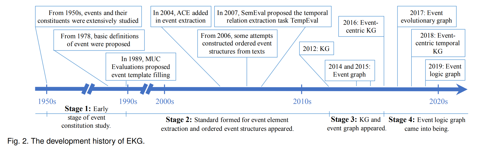
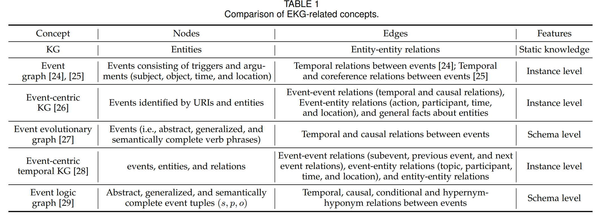
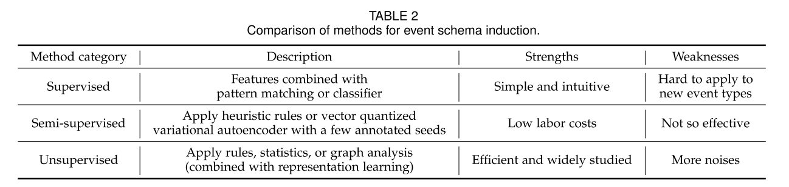
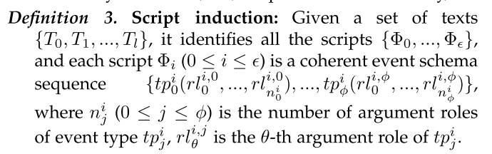
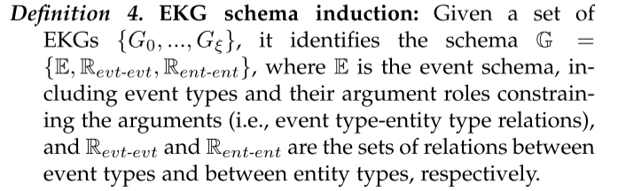
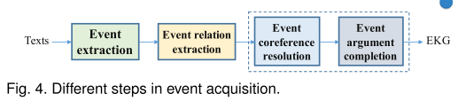
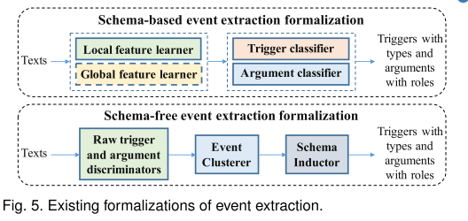

# 0、目录

本文深入探讨了什么是事件知识图谱以及它是如何发展的。 你想了解事件知识图谱什么？ 你可能会感兴趣的是它是如何产生的，什么是所谓的事件知识图谱，如何构造它，以及它可以在哪里应用。 因此，为了全面地介绍事件知识图谱，我们从历史、本体、实例和应用的角度来看待它。 

第二节：从历史的角度，我们详细介绍了事件知识图谱的简史和我们衍生的定义

第三节：从本体论的角度，我们研究了与事件知识图谱相关的基本概念，以及其中的任务和方法，包括事件模式、脚本和事件知识图谱模式归纳

第四节：从实例视图出发，我们详细阐述了事件获取和与事件知识图谱相关的代表性图/系统

第五节：从应用的角度，我们介绍了一些关于事件知识图谱的基础和深度应用，并对相关任务的发展过程和趋势进行了深入的研究

第六节：指出今后的方向

第七节：提出结论

# 1 What is EKG: History View

## 1.1 The Brief History of EKG

### Stage 1: Early stage of event constitution study

+ 20世纪50年代开始
  + 戴维斯试图得到句子中逻辑形式
+ 1978年，Mourelatos将事件定义为固有的可数事件
+ 1991年，Pustejovsky认为事件为语言分析提供了独特的表征，涉及动词的体特征、状语范围、论元角色以及从词汇到句法的映射

### Stage 2: Standard formed for event element extraction and ordered event structures appeared

+ 1989年，MUC(Message Understanding Conference)evaluations 提出了事件模板填充(event template filling)
+ ACE(Automatic Content Extraction)程序开发了从中提取意义的能力
+ 2004年开始，ACE增加了事件提取，定义为**提取事件触发器和参数**
  + 事件触发器：能够最清晰描述事件的词或跨度(span)，也就是事件类型
  + 参数：在事件中扮演特定角色的实体或跨度
+ 2006年，开始尝试用语篇中构建有序的事件结构
+ 2007年，SemEval(Semantic Evaluation)提出了时间关系抽取任务TempEval
  + 从文本中提取事件时间关系

### Stage 3: KG and event graph appeared

+ 2012年，谷歌提出KG
  + 利用语义网中所有收集的实体和关系的知识
  + 静态知识
+ 2014年，Glavaés和ésnajder提出了event graph
  + 构建了文本中关于事件的信息，以满足高效检索和呈现事件相关信息的需求
  + 节点是由触发器和参数(主体、对象、事件和地点)组成的事件
  + 边是事件时间关系
+ 2015年，Glavaés和ésnajder进一步增加了事件共指关系(event coreference relations)
+ 2016年，Rospocher提出了以事件为中心的知识图谱(event-centric KG)
  + 节点：有URI和实体标识的事件
  + 边：事件-事件关系、事件-实体关系、一般事实
  + 事件-事件关系：因果关系、时间关系
  + 事件-实体关系考虑动作、参与者、时间和位置，抽取（内容，人物，时间和地点）

### Stage 4: Event logic came into being

+ 2017年，Li等人提出了事件演化图谱(event evolutionary graph)
  + 节点：抽象的、广义的、语义完整的动词短语
  + 进一步考虑了事件的因果关系，揭示了事件的演化模式和发展逻辑
+ 2018年，Gottschalk和Demidova提出了以事件为中心的时间的知识图谱(event-centric temporal KG)
  + 节点：事件、实体和关系
  + 事件具有主题、时间和地理信息，并与参与活动的实体联系到一起
  +  他们还考虑了子事件、上一个事件和下一个事件关系以及实体-实体关系
+ 2019年，事件演化图谱(event evolutionary graph)派生为事件逻辑图(event logic graph)
  + 节点是抽象的、广义的、语义完整的事件元组$(S, P, O)$
    + $S$：actor/subjet，行动者或主体
    + $P$：action/predicate，动作或谓词(也就是事件触发器)
    + $O$：object，对象
  + 考虑了两个事件关系(two more event relations)，条件关系(conditional)，超名词和下位词之间的关系(hypernym-hyponym)

## 1.2 The Definition of EKG

+ 以事件为中心
+ 有两类节点
  + 事件
  + 实体
+ 三类有向边
  + 事件-事件关系
    + 时间关系
    + 因果关系
    + 条件关系
    + 主题关系
    + ...
  + 事件-实体
    + 代表事件的论元，即边是实体对相关事件的论元作用
  + 实体-实体
    + 描述实体之间的关系

**Definition 1.** EKG $G$ is a graph of events $N_{evt}$, entities $N_{ent}$, and their relations $E$, where $E_{evt-evt}$, $E_{evt-ent}$, and $E_{ent-ent}$ are the relations between events, between events and entities, and between entities, respectively.
$$
G = \{(s, p, o)|\{s, p\} ∈ N, p ∈ E,N = \\N_{evt}∪N_{ent},E = E_{evt-evt}∪E_{evt-ent}∪E_{ent-ent}\}
$$

# 2、What is EKG: Ontology View

形成事件知识图谱的基本概念

+ 事件类型
+ 论元角色
+ 事件关系

## 2.1、Event Schema Induction

事件模型的设计方法：

+ 人工设计：

  + 实例：

    + ACE事件模型

    + FrameNet框架

  + 缺陷：

    + 低覆盖率
    + 领域适应困难

+ 事件模式归纳(event schema induction)

**Definition 2.** **Event schema induction:** Given a set of texts
$\{T_0, T_1, ..., T_l\}$, it identifies the event schema, including
all event types$ \{tp_0, ..., tp_τ\}$ and all argument roles
$\{rl^i_0, ..., rl^i_ρ\}$ for each event type tpi $(0 ≤ i ≤ τ)$.

**实例：**

**Input:** 

+ $T_0$: Barack Obama previously served as a U.S. senator from 3 January 2005. Then, he was selected as the President of America on 20 January 2009. 

+ $T_1$: Before winning the presidential election, Obama was nominated for the President of America on 27 August 2008.

**Output:**

+  $ tp_{0}$ : Start-position, $rl^0_0$ : person, $rl^0_1$ : position,$rl^0_2$ : time;
+  $ tp_1$ : Nominate, $rl^1_0$: nominee, $r1^1_1$ : position, $rl^1_2$ : time.

现有方法：监督方法、半监督方法、无监督方法

### 2.1.1 Supervised methods 监督方法

**==用被标记的数据学习，然后从新文本中归纳出事件模式==**

+ methods in the third MUC evaluations
  + 模式匹配（正则表达式）
  + 语法驱动技术(syntax-driven techniques)
    + 将语法分析与语义和后续处理相结合
  + 将语法驱动技术集成到模式归纳的模式识别中
+ Chieu等人
  + 采用语义和话语特征
  + 为每个论元构建一个分类器
    + 最大熵(maximum entropy)
    + 支持向量机(Support Vector Machine, SVM)
    + 朴素贝叶斯(naive Bayes)
    + 决策树(decision tree)

### 2.1.2 Semi-supervised methods 半监督方法

==**从少量标记种子开始归纳事件模式**==

+ Patwardhan和Riloff创建了一个**自训练的SVM**来识别感兴趣领域的相关句子，然后通过**语义亲和力** (semantic affinity) 提取领域相关事件模式(domain-relevant event schema)。
  + 自学习从种子模式和相关、不相关文件开始
  + 之后的事件模式提取是建立在基于语法分析的启发式规则上的
  + 提取结果被基于频率的语义亲和度排序，以保持最优解
+ Huang和Ji通过利用可用于少数已见类型的注释发现了未见的事件类型
  + 他们设计了一个**矢量量化的变分自动编码器**(vector quantized variational autoencoder)来学习每个可见或不可见事件类型的**嵌入**(embedding)，并使用可见事件类型优化(optimize)它。
  +  进一步引入了一个变分自动编码器(variational autoencoder)，根据事件类型的分布对每个事件触发器进行重构。

### 2.1.3 Unsupervised methods 无监督方法

**==消除了对标记数据的需要==**，使用率最高

+ Chambers 和 Jurafsky 将事件模式归纳视为发现不受限制的关系。 
  + 他们使用**点互信息(Pointwise Mutual Information, PMI)测量事件和基于距离的聚类事件之间的距离**
  + 然后，他们通过**句法关系归纳出事件的论元作用**。 
+ 巴拉苏布拉马尼安等人利用$（s,p,o）$对的**共现统计量**(co-occurrence statistics)建立了以这些**三元组为结点**的图
  + **边由所涉及的三元组对的对称条件概率**(symmetric conditional probabilities)加权
  + **其中的三元组使用词干词目(stemmed headwords)和语义类型(semantic types)进行规范化 
  + 它们从**高连通性节点(high-connectivity node)作为种子**开始
  + 然后，他们**应用图分析找到与种子密切相关的三元组，并合并它们的参数角色来创建事件模式**
+ Chambers提出了第一个类似于LDA的图式归纳生成模型
+ 阮等人进一步介绍了实体消歧。 最近的研究介绍了表征学习

**表征学习在无监督下生成事件模式**

+ Yuan等人提出一个两步走的框架
  + 首先，通过聚类新闻文章检测事件类型
  + 然后提出一个基于图的模型——利用实体共现性去学习实体的嵌入并将这些嵌入加入到论元角色中
+ 2019年语义评估国际研讨会上应用了预训练语言模型，比如BERT
  + 得到词汇嵌入
  + 然后，他们用手工制作的特性聚集这些嵌入，并将它们与现有事件模式（例如FrameNet）的事件类型和参数角色对齐。
+ Yamada等人提出利用bert的掩蔽词嵌入来获得深层语境化的词嵌入
  + 应用了一种两步聚类方法，根据嵌入对同一动词的实例进行聚类，再进一步跨动词进行聚类。最后每一个生成的聚类视为一个生成的模式

## 2.2 Script Indution

脚本可以被视为表达特定场景的事件模式的原型结构。 具体地说，**它将一组事件组织成一定的结构（通常根据它们的时间关系）**。 脚本中的“事件”称为脚本事件，是事件模式而不是实例。 在早期的研究中，脚本是手工设计的。 在最近的研究中，研究者试图**从文本中自动提取脚本**，即脚本归纳。

(先略)

## 2.3 EKG Schema Induction

+ 2020年，Li等人首先研究了事件图模式归纳，侧重于丰富的事件组件(rich event components)和事件-事件连接(event-event connections)。 提出了一种路径语言模型来构建事件图模式库
  + 其中**两种事件类型通过涉及填充重要论元角色的实体的事件-事件路径连接**，这些实体被它们的类型所取代。 然而，这项工作只关注事件之间的联系。 
+ 2021年，Li等人进一步侧重于所有三种类型的关系，即事件-事件、事件-实体和实体-实体关系。 他们把模式作为隐含的知识来指导事件图的生成，并通过最大化这些实例图的概率(maximize the probability of these instance graphs)来学习。 但是，对于事件之间关系，只考虑时间关系。

# 3、What is EKG: Instance View

从实例视图出发，介绍如何构建事件知识图谱，即事件获取和与事件知识图谱相关的代表性图/系统。

## 3.1 Event Acquisition

+ 事件抽取(event extraction)
+ 事件关系抽取(event relation extraction)
+ 事件共指消解(event coreference resolution)
+ 事件论元补全(event argument completion)

### 3.1.1 Event Extraction

构建事件知识图谱的首要步骤

从文本中抽取结构化的事件信息，包括带有类型的事件触发器和带有角色的论元

两个任务：

+ 触发器检测
  + 识别事件触发器
  + 为事件触发器分配预定义类型或聚集类
+ 论元抽取
  + 识别论元
  + 为论元分配触发事件的论元角色

**Definition 5.  Event extraction：** Given a text $S = \{w_0,w_1,...,w_n\}$ of $n$ words, it identifies all event triggers $\{trg_0,...,trg_m\}$ and predicts the event type $tp_i$ for each event trigger $trg_i = \{w_{b_{i}^{trg}},...,w_{d_{i}^{trg}}\}$ , where $0 \leq i \leq m$ ,$b_i^{trg}$ and $d_i^{trg}$ are the beginning and end indexes of $trg_i$ . It also identifies event arguments $\{{arg}_0^i,...,{arg}_k^i\}$ for ${trg}_i$ and predicts the argument role ${rl}_j^i$ for each event argument ${arg}_j^i = \{w_{b_{ij}^{arg}},...,w_{d_{ij}^{arg}}\}$ , where $0 \leq j \leq k$ ,  $b_{ij}^{arg}$ and $d_{ij}^{arg}$ are the beginning and end indexes of $arg_j^i$                            

根据是否存在预定义的模式，将事件抽取分为：

+ 基于模式的事件抽取
  + 将文本传递给特征学习器以获取局部(和全局)特征
  + 之后，触发器分类器和论元分类器输出预定义模式上的概率分布，并根据峰值得到结果

+ 无模式的事件抽取
  + 将文本传递给判别器(discriminator)，得到原始触发器和论元
  + 然后使用聚类归纳成事件模型并得到结果
  + 通常使用简单无监督事件模型归纳方法(simple unsupervised event induction methods)

根据输出规模：

+ 基于模式的事件抽取
  + 句子级(更广泛的研究)
  + 文档级
+ 无模式的事件抽取——开放域事件抽取

#### 3.1.1.1 Sentence-level event extraction

提取句子中的事件触发器和论元

早期的方法设计了复杂的特征并应用了统计学习方法

假设事件触发器及其参数在同一个句子里

随着大规模数据集（如ACE、TAC-KBP、RAMS)的构建和深度学习的发展，研究人员采用**神经网络自动提取特征**。

根据特性范围，分为三类：

+ Explore intra-subtasks features探索子任务内部特性

  大多数方法采用**卷积神经网络(CNN)**或**递归神经网络(RNN)**来提取子任务内的特征，并遵循**流水线框架顺序**执行每个事件提取子任务

  + Chen等人提出了**动态多池CNN(dynamic multi-pooling CNN)**来提取候选词和各种句子级特征
    + 作为一种基于CNN的方法，这项工作不能很好地处理句子中单词之间的**顺序关系(sequential relation)**和**长程依赖关系(long-range dependency)**
    + 因此，Chen等人采用**双向动态多池长短时记忆网络(bidirectional dynamic multi-pooling Long Short-Term Memory network, LSTM)**
    + 他们还**设计了一个张量层(tensor layer)去探索候选词之间的相互作用**

  将**预训练语言模型BERT和Elmo**加入

  + Yang等人在BERT上增加了一个**多分类器**用于**触发器检测** 
    + 在BERT上增加了多组二元分类器用于论元检测
  + Deng等人用事件-事件关系(时间、因果、层次关系)丰富了事件模式，以提升BERT上的触发器检测
  + Du 和 Cardie 和 Liu等人**基于BERT提出了机器阅读理解框架(machine reading comprehension frameworks)**， 该框架采用问题回答来提取事件

+ Explore inter-subtasks features探索子任务间的特性

  这些方法探索了触发器检测和参数提取的子任务特性，通常遵循**联合框架(joint framework)**，缓解了上述流水线框架的错误传播(error propagation)

  + Nguyen等人提出了一种**基于双向门控循环单元(bidirectional gated recurrent units)和全连通网络(Fully Connected Network)的联合模型(joint model)**
    + 他们引入**内存向量(memory vector)去存储触发器子类型和论元角色之间的依赖**
  + 为了进一步利用句法特征，Sha等人在CNN中增加了**依赖桥(dependency bridges) 去连接句法相关的词**，并且**在每对候选论元上建立一个张量层**，用来更有效地捕捉**远程依赖**
  + Liu等人使用**基于注意力(attention-based)的图卷积网络(Graph Convolution Network, GCN)**通过**句子的句法树的路径**聚合单词信息，并且捕捉候选触发器和论元之间的更多交互作用

+ Explore inter-IE features 探索信息提取之间的特性

  为了更好地对事件元素的语义信息进行建模，近年来研究者通过引入其他相关的信息提取任务来探索更多的全局特征。在**多任务学习框架**下，这些IE任务相互受益。

  + Nguyen和Nguyen 采用了**双向RNN来学习单词嵌入**，通过**基于FCN和softmax的分类器进行实体和事件提取**。 
  + Wadden等人进一步处理了实体提取、实体关系提取、事件提取和共指解析。
    + 在通过BERT对句子进行编码后，他们列举了文本跨度并构建了一个跨度图(span graph)。
    + 跨度嵌入通过整合相邻的嵌入来更新，并传递给面向所有任务的基于FCN的分类器。
    + 这些任务都是**单独**处理任务。
  + 为了更好地探索IE间的特征，Lin等人**同时**提取了实体、实体关系和事件。
    + 他们**通过BERT嵌入和基于FCN的分类器计算了所有候选触发器、实体及两者之间成对链接的局部得分。**
    + 然后，他们**使用基于波束搜索的解码器(beam search-based decoder)搜索全局最优结果**，该解码器结合了候选触发器和实体之间的相互依赖性

#### 3.1.1.2 Document-levent extraction

难点：

+ 论元可能存在不同的句子中
+ 一个文档通常包含多个事件

早期的方法使用手工制作的特征来对事件和所涉及的实体进行建模。然后，他们通过统计学习方法提取文档中的事件

+ 代价高

Yang等人使用了**远程监督方法**来自动标记文档中的事件。

+ 为了解决手工带价高

+ 使用带标记的数据，训练了一个句子级事件提取模型
  + Bidirectional LSTM(BiLSTM)双向长短记忆递归网络
  + Conditional Random Field(CRF) layers 条件随机场层
+ 根据提取的事件，填补缺失参数
+ 以流水线的方式处理参数

Zheng等人**将事件转换为基于实体的有向无环图(an entity-based directed acyclic graph)**

+ **将事件提取转化为几个连续路径扩展子任务(several sequential path-expanding subtasks)**
+ 为了处理端到端的文档级事件提取

Xu等人也进行上述转换，但更多研究句子和事件之间的相互作用，通过在句子和事件的图上应用**图神经网络(Graph Neural Network, GNN)**的方式

+ 为了方便当前提取，将提取的事件存储在一个全局内存中

为了提取触发器，Lou等人提出了一种**多层双向网络(multi-layer bidirectional network)**，去同时获得文档级信息和事件依赖

## 3.2 EKG-related Representative Graphs/System

### 3.2.1 Domain-specific graphs/systems

+ 2016 年，Rosopcher等人构建了四个以事件为中心的KG ，即：维基新闻(WikiNews)英文版 、国际足联世界杯(FIFA WorldCup)英文版 、汽车英文版和空中客车语料库英文版 、荷兰语版和西班牙语版，来自不同的新闻 。

# 4.

### 4.1.4 Event Argument Completion

目的：补全现有事件

形式：填充缺失的论元或论元角色

方法：进一步将此任务形式化为预测或分类任务

**早期研究**

主位匹配在句子理解中的作用

例子：

+ Tilk结合了基于神经网络的论元-角色-参数对嵌入

  添加这些已知对的组合嵌入，以便与目标论元角色进一步结合

  然后预测缺少的论元

  ——预测类

  O. Tilk, V. Demberg, A. Sayeed, D. Klakow, and S. Thater, “**Event**
  **participant modelling with neural networks**,” in EMNLP, **2016**,
  pp. 171–182.

+ Hong等人将这对嵌入的和替换为它们的加权和

  + 并预测了目标论元缺少的论元角色。
  + 
