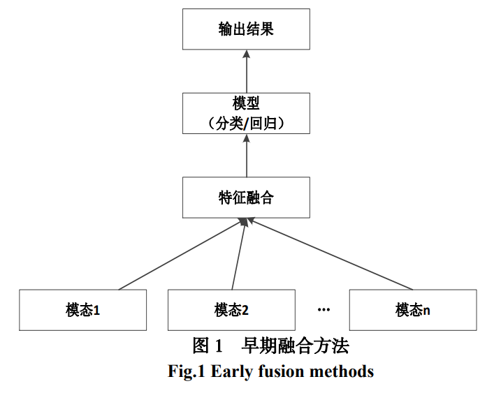
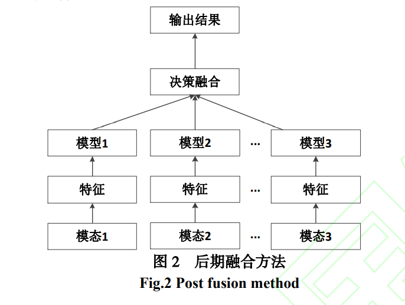
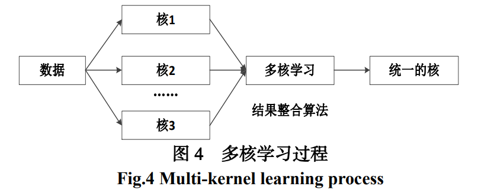

# 多模态融合方法

## 1、模型无关的融合方法

根据融合发生的时间进行分类

### 1、早期融合方法——特征融合方法

对每个模态进行特征提取之后立即进行的融合方法

优势：

+ 可以在早期利用来自不同模态的多个特征之间的相关性

**应用场景：模态之间高度相关的情况**

​	结合语音识别的音频和视频特征时

缺点：

+ 特征提取难度较大
+ 难以表示多模态特征之间的时间同步
+ 只进行简单的属性融合可能会忽视各个模态独有的属性和相关性
+ 可能会产生数据间的冗余和数据依赖
+ 要求融合前的特征以相同格式表示
  + 无论对于融合的过程，还是融合后使用模型的要求，都要求融合前的特征以相同格式表示
+ 随着特征数量增加，难以获得特征之间的交叉相关性
+ 容易造成过拟合

### 2、后期融合方法——决策层融合方法

在每个模态做完决策后进行融合

优点：

+ 可以处理简单的数据异步性
+ 允许使用最适合分析每一种单一模态的方法
+ 解决过拟合问题

缺点：

+ 忽视了多个模态之间的低水平的相互作用
+ 融合难度较高
+ 学习过程耗时费力
  + 针对不同模态的数据需要使用不同的单一模态方法进行训练，相对早期融合方法需要花费多倍时间和成本
+ 不允许分类器同时训练所有数据
  + 因为是针对每一个模态的数据使用单一模态方法

### 3、混合融合方法

综合早期融合与后期融合的优点

优点：

+ 灵活使用，更适合深度学习模型

缺点：

+ 使模型结构变得复杂，加大训练难度

==**更需要针对于具体的体系结构，具体的问题与研究内容选择适宜的融合方法**==

​	因为是结合早期融合方法和后期融合方法，要求根据具体问题和研究内容，选择合适的融合时机，从而达到更好的效果

## 2、基于模型的融合方法

### 1、多核学习方法

多核学习方法(Multi-kernel Learning，MKL)

内核支持向量机方法的扩展

特点：

+ ==**允许用不同的核对应数据的不同视图**==
+ 由于核都是相似函数，所以能更好的融合异构数据且使用灵活

优点：

+ 核选择灵活，损失函数为凸函数（极小值为最小值）
+ 可以使用全局最优解训练模型来提升模型性能

缺点：

+ 在应用中更为灵活，没有统一的使用标准，需要做更多的工作去选择核函数
+ 较高的时间复杂度和空间复杂度
+ 占用内存大，对训练数据有依赖

实例：

+ Heterogeneous embedding for subjective artist similarity

  + McFee B，Lanckriet G
  + 声学、语义和艺术家社会观
  + 音乐艺术家排序
+ easyMKL

**个人观点：属于后期融合的一种；多核函数之间的结合是关键。**

### 2、图像模型方法

通过对图像进行切割、拼接、预测的操作将浅层或深层的图形进行融合

+ **生成式模型——联合概率模型**

  试图对输入和输出的联合概率分布进行建模

  应用：

  + 自然语言处理
  + 动态贝叶斯网络（Dynamic Bayesian Networks）
  + 隐马尔可夫模型

+ **判别模型——条件概率模型**

  比生成模型更简单，更容易学习

  应用：

  + 条件随机场（Conditional Random Field，CRF）
    + 对图像的组成成分进行分类标记——多模态数据分类

**优点：**

+ 容易发掘数据中的空间结构和时间结构
+ 通过将专家知识嵌入到模型中，能够增强模型的可解释性

**缺点：**

+ 特征之间具有复杂的依赖关系
+ 模型的泛化性不强

### 3、神经网络方法

最泛用方法之一

+ **长短期神经网络（）**
  + 应用：
    + 双向长短期时间网络——多模态情感识别

+ **循环神经网络**
  + 应用：
    + 多模态循环神经网络（Multimodal Recurrent Neural Networks，m-RNN）
      + 将图像表示和词向量作为多模判断的输入，在图像字幕处理等任务中表现良好

**优点：**

+ 能达到比多核学习和图像模型更好的效果
+ 较强的学习能力
+ 较好的可扩展性

**缺点：**

+ 随着模态数量的增加，深度学习的可解释性变差，而且需要依赖大量的训练数据

**可供考虑的神经网络模型：**基于遗传算法（Genetic algorithm，GA）的神经网络结构优化

