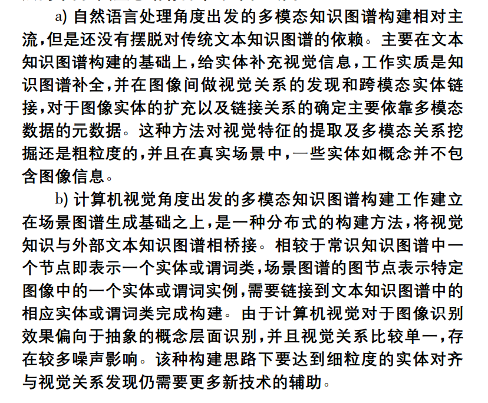

# 多模态知识图谱构建与应用研究综述

## 1、知识图谱（Knowledge graph，KG）：

+ 诞生：2012年由Google公司提出
+ 本质：基于图模型的关联网络知识表达
+ 目的：采用图结构来建模和记录世界万物之间的关联关系和知识，以实现更加精准的对象及搜索
+ 概念：
  + ==**从语义角度出发**==
  + **==以事实三元组的形式描述客观世界中概念、实体及其关系==**
    + 将实体和概念抽象为节点
    + 将关系抽象为边
  + ==**通过结构化的形式对知识进行建模**==
+ 三元组：（实体1，关系，实体2）
  + 例子：（张三，国籍，中国）
+ 

发展：

+ 语义网络——传统知识图谱
  + 实体覆盖率更高
  + 语义关系更加全面
+ 传统知识图谱——多模态知识图谱
  + 单模态的表示学习可以将文本或图像数据表示为计算机能够理解的数值向量或者进一步抽象出的特征向量
  + 多模态表示学习在保持模态特定语义的完整下，有助于缩小异质性差距
  + 多模态实链接技术可以帮助相同实体的跨模态的信息进行补全对齐

**问题：如何构建和应用多模态知识图谱**

构建知识图谱：

采用**自动或半自动技术**，从**结构化、半结构化及非结构化数据资源**中抽取知识，并存入**基于逻辑划分**的数据层和模式层，是一个迭代更新的过程。

步骤：

+ **信息抽取**
+ **知识融合**
+ **知识加工**

利用自然语言处理、机器学习等技术从多源异构的数据资源中自动构建知识图谱的技术

+ TestRunner、RLLIE——华盛顿大学
+ NELL——卡耐基梅隆大学

**多模态数据技术研究的两大挑战：**

+ 语义鸿沟(senmatic gap)
  + 计算机标识系统与人类认知系统对于同一概形成不同描述的差异性
+ 异构鸿沟(heterogeneity gap)
  + 图像、文本等不同媒体的数据具有不同的特征表示形式，之间的相似性难以直接度量

## 2、多模态学习：

对多源异构数据的挖掘分析

任务：通过学习多个模态数据中的信息，实现各个模态信息的转换和交流

方法：（之一）**==把不同媒体的数据从各自独立的空间映射到一个第三方公共空间中进行相似度量==**

**多模态深度学习：**

作用：**==用深度学习的方法将多模态数据在同一高层语义表示空间进行对齐，以便进行对齐、比较和融合==**

```
通常用合适的神经网络学习文本、图 像、音频、视频等多模态数据在相应特征空间的表示，随后将各模态的表示作为输入，继续构建更深层的神经网络结构，利用深度跨模态表示学习构建的神经网络，融合各模态的语义信息，得到在共同表示空间中各模态的高层语义表示。
```


+ 先使用各种深度学习方法对每个模态的数据进行特征提取
+ 再讲各个模态的数据作为输入，进行深度跨模态表示学习
+ 得到多模态数据的共同表示空间

注：基于框架的后期融合

困难：多模态数据数据量大、数据分布稀疏，指代同一实体的不同模态数据需要使用人工，**==导致大规模的多模态研究面临训练数据缺失的难题==**。

现有的解决方法：**==通过跨模态知识跃迁和预训练来避免对标注数据的过高依赖==**。

## 3、多模态知识图谱

### 1、基于图数据库视角的构建

早期描述多模态数据的数据集

+ 捕获多媒体文件的作者、创建日期、大小等高级元数据
+ 不能很准确的支撑多模态知识图谱的构建

应用

+ **ESG项目**

  + 以网页游戏的形式，将图像标注任务外包，进行视觉模态数据的收集

+ **ImageNet**、Visipedia等图像数据集

  + 应用在计算机视觉领域

  + 图像数据集结构：WordNet层次结构
  + 目标：收集大量带有标注信息的图像数据供计算机视觉模型训练
  + 特点：每个概念图像都是经过质量控制和人为标注的
  + 缺点：
    + 收集方式在多样性和伸缩性受限
    + 成本大
  + 规模：
    + 1500万张已标注高清图片
    + 涉及22000个类
    + 对近百万张图片中的主要物体的定位边框进行标注
  + 实质：图片版的WordNet


**==分割线：2013年，Chen等人提出NEIL==**

​	——大规模自动化图像抽取变成主流


+ Vijayanarasimhan 等人使用**亚马逊土耳其机器人**进行抽取任务
  + 检索精度不高
+ **Wikidata**
  + 存在大量的多模态数据
  + 免费的协作知识库
  + 提供可靠而强大的数据共享查询服务
  + 存储形式：文档
    + 每个文档都有唯一的数字标识
+ **DBpedia**
  + 早期语义网项目
  + 知识形式：严格的本体形式组织
  + 数据来源：维基百科
  + 特点： 对于每个实体，DBpedia 定义了一个唯一的全局标志符，可以将其引用为网络上描述的一个实体
  + 规模：涵盖了超过260万个实体
+ **Visual Genome**
  + 类型：图片-文本
  + 映射到 WordNet 同义词集的**大规模图片语义理解数据集**
  + 数据来源：
    + 文本：WordNet
+ **MS-Celeb-1M**
  + Guo
  + 数据来源：
    + 图像：Facebook
    + 文本：Freebase
  + 规模：100万个名人


**==分割线：2016年，哥伦比亚Li等人提出一种多模态模式挖掘方法==**

+ 目的：用于挖掘和命名来自高级新闻事件图像标题对的语料库中的多模态视觉模式
+ 数据来源：高级新闻事件图像标题对的语料库
+ 作用：从计算机视觉角度推动了图数据库的构建


### 2、基于知识图谱的视角的构建

尝试合并视觉信息，但仅是通过超链接将它们链接到文本，使用时才缓存视觉内容。

+ **IMGpedia**
  + 数据来源：
    + 可视化信息：Wikimedia Commons 数据集
  + 规模：
    + 构建并生成 1500 万个视觉内容描述符
    + 图像之间有 4.5 亿个视觉相似关系
  + 单个图像与DBpedia、Wikidata之间存在链接
  + 特点：**使用四种图像描述符进行基准测试**，并且这些描述符的引用和实现是公开的。
  + 相较于DBpedia提供了一个更好的可视化语义查询平台
  + 缺点：
    + 关系类型稀疏
    + 关系数量少
    + 图像分类不清晰
    + 没有对图像内可能存在的实体间关系进行深入挖掘
  
+ **CN—DBpedia**
  + 复旦大学知识工场实验室研发并维护
  + 中文大规模通用领域结构化百科知识库
  
+ **ImageGraph**
  + 作用：回答网络提取的知识图谱中的视觉相关查询
  + 规模：
    + 1 330 种关系类型
    + 14 870 个实体
    + 829 931 张从网络中爬取的图像
  + 方法：
    + 将图像视为一等公民
    + 引入卷积神经网络和知识图谱嵌入的组合
  
+ **MMKG**
  + 2019 年，Liu 等人在之前 Rubio 的工作基础上构建了一个包含所有实体的数字特征和图像的三个知识图谱的集合MMKG
  
  + 格式：N-Triples格式
  
  + 实体对齐基准：数据集 FB15K
  
  + 特点：联合不同知识图谱中的不同实体和图像执行关系推理
  
  + 优点：多关系预测和实体匹配任务
  
  + 缺点：
    + 针对于小数据集
    + 图像没有作为单独的图像实体存在，依赖于相应的 传统文本实体
    + 没有考虑图像的多样性
    
  + 分析：
  
    


**==分割线：多模态知识图谱概念被提出==**

+ 时间：2019年前后

+ 建立在复杂的**场景图谱生存(SGG)**之上，结合了计算机视觉领域的部分工作
+ 代表工作：哥伦比亚大学 Chang 团队
  + 在分别构建**文本知识图谱**和**场景图谱**的基础之上， 通过**动态消息传递**和**桥接算法**融合成一个图，生成一个新的多模态知识图谱支撑下游应用任务
+ 场景图谱：可视为常识知识图谱的一个具有图像条件的实例化
  + 通过图像识别技术将图像解析为抽象的语义元素——对象及其交互
  + 实体为图像中一个领域


+ **Ｒichpedia**
  + 相关信息：2019 年，Wang 等人
  + 作用：通过网络链接和图片搜索，向Wikidata中的文本实体补充足量和多样的图像
  + 数据来源：
    + 文本：Wikidata
    + 图像：网络链接和图片搜索
  + **==构建工作：==**
    + 数据获取
    + 图像处理
    + 关系发现
  + ==**具体举措**==
    1. 通过借助外部图像搜索引擎获取图像，解决由于单个资源中信息稀疏导致的长尾问题
    2. 利用搜索引擎中图像相关性排序获得与文本实体最相关的图像模态数据
    3. 通过**去噪操作**和**RGB多样性检测**对图像进行预处理和筛选，确保图像实体的相关性和多样性
    4. 为所有实体添加了URI，并利用**基于规则的关系抽取模板**构建多模态语义关系
    5. 借助图像的文本描述，完成图像实体之间的语义关系检测
+ **2020 年，Kannan 等人在 DCC 项目中将科学出版物和附带的源代码表示为统一的知识图谱**
  + 数据来源：科学出版物及其附带的源代码
  + 使用方法：**知识图谱对齐方法**
  + 特点：集成多媒体文档中文本、结构化图像和源代码
+ **GAIA**

  + 构建工作

    + 文本知识提取
    + 可视化知识提取
    + 采用相同的文档集作为输入，使用在相同语义空间中定义的类型
    + 分别编码各自模态信息创建单独的知识库
    + 通过共享空间使两个知识库可以融合一个单一、一致的多媒体知识库

论文小结：




## 4、多模态知识图谱关键技术

前提摘要：

+ 图像等视觉信息当前可以通过链接或者以具有数据类型的二进制字符串形式包含在知识图谱中
+ 异构信息只有有效关联后，才能真正反映模态数据中的知识

### 1、多模态信息抽取

主要目标：从无结构的生文本中抽取出结构化、半结构化或非结构化的数据

是多模态学习与信息抽取技术的结合，是当前多模态知识图谱研究的主要工作之一。
