## **1、前提摘要**

2012年，谷歌提出知识图谱项目

关键技术：从互联网的网页中抽取实体、实体属性信息及实体之间的关系

作用：解决自动问答、个性化推荐和智能信息检索方面的问题

**知识图谱和语义网的区别**

|          | 知识图谱                         | 语义网                     |
| -------- | -------------------------------- | -------------------------- |
| 目标     | 实现人与计算机的无障碍沟通       | 实现人与计算机的无障碍沟通 |
| 方式     | 建立元数据                       | 建立图谱                   |
| 强调     | 实体之间的关联以及实体的属性值   | 对自然语言的句子做表示     |
| 数据来源 | 百科类半结构化数据和各种网络数据 | 人工构建                   |
| 关注重点 | 知识清洗、知识融合、知识表示技术 |                            |

大型知识图谱介绍：

+ 谷歌知识图谱
  用多种语言对知识图谱中的实体、属性和关系进行描述，以达到提高搜索质量的目的

+ 百度“知心”

  通过筛选、整合搜索结果，达到直接搜索到答案的效果

+ 搜狗“知立方”

  通过“语义理解”网上的碎片信息和优化结果，可以向用户显示最符合的信息。

## 2、知识图谱

### 1、基本概念

作为结构化语义知识库，使用"资源描述框架(Resource Description Framework，RDF)"来描述数据

基本模型是三元组，一般是"实体—关系—实体"三元组

节点：物理世界中的实体或概念

边：各种关系

实体(entity)、概念(concept)、关系(relation)

本体(ontology)：是对概念体系的明确的、形式化的、可共享的规范

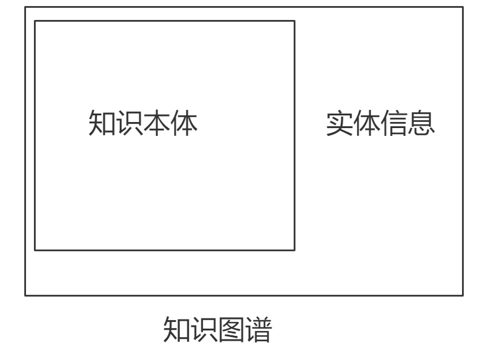

### 2、数据存储

#### 1、RDF存储

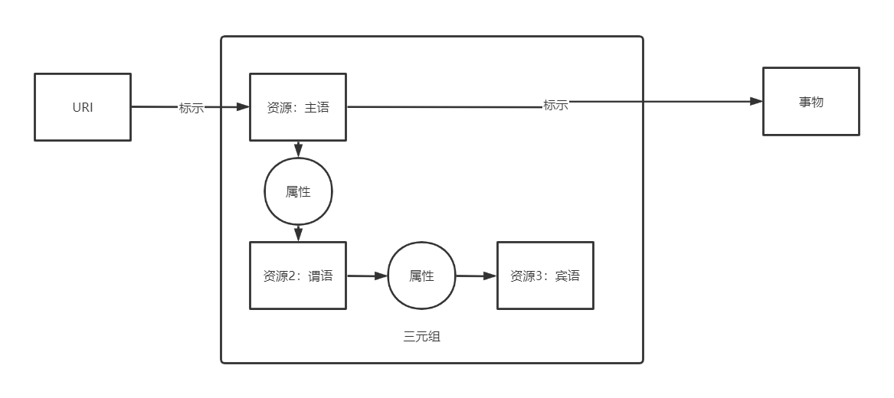

+ 查询、归并和连接高效
+ 空间开销大、更新维护代价大
+ 更多的RDF数据库采用列式存储
+ Jena是RDF领域内最流行的存储框架

#### 2、图数据库

+ 可以提供完善的图查询语言、支持各种图挖掘算法
+ 分布式存储使得大节点处的处理开销高，数据更新速度慢，整体实现的代价比较高
+ Neo4j是最流行的图数据库

### 3、构建方式与方法

知识图谱构建的方式

+ 自底向上——大部分采用
  + 先获得知识图谱的实体数据，再构建本体
  + 先得到具体再得到抽象的概念
  + 实例：谷歌的Knowledge Vault
+ 自顶向下
  + 先定义或获得本体的数据，再逐渐将具体的实体加入到知识图谱中
  + 实例：Freebase 

知识图谱构建流程：

+ 知识获取
+ 知识融合
+ 知识加工
+ 知识更新

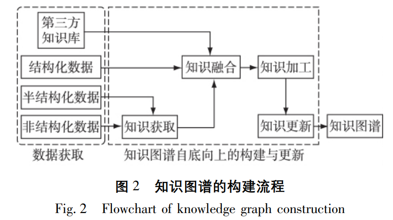

构建方法：

+ 完全的专家手工构建
+ 利用众包构建
  + Wikipedia
  + Freebase
+ 半自动构建
  + 预先人工设定规则或正则
  + 然后从半结构化的信息中再进行自动构建
+ 完全从非结构化信息中自动构建

### 4、数据来源与知识库

数据来源：

+ 结构化数据
  + 已经组织好的RDF数据
+ 半结构化数据
+ 非结构化数据

知识库：包含半结构化和非结构化数据

+ 链接知识库

  + Freebase
    + 谷歌知识图谱的重要组成部分
    + 数据来源
      + 人工构建
      + 维基百科、NNDB和MusicBrainz等网站或语料库

  + Wikidata
    + 自由的协作式多语言辅助知识库
    + Wikipedia、Wikivoyage、Wikisource 中结构化数据的中央存储器
    + 数据存储形式：文档
      + 每个文档都有唯一的数字标识

  + DBpedia
    + 多语言综合型知识库
    + 作用：从多种语言的维基百科中抽取结构化的信息，并将其以关联数据的形式发布到互联网上， 提供给在线网络应用、社交网站或其他在线知识库使用

  + YAGO
    + 综合型知识库
      + 数据来源：维基百科、WordNet、GeoNames等网站
      + 类别层次结构体系
        + 融合维基百科的分类体系和WordNet的分类体系
      + 规模：1000万实体和超1.2亿个事实

+ 垂直行业知识库
  + IMDB
    + 关于电影演员、电影、电视节目、电视明星、电子信息以及电影制作的在线数据库
    + 资料按类型组织

### 5、分类

**1、按照研究对象分类：**

+ 基于单样本的知识图谱
+ 基于样本集的知识图谱

例子：

+ 文本：

  + 基于单文本的知识图谱

  + 基于文本集的知识图谱

+ 视觉上：

  + 基于单幅图片的知识图谱

  + 基于图片集的知识图谱

**2、按照研究内容的领域来分类**

+ 一般化知识图谱
  + 百度公司的知心
  + 搜狗公司的知立方
+ 领域知识图谱
  + 影视领域的IMDB
  + 金融领域的文因互联

**3、按照研究内容来分类**

+ 文本知识图谱
+ 视觉知识图谱
+ 多模态知识图谱

## 3、文本知识图谱

以文本为主要的研究内容，由**文本样本**构造，且节点和边均有**文本表示**的知识图谱

构建流程：

+ 知识表示
+ 知识融合
+ 知识加工
+ 知识更新

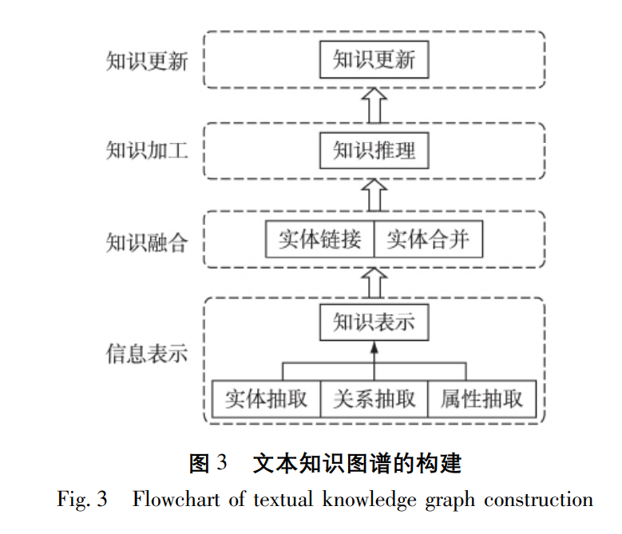

### 1、信息表示

#### 1、知识抽取

+ 实体抽取
+ 关系抽取
+ 属性抽取

知识抽取方式：

+ 对于结构化数据，基于规则抽取
+ 对于非结构化数据，基于学习抽取
  + SVM分类
  + 结合使用RNN和CRF

#### 2、知识表示

较多使用**翻译嵌入**(Translating Embedding)：将知识嵌入到一个低维空间中，获得知识的对应向量后就可以使用各种数学工具进行分析

+ 例子一：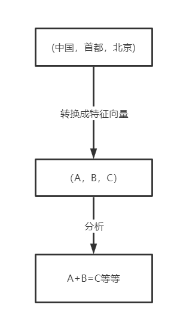
+ 例子二：**TransE**
  + **将每个三元组实例中的关系看作是从头实体到尾实体的翻译( Translating) ，并将实体和关系投影到一个平面中**
  + 优点：简单高效
  + 缺点：自反性有致命缺陷
+ 例子三：**TransH**
  + 采用**超平面**的思路，直接将翻译向量放在关系超平面上，使实体在不同关系三元组中有不同的角色
  + 可以一对多、多对一、多对多建模
+ **TransD、TransA、TransG、 TransＲ、KG2E**
+ TranSparse
  + 利用**稀疏矩阵**研究知识图谱和实体的不均匀性
  + 对不同难度的实体和关系使用不同稀疏程度的矩阵进行表示
  + 防止了对简单关系的过拟合和对复杂关系的欠拟合

#### 3、知识融合

包括**实体链接**和**实体合并**

+ 实体链接：将具有歧义的实体，链接到确切的知识上
  + 实体消歧
+ 实体合并：将语义相同的实体合并到一起
  + 将多异构的数据源实体归并为一个具有全局唯一标识 的实体对象
  + 基于规则或基于上下文提取词特征向量

#### **4、知识加工和知识更新**

知识图谱的完善，是随着知识加工步骤来进行补全、扩充的

+ 知识加工步骤：知识推理和知识更新步骤
  + 知识推理：利用现有的知识进行推理
    + 基于模板推理
    + 利用关系机器学习
      + 常用方法：矩阵分解、因子图和神经网络
  + 知识更新：对进来的知识进行处理
    + 全面更新：需要根据新增量重新计算所有的知识表示
    + 增量更新：将新知识添加到已有的知识表示当中去

### 3、应用

#### 1、语义检索

##### 1、传统的基于关键字的搜索

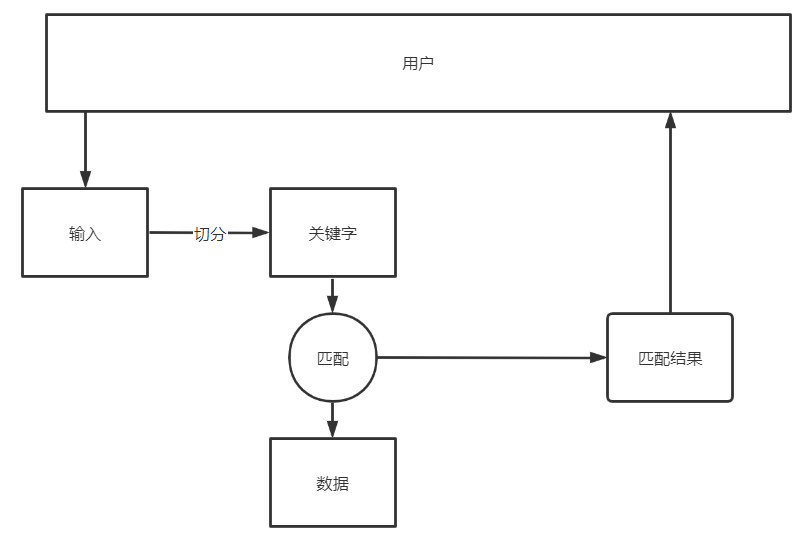

缺点：复杂语句无法理解，导致返回不相关结果

##### 2、基于知识图谱

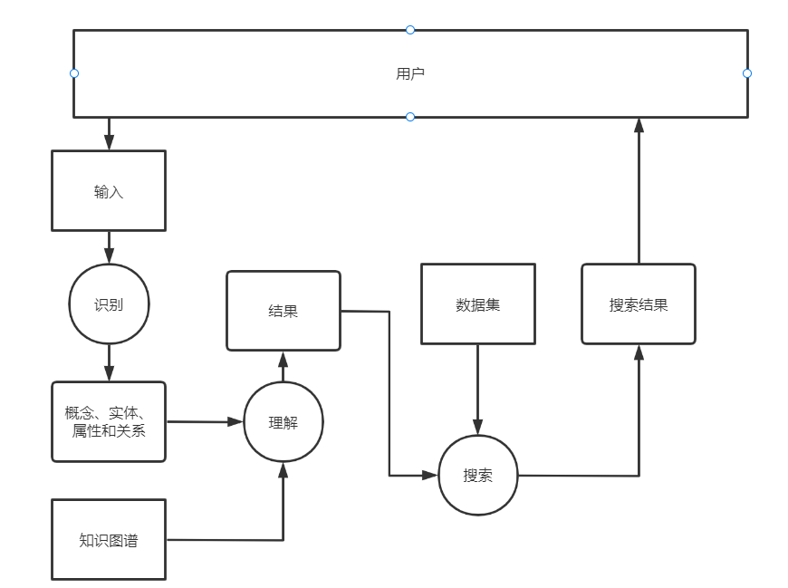

#### 2、深度搜索（知识导航）

使用知识图谱的深度搜索可以不只是提供用户输入的相关答案，还能提供用户输入的相关深度信息，也 就是提供相关的知识导航供用户了解学习．

#### 3、情报分析

深度情报分析，辅助决策

+ 股票投研
+ 公安办案

## 4、视觉知识图谱

以图像为主要的研究内容，由**视觉样本**构造，且节点和百年均有**视觉表示**的知识图谱

构建步骤：

+ 信息表示
+ 知识加工
+ 知识更新

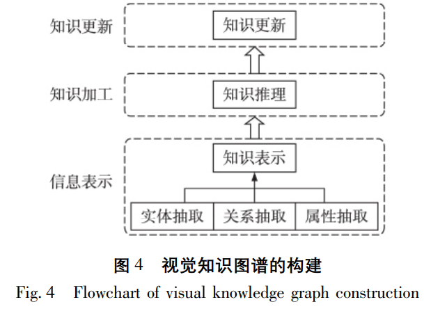

### 1、实体抽取

难点：

+ 实体列表难以获取
  + 采取预定义或数据挖掘的方式获得
+ 实体对应视觉图像难以获取
  + 利用搜索引擎的返回图片筛选得到
+ 一词多义
  + 使用聚类解决
+ 概念主体在图片上的位置未知
  + 物体检测

例子：

+ **NEIL**

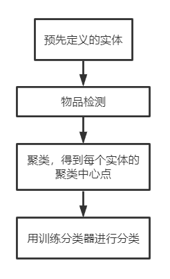

+ 2015年，johnson提出先对图像中的每一个物体区域和 区域内对应的实体进行标注，再利用所有标注区域 来训练物体检测器的方法
  + 完全需要手工标注
  
+ Divvala的方法：

  + 特点：预先定义的实体不太具体

  方法：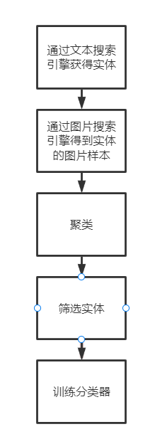

### 2、属性抽取

#### 1、对于形状、颜色等物体属性

+ Krishna 等**对每一类属性都训练了一组分类器**

#### 2、对于整幅图像的属性

+ 使用深度卷积网络和评价损失函数相结合的方法抽取
+ Souri 等在 2016 年提出了一种预测图像属性相关性的方法
  + 结合使用了 convNet 和 ranking layer 
    + convNet：学习图像特征
    + ranking layer：给图像评分

### 3、知识表示

1、直接将视觉特征向量作为信息表示

2、将所有特征合成因子图的形式进行知识表示

### 4、知识推理

1、使用基于视觉特征的标签传播

​	根据相似性矩阵进行标签传播

2、基于检测和分类模型的知识补全

​	将未知的实体、关系、属性等视觉内容提取视觉特征后送到对应的检测和分类模型中去预测结果。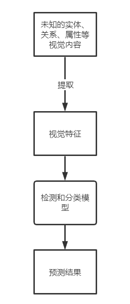

### 5、数据更新

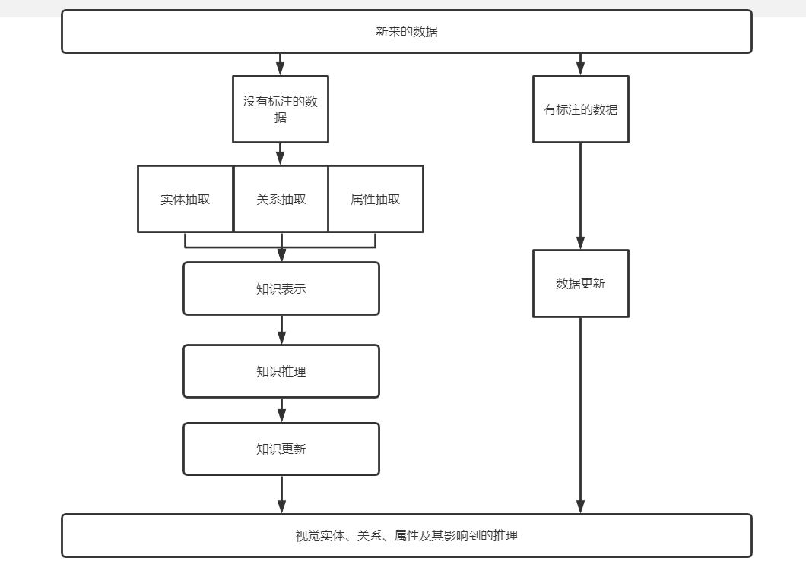

### 6、应用

+ 语义图像检索
  + 先分析输入的“实体”、“属性”，理解输入的含义结果，再利用含义结果进行图像检索，可以为用户返回更加相符和准确的目标图像
+ 文本关系真假判断
  + 判断依据：绝大部分的文本描述的真是关系拥有相匹配的图像与之对应
  + 对应图像不存在或者与同类图像一致性符时，就判断文本关系为假，否则为真

## 5、多模态知识图谱

构建过程：和视觉知识图谱基本一致

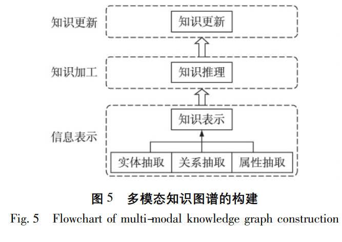

### 1、信息抽取

#### 1、实体抽取

从多模态样本中自动抽取实体列表

+ Sun等提出用**相似文本和视觉集合来自动提取视觉概念**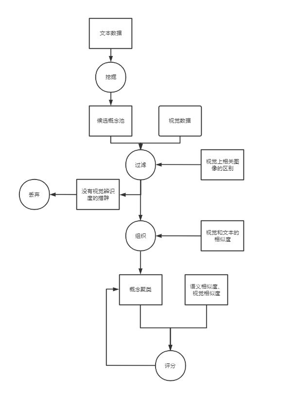
  + 在**图像和文本的双向概念获取任务**和**图像标记任务**上表现非常好
  
+ Fang等提出了一个**基于公众分类图像**来自动建立视觉实体框架
  + 根据文本和视觉的聚类结果来确定最终的视觉概念
  
  + 三个关键点：
    + 概念搜索
    
      + 作者基于维基百科从Flickr的标签中分辨筛选概念集
      + 对于那些已分辨得到的概念就使用相关标签的图学习出模型
      + 这样可以通过扩展和识别新图来自动更新结构化实体
    
      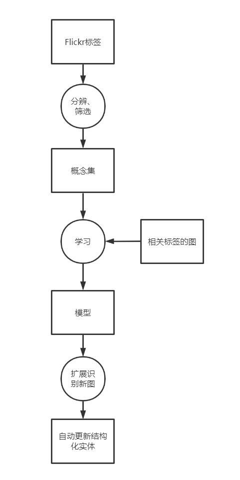
    
    + 概念关系提取
    
      + 不能直接获取的概念关系，先利用**视觉模范相似度**和**标签一致性**提取出来
      + 之后，类别关系可以直接通过**验证频度差异**、**概念标签的分布**计算出来
    
      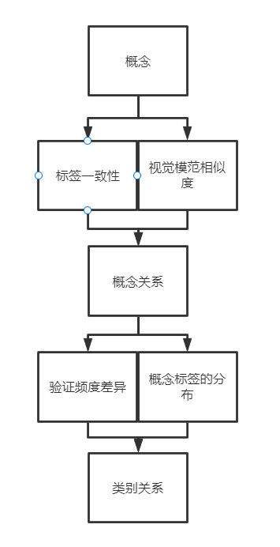
    
    + 概念分级建立
    
      + 通过**计算概念熵**来评估**概念的语义阔度**
    
  + 该框架能**有效应对用户生成的噪声标签**，通过利用文本和视觉两方面的信息实现了图片和概念的**不停更新**

#### 2、关系抽取

多模态样本关系：

+ 同时出现关系
+ 层级关系

一般思路：**通用的概念比具体的概念出现频率要高**

方法：计算实体的文本和图片特征的统计关系进行抽取

例子：上述的Fang的概念关系抽取

**3、属性抽取**

实体抽取一样的步骤

### 2、知识推理

+ 基于多模态特征的标签传播
  + Fang等根据**相似矩阵**和**图片相似矩阵**进行标签传播
+ 因子图推导学习
  + Zhu等采用**马尔科夫随机场结合Gibbs采样学习因子图的权重**进行知识推导与学习

### 3、知识更新

由于多模态知识图谱的每一步构建过程都需要全部的多模态样本，所以目前全部都采用的全面更新（待验证）

### 4、应用

+ 实现基于本体的图像检索
+ 视觉和文本相结合的视觉知识问答
  + Zhu——大规模多模态知识库结构
    + 将整幅图像及其具有的所有文字信息当作一个整体，直接将图片特征及其标注的文本内容作为实体

## 6、问题

多模态图谱：

+ 如何进行多模态的属性表示
+ 如何进行复杂的多模态关系的挖掘和统一表示
+ 如何进行多模态知识图谱的增量更新

未来趋势：多模态知识图谱

主要研究内容：

+ 多模态的概念挖掘

+ 概念的统一表示
+ 概念的简单关系的构建

