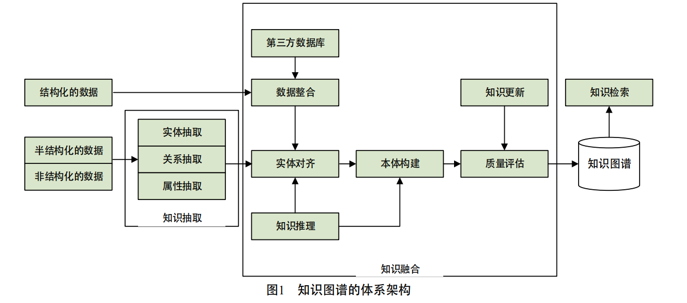

# 1、知识图谱的定义与架构

## 1、定义

```
在维基百科的官方词条中：知识图谱是Google用于增强其搜索引擎功能的知识库。本质上，知识图谱是一种揭示实体之间关系的语义网络，可以对现实世界的事物及其相互关系进行形式化地描述。现在的知识图谱已被用来泛指各种大规模的知识库。
```

三元组：$G = (E, R, S)$

$E=\{e_1,e_2,e_3,e_4,...,e_{|E|}\}$

$R = \{r_1,r_2,r_3,r_4,...,r_{|E|}\}$

$S\subseteq E \times R \times E$

分类：

+ 通用知识图谱
  + 注重广度
  + 强调融合更多实体
  + 应用于只能搜索领域
  + 相对行业知识图谱，准确度不够高
  + 受概念范围影响，很难借助本体库对公理、规则以及约束条件的支持能力规范其实体、属性、实体间的关系
+ 行业知识图谱
  + 依靠特定行业的数据构建，具有特定的行业意义
  + 需要考虑到不同的业务场景与使用人员

## 2、架构

知识图谱的架构主要包括自身的逻辑结构以及体系架构

### 1、逻辑结构


通过本体库形成的知识库层次结构强，冗余程度小

### 2、体系结构

知识图谱的体系架构是其指构建模式结构

知识图谱的构建过程需要随人的认知能力不断更新迭代

+ 自顶向下
  + 自顶向下指的是**先为知识图谱定义好本体与数据模式，再将实体加入到知识库**
  + 该构建方式需要**利用一些现有的结构化知识库作为其基础知识库**
    + Freebase—依靠—>维基百科
+ 自底向上——常用
  + 自底向上指的是**从一些开放链接数据中提取出实体，选择其中置信度较高的加入到知识库，再构建顶层的本体模式**
    + Google的Knowledge Vault



# 2、关键技术

## 1、知识抽取


### 1、实体抽取

命名实体学习(named entity learning)、命名实体识别(named entity recognition)

分为三种：基于规则与词典的方法、基于统计机器学习的方法以及面向开放域的抽取方法。

#### 1、基于规则与词典的方法

通常需要为目标实体编写模板，然后在原始语料中进行匹配

+ 文献[31]首次实现了一套能够抽取公司名称的实体抽取系统
  + ==**方法：启发式算法与规则模板相结合**==

缺点：

+ 需要大量的专家来编写规则或模板，覆盖的领域范围有限
+ 难以适应数据变化的新要求

####  2、基于统计机器学习

是通过机器学习的方法对原始语料进行训练，然后再利用训练好的模型去识别实体

##### 1、单纯的监督学习算法

+ 文献[32]实现了**对Twitter文本数据中实体的识别**
  + ==**方法：利用 KNN算法与条件随机场模型**==

缺点：

+ 性能上受到训练集合的限制
+ 算法的准确率与召回率不够理想

##### 2、监督学习算法与规则相结合

+ 文献[33]基于字典，在Medline论文摘要的GENIA数据集上进行了实体抽取实验
  + ==**方法：使用最大熵算法**==
  + 结果：实验的准确率与召回率都在70%以上

#### 3、面向开放域

是面向海量的Web语料

少量实体实例中自动发现具有区分力的模式，进而扩展到海量文本去给实体做分类与聚类

+ 通过**迭代方式**扩展实体语料库——文献[34]
  + 通过少量的实体实例建立特征模型，再通过该模型应用于新的数据集得到新的命名实体
+ 种基于**无监督学习的开放域聚类算法**——文献[35]
  + 是基于已知实体的语义特征去搜索日志中识别出命名的实体，然后进行聚类。

### 2、关系抽取

目标：解决实体间语义链接的问题

早期的关系抽取：通过人工构造语义规则以及模板的方法识别实体关系

发展：实体间的关系模型逐渐替代了人工预定义的语法与规则，但仍需提前定义实体间的关系类型

+ 面向开放域的信息抽取框架(open information extraction, OIE)
  + 对实体的隐含关系抽取方面性能低下

进一步发展：基于马尔科夫逻辑网、基于本体推理的深层隐含关系抽取方法

#### 1、开放式实体关系抽取

##### 1、二元开放式关系抽取

+ KnowItAll、TextRunner系统
  + 准确率和召回率上表现一般

+ WOE
  + 基于Wikipedia的OIE方法
  + 自监督得到抽取器
  + 准确率较TextRunner有明显提高
+ 第二代OIE ReVerb系统
  + 以动词关系抽取为主
+ 第三代OIE系统OLLIE(open language learning for information extraction)
  + 尝试弥补并扩展了OIE的模型及相应的系统
  + 抽取结果的准确度得到了增强

##### 2、n元开放式关系抽取

+ KPAKEN
  + 可以抽取任意英文语句中n元实体关系
  + 对语句深层语法特征的提取导致其效率显著下降，不适用于大规模开放域语料

#### 2、基于联合推理的实体关系抽取

典型方法：马尔科夫逻辑网(Markov logic network)

+ 将**马尔科夫网络**与**一阶逻辑**相结合的**统计关系学习框架**
+ **在OIE中融入推理**


+ StatSnowball
  + 自动产生或选择模板生成抽取器
+ EntSum
  + 实体识别和关系抽取相结合
  + 组成：
    + 扩展的CRF命名实体识别模块
    + 基于StatSnowball的关系抽取模块
  + 保证准确率、提高召回率
+ 简易马尔科夫逻辑(tractable Markov logic，TML)
  + 将领域知识分解成若干部分
  + 各部分的主要来源于事物类的层次结构
  + 并根据此结构，将各大部分进一步分解为若干个子部分
  + 以此类推

### 3、属性抽取

属性抽取主要是针对实体而言的，通过属性可形成对实体的完整勾画。

由于实体的属性可以看成 是实体与属性值之间的一种名称性关系，因此可以**将实体属性的抽取问题**转换为**关系抽取问题**

文献 [37,48]提出的**基于规则与启发式算法**的属性抽取方法

+ 从Wikipedia及WordNet的**半结构化网页**中自动抽取相应的属性名称与属性值
+ 还可扩展为一套本体知识库
+ 准确率达到95%+

从大规模开放域中抽取半结构化、非结构化数据：

+ 将上述从百科网站上抽取的结构化数据作为可用于属性抽取的训练集然后再将该模型应用于开放域中的实体属性抽取
+ 根据实体属性与属性值之间的关系模式，直接从开放域数据集上抽取属性。
  + 由于属性值附近普遍存在一些限定属性值含义的属性名等，所以该抽取方法的准确率并不高

## 2、知识表示

+ 基于三元组的知识表示
  + 计算效率、数据稀疏性
+ 将实体语义信息以**稠密低维实值向量**表示
  + 深度学习
  + 在低维空 间中高效计算实体、关系及其之间的复杂语义关联

### 1、应用场景

通过知识表示得到的**分布式表示形式**在知识图谱的计算、补全、推理等方面起到重要作用

1、语义相似度计算

低维实值向量——>使用**熵权系数法**、**余弦相关性**等方法**计算实体之间的相似度**

2、链接预测——知识图谱的补全

通过**分布式表示模型**，可以预测图谱中任意两个实体之间的关系，以及实体间已存在的关系的正确性。

### 2、代表模型

#### 1、距离模型

文献[56]提出了**知识库中实体以及关系的结构化表示方法(structured embedding，SE)**

思想：

1. 实体用向量表示
2. 关系矩阵将实体投影到与实体向量同一纬度的向量空间
3. 通过计算投影向量之间的距离来判断实体间已存在关系的置信度

缺点：由于距离模型中的关系矩阵是两个不同的矩阵，故实体间的协同性较差

问题点：

1. **向量化表示是如何表示**
2. **如何投影**
3. **如何计算置信度**

#### 2、单层神经网络模型

文献[57]针对上述提到的距离模型中的缺陷，提出了采用**单层神经网络的非线性模型(single layer  model，SLM)**

方法：模型为知识库中每个的三元组$(h,r,t)$定义了以下形式的评价函数
$$
f_r(h,t) = \mu_t^Tg(M_{r,1}l_h+M_{r,2}l_t)
$$

+ $\mu_t^T \subseteq R^k$为关系$r$的向量化表示
+ $g()$为$\tan{h}$函数
+ $M_{r,1}、M_{r,2}\subseteq R^{d \times k}$是通过关系r定义的两个矩阵（这个地方是个问题点）
+ $l_h、l_t\subseteq R^d$是三元组中头实体和尾实体的向量化表示

单层神经网络模型的非线性操作虽然能够进一步刻画实体在关系下的语义相关性，但计算开销大大增加。

问题点：

1. **$M_{r,1}、M_{r,2}\subseteq R^{d \times k}$是如何定义的**

#### 3、双线性模型

由文献[58-59]首先提出**隐变量模型(latent factor model，LFM)**

方法：模型为知识库中每个的三元组$(h,r,t)$定义了以下形式的评价函数
$$
f_r(h,t) = l_h^TM_rl_t
$$

+ $M_r\subseteq R^{d \times d}$是通过关系r定义的双线性变换矩阵
+ $l_h、l_t\subseteq R^d$是三元组中头实体和尾实体的向量化表示

基于实体间关系的双线性变换来刻画实体在关系下的语义相关性

优点：形式简单、易于计算、能够有效刻画实体间的协同性

改进：文献[60]尝试**将双线性变换矩阵 $M_r$ 变换为对角矩阵**，提出了**DISTMULT模型**

​	简化计算复杂度，提升实验效果

#### 4、神经张量模型

文献[61]提出的神经张量模型

基本思想：**在不同维度下，将实体联系起来，表示实体间复杂的语义联系**

方法：模型为知识库中每个的三元组$(h,r,t)$定义了以下形式的评价函数
$$
f_r(h,t) = \mu_t^Tg(l_hM_rl_t+M_{r,1}l_h+M_{r,2}l_t+b_r)
$$

+ $\mu_t^T \subseteq R^k$为关系$r$的向量化表示
+ $g()$为$\tan{h}$函数
+ $M_r\subseteq R^{d \times d \times k}$是一个三阶张量
+ $M_{r,1}、M_{r,2} \subseteq R^{d \times k}$是通过关系r定义的两个投影矩阵

**神经张量模型在构建实体的向量表示时，是将该实体中的所有单词的向量取平均值**

+ 可以重复使用单词向量构建实体

+ 有利于增强低维向量的稠密程度以及实体与关系的语义计算

#### 5、矩阵分解模型

通过矩阵分解得到低维的向量表示

是文献[62]提出的**RESACL模型**

+ 知识库中的三元组 $(h,r ,t) $ 集合被表示为一个三阶张量，如果该三元组存在，张量中对应位置的元素被置1，否则置为0
+ 通过**张量分解算法**，可将张量中每个三元组$(h,r ,t) $对应的张量值 $X_{hrt} $分解为双线性模型中的知识表示形式 $l_h^TM_rl_t$ ，并使得 $|X_{hrt} - l_h^TM_rl_t|_{L_2}$ 尽可能小

#### 6、翻译模型

文献[63]受到**平移不变现象**的启发，提出了 **TransE模型**

思路：**将知识库中实体之间的关系看成是从实体间的某种平移，并用向量表示**

关系 $l_r$可以 看作是从头实体向量 $l_h$ 到尾实体向量 $l_t$的翻译    


1	
